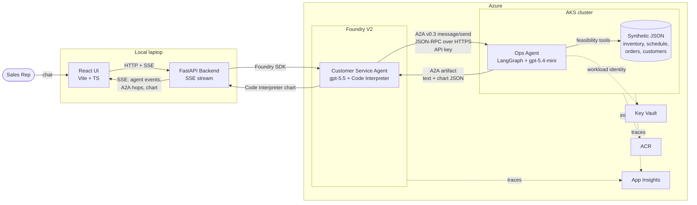

# Zava Smart Order Feasibility — A2A Multi-Agent Demo

[](https://azure.microsoft.com/)
[](https://github.com/google/A2A)
[](https://learn.microsoft.com/azure/ai-foundry/)
[](https://langchain-ai.github.io/langgraph/)
[](https://www.python.org/)
[](https://react.dev/)

> An external customer demo showing **two AI agents collaborating over the open A2A protocol** to solve a real manufacturing problem. A user-facing **Customer Service Agent on Microsoft Foundry V2** delegates a feasibility question to an internal **Manufacturing Ops Agent** running as a **LangGraph** application on **AKS**. A React UI visualises every A2A hop, every tool call, and the final chart-and-summary answer in real time.

> ⚠️ **Demo disclaimer.** This is **demonstration code, not production software**. It uses **Microsoft Foundry V2** and the **A2A protocol**, both of which are evolving (Foundry currently emits A2A **v0.3**, and this demo runs in v0.3-compat mode). All Zava data — customers, inventory, orders — is **synthetic**; no real customer information is used. Do not deploy this configuration to production without the hardening described in [`docs/private-vnet-considerations.md`](docs/private-vnet-considerations.md). Estimated run cost: **~$15–25 per day** while deployed; tear down promptly.

---

## Table of Contents

1. [Use Case](#use-case)
2. [Technology](#technology)
3. [How to Run the Demo](#how-to-run-the-demo)
4. [Repository Layout](#repository-layout)
5. [Documentation](#documentation)
6. [License & Disclaimers](#license--disclaimers)

---

## Use Case

**Zava** is a fictional precision-components manufacturer that builds industrial **pumps, motors, valves, and seals** for heavy-industry customers. Like most discrete-manufacturing businesses, Zava lives or dies by its ability to make accurate ship-date promises and keep them. Today, when a customer asks *"Can you ship 150 ZP-7000 centrifugal pumps by July 15?"*, the sales rep kicks off a chain of emails between Operations, the planner, and the order-book owner — and gets back a soft answer a day or two later. By then the customer has called a competitor.

The **Smart Order Feasibility** demo replaces that email chain with a single conversation. The rep types the question into a chat UI; **two AI agents collaborate over the A2A (Agent-to-Agent) protocol** to compute a data-driven answer; and the rep gets back a concrete ship-date promise, a chart, and a risk summary in seconds. The Customer Service Agent (Foundry V2) parses the request and delegates the heavy lifting to the Manufacturing Ops Agent (LangGraph on AKS), which queries fake inventory, production-schedule, order-book, and customer-tier data, computes a feasibility verdict, and returns a structured A2A artifact. The orchestrator then renders the result with Code Interpreter and streams the final answer back to the UI.

Why this pattern matters for a technical decision-maker:

- **Real-time, data-grounded feasibility** — promise dates are computed from current inventory, production load, and the open order book in a single round-trip, not estimated from gut feel.
- **Explicit risk surfacing** — the agent flags machine load, supplier lead time, and competing orders so reps don't promise dates that quietly depend on three things going right.
- **Priority-tier awareness baked in** — Platinum and Gold customers automatically benefit from reserved inventory and priority scheduling without the rep having to remember the policy.
- **An auditable trail** — every A2A hop, data lookup, and tool result is visible in the UI timeline and captured in Foundry traces. No black-box "the AI said so."
- **A reusable orchestrator + specialist-worker pattern** that generalises to any domain where a customer-facing agent needs to delegate to a back-office system of record.

→ Full narrative, personas, data model, and walkthrough: **[`docs/use-case.md`](docs/use-case.md)**.

---

## Technology

The demo is built entirely on **Azure** and uses the **new Microsoft Foundry V2** experience (project-based; **not** Foundry Classic / Hubs / V1 Assistants). The two agents speak the open **A2A protocol** over HTTPS — JSON-RPC `message/send` against an Agent Card discovered at `/.well-known/agent-card.json`. Foundry currently emits **A2A v0.3**, so the Ops Agent runs the `a2a-sdk` Python library in v0.3-compat mode.

**Component stack**

| Layer | Technology | Where it lives |
|---|---|---|
| Customer Service Agent (orchestrator) | Foundry V2 Agents API, **`gpt-5.5`** primary / **`gpt-5.4-mini`** fallback, Code Interpreter | Foundry account in Azure ([`apps/foundry-agent/`](apps/foundry-agent/)) |
| Manufacturing Ops Agent (worker) | **LangGraph** + `langchain-azure-ai` + **`a2a-sdk`**, `gpt-5.4-mini` | AKS pod ([`apps/ops-agent/`](apps/ops-agent/)) |
| Inter-agent transport | **A2A protocol** (HTTPS, JSON-RPC, v0.3-compat) | Public AKS Ingress, API-key authenticated |
| Backend mediator | **FastAPI** with **SSE** streaming | Local ([`apps/backend/`](apps/backend/)) |
| Frontend | **React + Vite + TypeScript** | Local ([`apps/frontend/`](apps/frontend/)) |
| Infrastructure | **Bicep** (Foundry, AKS, ACR, Key Vault, App Insights, UAMI) | [`infra/`](infra/) |
| Identity | **Workload Identity** federation; Azure AI User on Foundry; pre-shared API key on the A2A inbound endpoint | [`infra/modules/identity.bicep`](infra/modules/identity.bicep) |

**Condensed architecture**



The **A2A wire pattern** worth highlighting: the Ops Agent returns a **dual-part artifact** (R16) — a human-readable text part **and** a structured JSON chart payload in the same artifact — so the orchestrator can both quote the prose answer and hand the JSON to Code Interpreter for rendering. The inbound A2A endpoint is protected by a pre-shared API key (R17 mitigation) stored in Key Vault and injected into the AKS pod via Workload Identity. Models are switchable end-to-end via the `useGpt55` parameter in [`infra/main.bicep`](infra/main.bicep); `scripts/verify-quota.ps1` detects available quota and falls back to `gpt-5.4-mini` for both agents on Tier 1–4 subscriptions.

→ Deep dives: **[`docs/technology.md`](docs/technology.md)** (full stack, SDK choices, code patterns) · **[`docs/a2a-implementation.md`](docs/a2a-implementation.md)** (wire-level A2A, message schema, auth, error handling) · **[`docs/architecture.md`](docs/architecture.md)** (Azure resources, RBAC, network flow, cost model).

---

## How to Run the Demo

Full step-by-step instructions live in **[`docs/how-to-demo.md`](docs/how-to-demo.md)**. The summary below is enough to orient you.

### Prerequisites

- **Azure subscription** where you are **Owner** (or Contributor + User Access Administrator). Workload-identity role assignments require `Microsoft.Authorization/roleAssignments/write`.
- **Foundry quota** in a US region (East US, East US 2, West US, West US 2, or West US 3). Tier 5+ for `gpt-5.5`; Tier 1–4 will transparently fall back to `gpt-5.4-mini`.
- **(Optional) Owned DNS zone** where you can delegate a subdomain (e.g. `zava.example.com`). For a fast demo, you can skip this and use the free public [`sslip.io`](https://sslip.io) wildcard DNS service against the AKS Ingress IP — see [`docs/deployment-learnings.md`](docs/deployment-learnings.md) §1.
- **(Optional) TLS certificate** matching the public hostname. For an internal demo, plain HTTP between Foundry and the Ops Agent is sufficient (Foundry's A2A tool accepts `http://...` targets). For a customer-facing demo, issue a Let's Encrypt cert against the sslip.io name via cert-manager.
- **Local tools:** Azure CLI 2.60+, **PowerShell 7+**, `kubectl` 1.30+, **Python 3.13**, **Node 22 / npm 10**. Docker is **optional** (the recommended path uses `az acr build`).

### Quickstart

The five deployment scripts are designed to be run in order. Each is idempotent.

```powershell
# 0. Clone, sign in, pick a subscription
git clone https://github.com/miguelmsft/20260520-zava-a2a-demo.git
cd 20260520-zava-a2a-demo
az login
az account set --subscription "<subscription-id>"

# 1. Detect available model quota (auto-selects gpt-5.5 vs gpt-5.4-mini)
./scripts/verify-quota.ps1

# 2. Deploy Bicep: Foundry, AKS, ACR, Key Vault, App Insights, UAMI
./scripts/deploy-infra.ps1 -DnsZoneName zava.example.com -CertificatePfxPath ./ops-agent.pfx

# 3. Build & push the Ops Agent image to ACR (uses az acr build by default)
./scripts/build-and-push.ps1

# 4. Deploy the Ops Agent to AKS (Workload Identity, Ingress, A2A API key)
./scripts/deploy-k8s.ps1

# 5. Create the Foundry V2 Customer Service Agent and wire the A2A connection
./scripts/setup-foundry-agent.ps1
```

> **Note (Foundry V2 GA quirks):** the A2A connection is created automatically by step 5 via ARM REST PUT (data-plane SDK gap — see [`docs/deployment-learnings.md`](docs/deployment-learnings.md) §3). The Customer Service Agent's `responses.create` requires `model=<deployment name>` (`FOUNDRY_ORCHESTRATOR_DEPLOYMENT` env var, default `gpt-55-orchestrator`) and is incompatible with the older `api-version` query parameter — both are handled automatically by the shipped code.

Then start the local apps in two terminals:

```powershell
# Terminal A — backend
cd apps/backend
uv sync
uv run uvicorn app.main:app --reload --port 8000

# Terminal B — frontend
cd apps/frontend
npm install
npm run dev   # http://localhost:5173
```

Open **http://localhost:5173** and ask: *"Can we ship 150 ZP-7000 pumps to Apex Hydraulics by July 15?"* — you should see A2A hops light up in the timeline and a feasibility chart render in the response.

### Environment variables

Most variables are populated automatically by the deploy scripts (written to `.env` files in each app). The few you may need to set yourself:

| Variable | Used by | Source | Notes |
|---|---|---|---|
| `AZURE_SUBSCRIPTION_ID` | all scripts | you | Set before running scripts |
| `AZURE_LOCATION` | `deploy-infra.ps1` | you | Default `eastus2` |
| `DNS_ZONE_NAME` | `deploy-infra.ps1` | you | e.g. `zava.example.com` |
| `FOUNDRY_PROJECT_ENDPOINT` | backend, foundry-agent | written by `deploy-infra.ps1` | Foundry V2 project URL |
| `FOUNDRY_AGENT_NAME` | backend | written by `setup-foundry-agent.ps1` | Created agent's ID/name |
| `OPS_AGENT_ENDPOINT` | Foundry agent A2A connection | written by `deploy-k8s.ps1` | `https://ops-agent.<dns-zone>` |
| `OPS_AGENT_API_KEY` | A2A inbound auth | generated by `deploy-k8s.ps1`, stored as the Kubernetes Secret `ops-agent-secrets` (mounted into the pod). Key Vault is used only for the TLS certificate. | Pre-shared key |
| `APPLICATIONINSIGHTS_CONNECTION_STRING` | both agents, backend | written by `deploy-infra.ps1` | OTel exporter |

→ Full prerequisites, region/quota guidance, troubleshooting, and cleanup instructions: **[`docs/how-to-demo.md`](docs/how-to-demo.md)**.

### Cleanup (mandatory)

```powershell
az group delete --name rg-zava-demo --yes --no-wait
```

A forgotten environment will accrue tens of dollars per day silently.

---

## Repository Layout

```
.
├── apps/
│   ├── frontend/        React + Vite + TypeScript chat UI with A2A timeline
│   ├── backend/         FastAPI + SSE mediator between UI and Foundry agent
│   ├── foundry-agent/   Foundry V2 agent definition + setup helpers
│   └── ops-agent/       LangGraph + a2a-sdk worker; Dockerfile; k8s manifests
├── infra/               Bicep IaC (main.bicep + modules/) — Foundry, AKS, ACR, Key Vault, UAMI
├── scripts/             PowerShell deployment scripts (verify-quota, deploy-infra,
│                        build-and-push, deploy-k8s, setup-foundry-agent)
├── docs/                All long-form documentation (see below)
├── research/            Pre-build research notes that informed the plan
├── plan.md              The full implementation plan and design record
└── README.md            ← you are here
```

---

## Documentation

All documentation lives in [`docs/`](docs/):

- **[`docs/use-case.md`](docs/use-case.md)** — Zava company profile, business problem, personas, data model, full interaction walkthrough.
- **[`docs/technology.md`](docs/technology.md)** — Detailed component stack, SDK selection rationale, code patterns, observability, model strategy.
- **[`docs/a2a-implementation.md`](docs/a2a-implementation.md)** — Wire-level A2A: protocol version, Agent Card, JSON-RPC `message/send`, dual-part artifact pattern, auth, error handling.
- **[`docs/architecture.md`](docs/architecture.md)** — Azure resource inventory, RBAC matrix, network flow, K8s objects, failure modes, cost envelope, scaling vectors.
- **[`docs/private-vnet-considerations.md`](docs/private-vnet-considerations.md)** — What it would take to run this on a private VNet: what Foundry V2 + A2A supports today, gaps, and a hardened-architecture sketch.
- **[`docs/how-to-demo.md`](docs/how-to-demo.md)** — Full presenter / customer demo runbook with prerequisites, deploy steps, demo script, and cleanup.
- **[`docs/deployment-learnings.md`](docs/deployment-learnings.md)** — **NEW**: As-deployed notes from a successful end-to-end run, including Foundry V2 GA quirks (`api-version` rejection, `agent_reference.type`, model-binding rules), the ARM REST workaround for A2A connections, and the sslip.io / HTTP demo path.

For working context and design decisions, see [`plan.md`](plan.md) (the full implementation plan) and [`.github/copilot-instructions.md`](.github/copilot-instructions.md) (project specification).

---

## License & Disclaimers

This repository is a **public demonstration** under [`miguelmsft`](https://github.com/miguelmsft) and is provided **as-is, without warranty**. No license file is included; treat the contents as reference material rather than a redistributable library.

- **Demo only — not production code.** The networking model is intentionally simple (public endpoints with API-key auth). For production, harden as described in [`docs/private-vnet-considerations.md`](docs/private-vnet-considerations.md).
- **A2A is a preview-stage protocol.** Foundry currently emits **A2A v0.3**; this demo runs in v0.3-compat mode. Wire format and SDK behaviour are expected to evolve.
- **Foundry V2** features (Agents API, A2A connections, model availability) are evolving. Region and model availability may change; `scripts/verify-quota.ps1` is the source of truth for what your subscription can deploy today.
- **All Zava data is synthetic.** Customers, SKUs, inventory, schedules, and orders are entirely fabricated. No real customer information is used or implied.
- **No secrets in source.** All credentials are referenced via environment variables, generated at deploy time, or stored in Key Vault. Do not commit real subscription IDs, tenant IDs, or API keys.
- **Cost.** Approximately **$15–25 per day** while deployed. Run `az group delete --name rg-zava-demo --yes --no-wait` when you're done.

Zava is a fictional company. Any resemblance to real manufacturers is coincidental.
