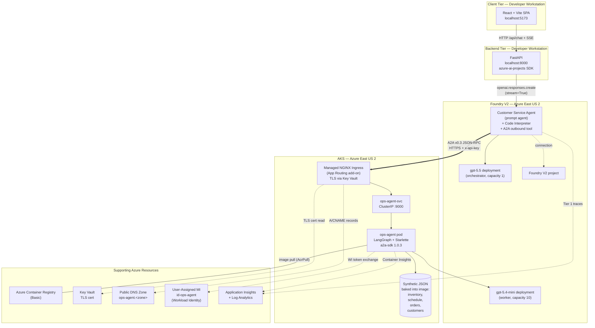
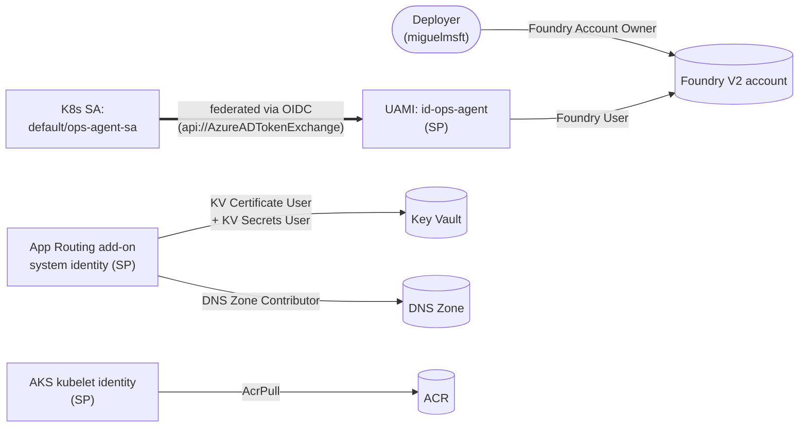

# Architecture — Zava Smart Order Feasibility Demo

> **Scope of this document.** This is the **systems-level architecture reference** for the Zava A2A multi-agent demo. It catalogs every deployable component, where each one lives (local process, Azure resource, Kubernetes object), how they are wired together at the network and identity layers, and how data flows between them.
>
> For **implementation-level concerns** (frameworks, code patterns, A2A wire format, libraries), see [`technology.md`](./technology.md). For **business context and user-facing scenario** see [`use-case.md`](./use-case.md). For **A2A protocol mechanics** see [`a2a-implementation.md`](./a2a-implementation.md). For **future private-VNet variants** see [`private-vnet-considerations.md`](./private-vnet-considerations.md). The canonical step-by-step implementation plan is [`../plan.md`](../plan.md); section anchors of the form §A.x / §F.x in this document refer to it.

---

## 1. Executive Summary

The demo realizes a four-tier architecture deployed across a developer workstation and a single Azure resource group in **East US 2**. The **client tier** is a React + Vite single-page app running on the developer's laptop. The **backend tier** is a FastAPI process — also local — that mediates between the React UI and the Azure-hosted Foundry V2 project via the `azure-ai-projects` SDK. The **agent compute tier** is split: the **Customer Service Agent** is a Foundry V2 prompt agent backed by a `gpt-5.5` (or `gpt-5.4-mini` fallback) Global Standard deployment that runs in Microsoft-managed Foundry capacity, while the **Manufacturing Ops Agent** is a LangGraph application running as a single pod on an AKS cluster the deployer owns. The two agents communicate over the open **A2A v0.3 JSON-RPC protocol** across the public internet, with the Foundry agent acting as A2A client and the AKS pod terminating A2A traffic at a Key Vault-backed TLS ingress. The **data tier** is intentionally minimal: four synthetic JSON files baked into the Ops Agent container image, loaded once at process start, and served read-only by tool functions. All of this stands up via a single Bicep deployment plus three PowerShell scripts; nothing in the demo writes back to Zava's "data of record" because there is no data of record — it is a feasibility demonstrator, not a production transaction system.

---

## 2. High-Level Architecture

The diagram below collapses the deployment into four tiers and shows the direction of every inter-component call. Compare with the simpler diagram in [`../plan.md` §A.2](../plan.md) — this one adds identity, ingress, and registry resources that §A.2 omits for clarity.

**Key observations:**

- The **two agents never share a process**. Their only contract is the A2A v0.3 wire format described in [`technology.md` §5](./technology.md) and [`a2a-implementation.md`](./a2a-implementation.md).
- The Foundry agent's outbound A2A call traverses the **public internet** to reach the AKS ingress — there is no VNet peering, no private endpoint, no Azure backbone shortcut. The TLS cert and `x-api-key` shared secret are the only things gating that hop. See [`private-vnet-considerations.md`](./private-vnet-considerations.md) for what a private variant would look like.
- The **worker model deployment** (`gpt-5.4-mini`) is called by the AKS pod via Workload Identity, not by the Foundry agent. The Foundry agent only calls its own `gpt-5.5` orchestrator deployment plus the A2A outbound tool.
- **No database, no queue, no cache** in this build. The four JSON files are the entire system of record.

---

## 3. Azure Resource Inventory

Every Azure resource is provisioned by a Bicep module under `infra/modules/` (see [`../plan.md` §C Steps 3–7](../plan.md)). All resources land in a single resource group in `eastus2`.

| # | Resource type | API version | Bicep module | Purpose | Region |
|---|---|---|---|---|---|
| 1 | `Microsoft.CognitiveServices/accounts` (kind `AIServices`) | 2026-03-01 | `foundry.bicep` | Foundry V2 account — host for the project and model deployments. `allowProjectManagement: true`, custom subdomain, public network access. | `eastus2` |
| 2 | `Microsoft.CognitiveServices/accounts/projects` | 2026-03-01 | `foundry.bicep` | Foundry V2 project — namespace under which the Customer Service Agent and A2A outbound connection are defined. | `eastus2` |
| 3 | `Microsoft.CognitiveServices/accounts/deployments` — `gpt-5.5` orchestrator | 2026-03-01 | `foundry-models.bicep` | Orchestrator model deployment used by the Foundry Customer Service Agent. `GlobalStandard` SKU, capacity 1. Falls back to `gpt-5.4-mini` (capacity 10) when `useGpt55 = false` per [§F.1 R1](../plan.md). | `eastus2` (global routing) |
| 4 | `Microsoft.CognitiveServices/accounts/deployments` — `gpt-5.4-mini` worker | 2026-03-01 | `foundry-models.bicep` | Worker model deployment used by the LangGraph Ops Agent. Always `gpt-5.4-mini`, `GlobalStandard`, capacity 10. | `eastus2` (global routing) |
| 5 | `Microsoft.OperationalInsights/workspaces` | 2023-09-01 | `appinsights.bicep` | Log Analytics workspace, `PerGB2018`, 30-day retention. Receives Container Insights from AKS. | `eastus2` |
| 6 | `Microsoft.Insights/components` (workspace-based) | 2020-02-02 | `appinsights.bicep` | Application Insights — receives Tier 1 traces from the Foundry project once linked post-deploy. | `eastus2` |
| 7 | `Microsoft.ContainerService/managedClusters` | 2026-02-01 | `aks.bicep` | AKS cluster (`Base/Free` SKU, OIDC issuer on, Workload Identity webhook on, App Routing add-on on, 1× `Standard_D2s_v5` system node, autoscale 1–2). | `eastus2` |
| 8 | `Microsoft.ContainerRegistry/registries` | 2024-11-01-preview | `acr.bicep` | ACR Basic — single image (`ops-agent:latest`). Admin user disabled; AKS kubelet identity has AcrPull. | `eastus2` |
| 9 | `Microsoft.KeyVault/vaults` | 2024-11-01 | `keyvault.bicep` | Holds the CA-issued TLS certificate `tls-cert-ops-agent` that the ingress serves. RBAC-authorized, soft-delete 7 days, no purge protection. | `eastus2` |
| 10 | `Microsoft.Network/dnsZones` (Public) | 2023-07-01-preview | `dns.bicep` | Public DNS zone for the ingress hostname `ops-agent.<zone>`. Deployer is responsible for NS delegation at the registrar. | `global` |
| 11 | `Microsoft.ManagedIdentity/userAssignedIdentities` (`id-ops-agent`) | 2024-11-30 | `identity.bicep` | UAMI federated to the K8s service account `default/ops-agent-sa`. Holds the `Foundry User` role on the Foundry account. | `eastus2` |
| 12 | `Microsoft.ManagedIdentity/.../federatedIdentityCredentials` | 2024-11-30 | `identity.bicep` | Federated credential binding the UAMI to the AKS OIDC issuer + SA subject + `api://AzureADTokenExchange` audience. | `eastus2` |
| 13 | `Microsoft.Authorization/roleAssignments` (×4) | 2022-04-01 | `identity.bicep` (and `main.bicep` for AcrPull) | UAMI→Foundry User on Foundry; App Routing identity→KV Certificate User + KV Secrets User on KV; App Routing identity→DNS Zone Contributor on zone; AKS kubelet identity→AcrPull on ACR. | scoped per resource |

The complete dependency graph between these modules is enforced by `main.bicep`; Foundry account → model deployments, AKS → identity (uses OIDC issuer URL + App Routing object ID), Key Vault + DNS → identity (RBAC scopes), AKS → ACR (AcrPull role assignment).

---

## 4. Network Topology

The demo uses **only public endpoints** and stock DNS. Every hop is HTTPS except the developer-loopback hops to localhost.

```mermaid
flowchart LR
    user(["Developer / customer<br/>browser"])
    ui["React dev server<br/>http://localhost:5173"]
    be["FastAPI<br/>http://localhost:8000<br/>(CORS: localhost:5173 only)"]
    foundryEp["Foundry endpoint<br/>https://&lt;foundry&gt;.services.ai.azure.com<br/>/api/projects/&lt;project&gt;"]
    fa["Customer Service Agent<br/>(prompt agent)"]
    ingDns["DNS A record<br/>ops-agent.&lt;zone&gt;"]
    ing["Ingress LB IP<br/>(managed NGINX, :443)"]
    svc["ops-agent-svc<br/>ClusterIP :9000"]
    pod["ops-agent pod<br/>:9000"]
    worker["gpt-5.4-mini<br/>deployment endpoint"]

    user -- "HTTP" --> ui
    ui -- "fetch /api/* via Vite proxy" --> be
    be -- "HTTPS + Bearer (Entra)" --> foundryEp
    foundryEp --> fa
    fa == "A2A /v1/message:send<br/>HTTPS + x-api-key" ==> ingDns
    ingDns -- "Azure DNS resolution" --> ing
    ing -- "TLS termination<br/>+ host routing" --> svc
    svc --> pod
    pod -- "HTTPS + AAD token<br/>(Workload Identity)" --> worker
```

**Port + path inventory:**

| Hop | Source | Destination | Port | Transport | Auth |
|---|---|---|---|---|---|
| 1 | Browser | React dev server | 5173 | HTTP | none (loopback only) |
| 2 | React app | FastAPI backend | 8000 | HTTP + SSE | none (CORS allowlist `localhost:5173`) |
| 3 | FastAPI | Foundry project endpoint | 443 | HTTPS | Entra ID (`DefaultAzureCredential` → deployer's identity) |
| 4 | Foundry agent runtime | AKS ingress hostname | 443 | HTTPS (A2A JSON-RPC v0.3) | `x-api-key` header (32-byte random) |
| 5 | NGINX ingress | `ops-agent-svc` ClusterIP | 9000 | HTTP | none (intra-cluster) |
| 6 | Ops Agent pod | `gpt-5.4-mini` Foundry deployment | 443 | HTTPS | Entra ID (Workload Identity → UAMI → Foundry User) |

**Things that do not exist in this topology** (and would, in a private variant): VNet, subnets, NSGs, private endpoints, private DNS zones, AKS private cluster, Foundry private endpoint, ExpressRoute. The omitted resources and their justification are documented in [`private-vnet-considerations.md`](./private-vnet-considerations.md).

---

## 5. Identity & RBAC Architecture

Three identity types participate: the **deployer** (a human Entra user), the **Ops Agent UAMI** (the pod's federated workload identity), and the **AKS-managed system identities** (App Routing add-on identity, kubelet identity). The diagram below shows what each can do where.

| Principal | Type | Role | Scope | Granted by | Why |
|---|---|---|---|---|---|
| Deployer (Entra user) | Human | **Foundry Account Owner** (Cognitive Services Contributor + supporting) | Foundry account | manual (per [`../plan.md` §A.8](../plan.md)) | Create project, agent, A2A connection, model deployments; read Tier 1 traces. |
| `id-ops-agent` UAMI | Service principal | **Foundry User** (`53ca6127-…`) | Foundry account | `identity.bicep` | Pod calls `gpt-5.4-mini` worker deployment from inside the LangGraph executor via `AzureChatOpenAI`. |
| `default/ops-agent-sa` | K8s service account | _(federated to UAMI)_ | — | `deployment.yaml` + `identity.bicep` `federatedIdentityCredentials` | OIDC subject `system:serviceaccount:default:ops-agent-sa`, audience `api://AzureADTokenExchange`. |
| App Routing add-on identity | System-assigned SP | **Key Vault Certificate User** (`db79e9a7-…`), **Key Vault Secrets User** (`4633458b-…`) | Key Vault | `identity.bicep` | Pull `tls-cert-ops-agent` and serve it on the ingress. |
| App Routing add-on identity | System-assigned SP | **DNS Zone Contributor** (`befefa01-…`) | DNS zone | `identity.bicep` | Create the A record `ops-agent.<zone>` pointing at the ingress LB IP. |
| AKS kubelet identity | System-assigned SP | **AcrPull** | ACR | `main.bicep` | Pull `ops-agent:latest` from ACR on pod scheduling. |

**No Entra app registrations, no client secrets, no SAS tokens, no static service principal credentials** — every Azure-to-Azure auth uses managed identities, and the one shared secret (`A2A_API_KEY`) lives only in a K8s `Secret` (not committed) and in the Foundry portal A2A connection (entered manually).

---

## 6. Kubernetes Objects Inventory

All K8s objects live in the `default` namespace of a single-node AKS cluster. They are defined in `apps/ops-agent/k8s/` (see [`../plan.md` §C Step 10](../plan.md) for the manifest authoring contract).

| Kind | Name | Defining manifest | Notes |
|---|---|---|---|
| `ServiceAccount` | `ops-agent-sa` | `k8s/deployment.yaml` | Annotated `azure.workload.identity/client-id: <UAMI client ID>`. Federated to UAMI `id-ops-agent`. |
| `Deployment` | `ops-agent` | `k8s/deployment.yaml` | 1 replica. Pod label `azure.workload.identity/use: "true"`. Image `${ACR_LOGIN_SERVER}/ops-agent:latest`, port 9000. Liveness + readiness `GET /health` (period 30s / 10s). Resources: 250 m / 256 Mi requests, 500 m / 512 Mi limits. |
| `Service` | `ops-agent-svc` | `k8s/service.yaml` | `ClusterIP`, port 9000, selector matches the Deployment's pod labels. |
| `Ingress` | `ops-agent` | `k8s/ingress.yaml` | `ingressClassName: webapprouting.kubernetes.azure.com`. Annotation `kubernetes.azure.com/tls-cert-keyvault-uri: https://<kv>.vault.azure.net/certificates/tls-cert-ops-agent`. Host `ops-agent.<DNS_ZONE>`, TLS `secretName: keyvault-ops-agent-ingress` (synthesized by App Routing), backend `ops-agent-svc:9000`. |
| `Secret` | `ops-agent-secrets` | _imperative_ (not committed) | Created by `scripts/deploy-k8s.ps1` with `kubectl create secret generic ops-agent-secrets --from-literal=A2A_API_KEY=$(openssl rand -base64 32)`. Mounted as env var `A2A_API_KEY` on the Deployment. A schema-only `secret.template.yaml` documents the shape but is never applied. |

**Environment variables injected into the pod** (per `deployment.yaml`): `AZURE_OPENAI_ENDPOINT` (Foundry endpoint), `AZURE_OPENAI_DEPLOYMENT` (worker model name), `AZURE_OPENAI_API_VERSION` (`2025-03-01-preview`), `AZURE_CLIENT_ID` (UAMI client ID, signals Workload Identity to `DefaultAzureCredential`), `DATA_DIR` (`/srv/data`), `OPS_AGENT_PUBLIC_URL` (`https://ops-agent.<DNS_ZONE>/` — used in the Agent Card), `A2A_API_KEY` (secretKeyRef).

There is intentionally **no ConfigMap, HPA, PDB, NetworkPolicy, or PVC**. The pod is stateless and ephemeral.

---

## 7. Data Architecture & Lifecycle

The demo's data tier is the simplest possible thing that exhibits the use case credibly. Four JSON files under `apps/ops-agent/data/` (per [`../plan.md` §A.4](../plan.md)):

| File | Shape | Records target | Used by |
|---|---|---|---|
| `inventory.json` | `{ items: [{ sku, on_hand, allocated, reserved, available, reorder_point, supplier_lead_time_days, unit_cost, … }] }` | 12–15 SKUs | `tools.lookup_inventory(sku)` |
| `production_schedule.json` | `{ machines: [{ machine_id, sku_capabilities, capacity_per_day, current_load_pct, available_slots[], … }] }` | 6–8 machines | `tools.lookup_production_schedule(sku)` |
| `order_book.json` | `{ orders: [{ order_id, customer_id, sku, quantity, requested_ship_date, status, priority }] }` | 15–20 orders | `tools.lookup_open_orders(sku)` |
| `customers.json` | `{ customers: [{ customer_id, name, priority_tier, region, payment_terms, annual_volume }] }` | 8–10 customers | `tools.lookup_customer(customer_id)` |

**Lifecycle:**

1. **Build time.** The Dockerfile's runtime stage copies `data/` to `/srv/data` in the image. Data is shipped with the container — there is no volume mount, no init container, no remote fetch.
2. **Pod start.** `apps/ops-agent/app/tools.py` loads each JSON file once into a module-level cached singleton (per [`../plan.md` §C Step 8](../plan.md)). `DATA_DIR=/srv/data` selects the path.
3. **Per A2A request.** Tool functions called by the LangGraph graph perform purely in-memory lookups against the cached singletons. **No writes.** The pod is effectively a read-only fact server with a model attached.
4. **Pod restart.** The cached singletons are rebuilt from the image; nothing persists. Because the data is part of the image, every pod replica sees identical content.

**Production extension path** (out of scope for the demo, documented for completeness):

| Concern | Demo today | Production successor |
|---|---|---|
| Inventory | static JSON in image | Azure SQL or Cosmos DB read replica of the ERP inventory ledger |
| Production schedule | static JSON | Live feed from MES (e.g., SAP DM / ignition historian) via Azure Event Hubs |
| Order book | static JSON | Source-of-record CRM (Dynamics 365) via change-data-capture into Cosmos |
| Customers | static JSON | Master Data Management hub; Foundry agent fetches with row-level security |
| Writes | none | Append-only audit log of feasibility decisions in Azure Storage / Log Analytics |
| Refresh | redeploy pod | Streaming refresh via background asyncio task or sidecar |

Moving from JSON files to a real data tier does not change the agent contract — the `tools.*` functions become async DB calls, but the LangGraph node interface and the A2A artifact schema stay identical.

---

## 8. Failure Modes

This section is intentionally narrow: it catalogs how each component **can fail in the demo as built**, what the user-visible symptom is, and which signal to look at first. None of these failures cascade silently — every path either restarts itself or surfaces an error to the React UI.

| Failure | Trigger | Symptom | Recovery | First signal |
|---|---|---|---|---|
| **Pod crash / OOM** | LangGraph executor exception, OOM kill | A2A request times out; Foundry agent surfaces "A2A call failed" in the chat | K8s `liveness` probe (`GET /health`, 30 s period) restarts the pod; in-flight A2A request is lost (no retry by Foundry today) | `kubectl logs deploy/ops-agent --previous`; pod restart count |
| **Token expiry** | UAMI's AAD token expires (~1 h) | Worker model call returns 401 | `DefaultAzureCredential` refreshes via Workload Identity automatically; `AzureChatOpenAI` retries on the next call | App Insights dependency: `AAD.AcquireTokenForClient` retry |
| **Model rate limit** | Worker `gpt-5.4-mini` exhausts capacity-10 TPM | `AzureChatOpenAI` raises `RateLimitError` (429) | Executor emits A2A `TaskStatusUpdateEvent(FAILED)`; Foundry agent surfaces the error to the user | App Insights exception telemetry; Foundry Tier 1 trace |
| **Foundry agent A2A wiring missing** | A2A outbound connection not created on Foundry portal (R3 per [§F](../plan.md)) | Foundry agent never calls the worker; replies with a generic answer | Re-run `apps/foundry-agent/create_a2a_connection.py` (or portal) | Foundry portal → Agent → Connections tab; absence of A2A span in Tier 1 trace |
| **DNS resolution fails** | Registrar NS delegation incomplete (Q1/R7 per [§F.1](../plan.md)) | Foundry agent's outbound A2A call fails with name resolution error | Verify `dig NS <zone>` returns Azure NS records; fix delegation at registrar | `nslookup ops-agent.<zone>` from any internet host |
| **TLS handshake fails** | KV cert not present, mis-named, or App Routing identity missing KV permissions (Q2/R4 per [§F.1](../plan.md)) | Foundry outbound HTTPS client rejects cert; A2A call fails | Verify cert exists in KV as `tls-cert-ops-agent`; verify identity has KV Certificate User; verify ingress annotation URI matches | `openssl s_client -connect ops-agent.<zone>:443 -servername ops-agent.<zone>`; `kubectl describe ingress ops-agent` |
| **A2A_API_KEY mismatch** | K8s Secret rotated but Foundry portal connection not updated (or vice versa) | A2A server returns 401; Foundry surfaces "A2A call failed" | Compare keys: `kubectl get secret ops-agent-secrets -o jsonpath='{.data.A2A_API_KEY}' \| base64 -d` vs the value on the Foundry portal A2A connection. Re-deploy whichever drifted. | A2A server access log: 401 with `X-Failed-Reason: invalid-api-key` |
| **App Insights link absent** | Foundry project not linked to App Insights post-deploy (R13 per [§F.3](../plan.md)) | Demo works; Tier 1 traces tab is empty | Link in Foundry portal → Project → Tracing → connect App Insights | Foundry portal banner: "No App Insights connected" |

**Q1 (DNS) and Q2 (TLS) are gating risks** per [`../plan.md` §F.1](../plan.md): the demo cannot reach Step 15 (AKS deploy) until both are answered. They are the highest-probability source of post-deploy debugging time.

---

## 9. Cost & Scaling Considerations

### 9.1 Demo cost envelope

The demo is sized for **single-user, on-demand use** — start it, run the scenario, tear it down. A rough daily cost in East US 2 at list price (US currency):

| Component | Unit cost driver | Approx daily cost (running) |
|---|---|---|
| AKS Free tier control plane | $0 | $0.00 |
| 1× `Standard_D2s_v5` system node | ~$0.096 / h | ~$2.30 |
| AKS managed disk (30 GiB Premium SSD) | ~$5 / mo | ~$0.17 |
| ACR Basic | $0.167 / day | $0.17 |
| Foundry account + project (S0) | $0 base | $0.00 |
| `gpt-5.5` orchestrator (Global Standard, capacity 1) | per-token, low volume in demo | $1–5 |
| `gpt-5.4-mini` worker (Global Standard, capacity 10) | per-token, low volume | $0.50–2 |
| Application Insights + Log Analytics (PerGB2018, 30 d retention) | per GB ingested | $0.50–2 |
| Key Vault Standard | per-operation | <$0.10 |
| Public DNS Zone | $0.50 / mo | $0.02 |
| Public IP for ingress LB | ~$0.10 / day | $0.10 |
| **Total** | — | **~$5–10 / day idle, $15–25 / day under demo load** |

This excludes one-time costs (TLS cert, if purchased) and assumes the developer **tears the resource group down** when not actively demoing.

### 9.2 Scaling vectors (in scope)

| Vector | Lever | Limit in the demo |
|---|---|---|
| AKS compute | `agentPoolProfiles[0].count` / autoscaler max | 1–2 nodes (hardcoded in `aks.bicep`) |
| Ops Agent throughput | Deployment `replicas` | 1 (single replica; no HPA) |
| Worker model TPM | `gpt-5.4-mini` deployment `capacity` | 10 (post-deploy Bicep edit + redeploy) |
| Orchestrator model TPM | `gpt-5.5` deployment `capacity` | 1 (Tier 5 quota gate — see [§F.1 R1](../plan.md)) |
| App Insights retention | `retentionInDays` on Log Analytics | 30 days |

### 9.3 Production scaling path (out of scope, for context)

| Concern | Demo posture | Production posture |
|---|---|---|
| Ops Agent replicas | `replicas: 1` | `HorizontalPodAutoscaler` on CPU + RPS; PDB; multi-AZ node pool |
| Stateful tools | none | Async DB-backed tools with connection pooling + circuit breakers |
| Agent versioning | one Foundry agent per environment | Foundry agent versions + blue/green via A2A connection swap |
| Model deployments | one of each | Per-region active/active deployments; A/B test orchestrator models with router |
| Telemetry | Tier 1 traces only | Tier 1 + Tier 2 (AI Gateway: Defender, Purview, token caps) per [`../plan.md` §A.7](../plan.md) |
| Networking | public endpoints + `x-api-key` | Private VNet + Entra ID auth on A2A; see [`private-vnet-considerations.md`](./private-vnet-considerations.md) |
| Data tier | static JSON in image | Cosmos / SQL / Event Hubs (see §7 above) |
| CI/CD | manual `scripts/*.ps1` | GitOps (Flux/Argo) for K8s; azd pipeline for Bicep; signed images |

None of these changes alter the **agent-to-agent contract**. The A2A v0.3 wire format, the Agent Card discovery flow, and the structured feasibility artifact remain stable — which is the architectural property the demo is meant to prove.

---

## 10. Cross-References

- [`technology.md`](./technology.md) — implementation-level deep dive: SDK choices, A2A wire format, code patterns, security model details.
- [`a2a-implementation.md`](./a2a-implementation.md) — A2A protocol mechanics specific to this build.
- [`use-case.md`](./use-case.md) — business scenario, persona, demo script.
- [`how-to-demo.md`](./how-to-demo.md) — run-the-demo playbook.
- [`private-vnet-considerations.md`](./private-vnet-considerations.md) — what would change for a private-networking variant.
- [`../plan.md`](../plan.md) §A.2 (architecture diagram), §A.3 (tech stack), §A.4 (data model), §A.7 (observability), §A.8 (security), §C Steps 3–10 (Bicep + K8s manifests), §F.1 (gating risks).
