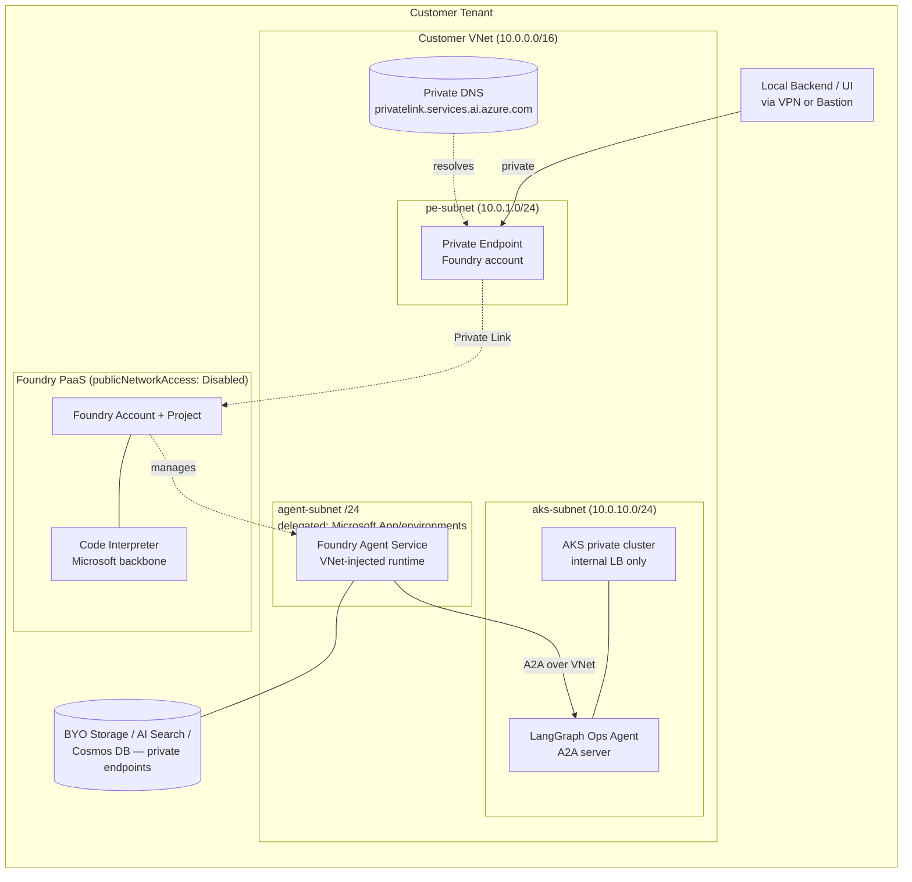

# Private VNet Considerations for A2A on Foundry Agents V2 + AKS

> **Audience:** Technical architects evaluating whether the Zava Smart Order Feasibility demo's pattern (Microsoft Foundry V2 ↔ A2A ↔ LangGraph on AKS) can be deployed inside a private network architecture.
>
> **Document type:** Reference / design guidance. The Zava demo itself **does not** deploy any of the network isolation resources described here — see [§7 — This demo's choice](#7-this-demos-choice). All the architecture below is buildable from official Microsoft documentation, but **none of it has been runtime-verified by this repository**. Where a claim is verified by inspection of public Microsoft documentation, the source is cited inline.

---

## 1. Top-line answer

**Yes — Agent-to-Agent (A2A) on Microsoft Foundry Agents V2 is explicitly supported alongside Foundry's private-VNet network isolation.** A2A traffic flows through the customer's VNet subnet when network isolation is enabled.

> Tool: **Agent-to-Agent (A2A)** — Support Status: **✅ Supported** — Traffic Flow: **Through your VNet subnet**
>
> — Source: Microsoft Learn, [How to configure network isolation for Microsoft Foundry](https://learn.microsoft.com/en-us/azure/foundry/how-to/configure-private-link), reproduced in `research/2026-05-20-foundry-agents.md` §6 and §7.

This means a customer building this same two-agent pattern in production *can* keep all inter-agent traffic on their own private network. The only design constraint is that the A2A target (the LangGraph agent on AKS, in our case) must be reachable from Foundry's injected subnet — same VNet, peered VNet, or via private endpoint.

---

## 2. A2A + Private VNet support matrix

The matrix below is a verbatim subset of the official Foundry tool support matrix when network isolation (VNet injection + private endpoint) is enabled. The full table is reproduced in `research/2026-05-20-foundry-agents.md` §6.

| Capability | Status with Network Isolation | Traffic path |
|---|---|---|
| **Agent-to-Agent (A2A)** | ✅ Supported | Through your VNet subnet |
| MCP Tool (Private MCP) | ✅ Supported | Through your VNet subnet |
| Azure AI Search (BYO) | ✅ Supported | Through private endpoint |
| Code Interpreter | ✅ Supported | Microsoft backbone |
| Function Calling | ✅ Supported | Microsoft backbone |
| OpenAPI tool | ✅ Supported | Through your VNet subnet |
| Azure Functions | ✅ Supported | Through your VNet subnet |
| Bing Grounding / Web Search / SharePoint Grounding | ✅ Supported | Public endpoint (egress only) |
| Fabric Data Agent | ❌ Not supported | Fabric public access required |
| Logic Apps | ❌ Not supported | Under development |
| **File Search** | ❌ **Not supported** | **Under development** |
| Browser Automation | ❌ Not supported | Under development |
| Computer Use | ❌ Not supported | Under development |
| Image Generation | ❌ Not supported | Under development |

— Source: [How to configure network isolation for Microsoft Foundry](https://learn.microsoft.com/en-us/azure/foundry/how-to/configure-private-link).

For the Zava use case (A2A + Code Interpreter on the Foundry side; LangGraph reading CSVs on the AKS side), every required capability is in the **✅ Supported** rows.

---

## 3. How to architect it

A production deployment of the Zava pattern with network isolation has five building blocks:

1. **Foundry resource with `publicNetworkAccess: 'Disabled'`** — turns off the default public endpoint for the Foundry account.
2. **Private endpoint** from the customer VNet to the Foundry resource — gives Foundry a private IP inside the VNet so the local backend / portal can call the Responses API privately.
3. **VNet injection of the Foundry Agent Service** — Foundry runs the Agent runtime inside a customer-delegated subnet (delegated to `Microsoft.App/environments`, `/27` minimum, `/24` recommended), so outbound A2A calls originate from the customer's VNet.
4. **AKS with an internal load balancer** (no public IP) hosting the LangGraph agent's A2A endpoint, addressable from the same VNet (or a peered VNet).
5. **Private DNS zones** for `privatelink.services.ai.azure.com` (Foundry) and the AKS internal LB FQDN, linked to the VNet so name resolution works for the private endpoints.

Per `research/2026-05-20-foundry-agents.md` §6, VNet injection additionally requires **bring-your-own (BYO) Azure Storage, Azure AI Search, and Azure Cosmos DB** with their own private endpoints — these are the Agent Service's state stores. They are not required in the demo's public-endpoint build but become mandatory when network isolation is enabled.

### A2A traffic flow with isolation enabled

1. The Foundry Customer Service Agent decides to invoke the Manufacturing Ops Agent.
2. The A2A client running inside the Agent Service's **injected subnet** opens an HTTPS connection to the AKS internal load-balancer IP.
3. Because both endpoints live in the same VNet (or peered VNets), traffic never leaves the customer's private network.
4. Response artifacts (e.g., the Code Interpreter chart) stay on the Microsoft backbone (Code Interpreter is a managed tool — see matrix above) but the A2A hop itself is fully private.

---

## 4. Bicep snippets (illustrative — not deployed by this repo)

> The snippets below are taken directly from the patterns documented on [Microsoft.CognitiveServices/accounts](https://learn.microsoft.com/en-us/azure/templates/microsoft.cognitiveservices/accounts), [Microsoft.Network/privateEndpoints](https://learn.microsoft.com/en-us/azure/templates/microsoft.network/privateendpoints), and [Kubernetes Services internal LB documentation](https://learn.microsoft.com/en-us/azure/aks/internal-lb). They were verified to compile in isolation with `bicep build` but **are not wired into `infra/main.bicep`**.

### 4.1 Foundry account with public network access disabled

```bicep
// foundry-private.bicep — illustrative
resource foundry 'Microsoft.CognitiveServices/accounts@2026-03-01' = {
  name: foundryName
  location: location
  identity: { type: 'SystemAssigned' }
  kind: 'AIServices'
  sku: { name: 'S0' }
  properties: {
    customSubDomainName: foundryName
    allowProjectManagement: true
    publicNetworkAccess: 'Disabled'
    networkAcls: {
      defaultAction: 'Deny'
      virtualNetworkRules: []
      ipRules: []
    }
  }
}
```

The only change versus this repo's `infra/modules/foundry.bicep` (which uses `publicNetworkAccess: 'Enabled'`) is flipping the access flag and locking down `networkAcls.defaultAction`. Per Microsoft Learn, this alone makes the Foundry data plane reachable only via private endpoint.

### 4.2 Private endpoint from a VNet subnet to the Foundry account

```bicep
// foundry-private-endpoint.bicep — illustrative
param vnetName string
param peSubnetName string
param foundryAccountId string
param location string = resourceGroup().location

resource pe 'Microsoft.Network/privateEndpoints@2024-05-01' = {
  name: 'pe-foundry'
  location: location
  properties: {
    subnet: {
      id: resourceId('Microsoft.Network/virtualNetworks/subnets', vnetName, peSubnetName)
    }
    privateLinkServiceConnections: [
      {
        name: 'foundry-plsc'
        properties: {
          privateLinkServiceId: foundryAccountId
          // groupIds for AIServices accounts: 'account'
          groupIds: [ 'account' ]
        }
      }
    ]
  }
}
```

### 4.3 AKS with an internal load balancer (Service annotation)

The internal LB is configured at the **Kubernetes Service** level rather than the cluster level — AKS provisions a Standard Load Balancer with no public IP when the annotation below is present:

```yaml
# k8s/ops-agent-service.yaml — illustrative
apiVersion: v1
kind: Service
metadata:
  name: ops-agent
  annotations:
    service.beta.kubernetes.io/azure-load-balancer-internal: "true"
spec:
  type: LoadBalancer
  selector:
    app: ops-agent
  ports:
    - port: 443
      targetPort: 8080
```

For full network isolation of the cluster itself, also enable a **private API server** at cluster creation:

```bicep
// aks-private.bicep — illustrative
resource aks 'Microsoft.ContainerService/managedClusters@2024-09-01' = {
  name: aksName
  location: location
  identity: { type: 'SystemAssigned' }
  properties: {
    dnsPrefix: aksName
    apiServerAccessProfile: {
      enablePrivateCluster: true
    }
    networkProfile: {
      networkPlugin: 'azure'
      loadBalancerSku: 'standard'
      outboundType: 'userDefinedRouting'
    }
    agentPoolProfiles: [
      {
        name: 'system'
        count: 2
        vmSize: 'Standard_D2s_v5'
        mode: 'System'
        vnetSubnetID: resourceId('Microsoft.Network/virtualNetworks/subnets', vnetName, aksSubnetName)
      }
    ]
  }
}
```

### 4.4 Private DNS zone link for Foundry

```bicep
// foundry-private-dns.bicep — illustrative
resource zone 'Microsoft.Network/privateDnsZones@2020-06-01' = {
  name: 'privatelink.services.ai.azure.com'
  location: 'global'
}

resource zoneLink 'Microsoft.Network/privateDnsZones/virtualNetworkLinks@2020-06-01' = {
  parent: zone
  name: '${zone.name}-link'
  location: 'global'
  properties: {
    registrationEnabled: false
    virtualNetwork: {
      id: resourceId('Microsoft.Network/virtualNetworks', vnetName)
    }
  }
}
```

The matching `privateDnsZoneGroups` child of the private endpoint (not shown) wires the endpoint NICs into this zone so the Foundry FQDN resolves to the private IP.

---

## 5. Network diagram



The diagram captures the three distinct private paths: (a) developer/UI → Foundry control plane via the private endpoint, (b) Agent Service runtime → LangGraph A2A endpoint inside the VNet, (c) Agent Service runtime → BYO state stores via their own private endpoints.

---

## 6. What's NOT supported or has caveats

The following caveats apply specifically when network isolation is enabled. Sources are cited inline; all statements are **documentation-verified, not runtime-verified by this repository**.

- **File Search tool is unavailable** behind a VNet (listed as "Under development"). Code Interpreter, by contrast, is supported because it runs on the Microsoft backbone. — [Network isolation tool matrix](https://learn.microsoft.com/en-us/azure/foundry/how-to/configure-private-link).
- **Logic Apps, Fabric Data Agent, Browser Automation, Computer Use, Image Generation** are also not yet supported behind a VNet. — same source.
- **Subnet sizing and delegation are strict.** The Agent runtime subnet must be delegated to `Microsoft.App/environments`, sized **/27 minimum** (recommended **/24**), and must use a private IP range from RFC 1918 (`10.0.0.0/8`, `172.16.0.0/12`, `192.168.0.0/16`). — [Foundry Agent Service FAQ](https://learn.microsoft.com/en-us/azure/foundry/agents/faq).
- **BYO state stores are mandatory** for VNet injection — Azure Storage, Azure AI Search, and Azure Cosmos DB must all be customer-provisioned with private endpoints. — [How to configure network isolation for Microsoft Foundry](https://learn.microsoft.com/en-us/azure/foundry/how-to/configure-private-link).
- **Portal vs. SDK provisioning of A2A connections.** The portal's "Create Foundry resource with VNet injection" wizard only appears after BYO resources and `publicNetworkAccess: Disabled` are selected, per the same source. The Foundry Agents service, including A2A connection configuration, is **in preview**, so portal coverage may lag the SDK (`azure-ai-projects`) — provision A2A connections via SDK/Bicep in private deployments, as cited in `research/2026-05-20-foundry-agents.md` §6 and §3.
- **Region co-location.** All resources (Foundry, Agent Service, BYO stores, AKS, private endpoints) must be in the same region as the Foundry resource. VNet peering across regions is supported but not recommended due to data-transfer cost. — [Foundry Agent Service FAQ](https://learn.microsoft.com/en-us/azure/foundry/agents/faq).
- **Foundry Agent Service is in preview.** The whole feature surface — including the A2A tool itself — is preview, so SLAs, regional availability, and tool support can change. — `research/2026-05-20-foundry-agents.md` §1.

---

## 7. This demo's choice

**The Zava demo uses public endpoints for both Foundry and AKS, by design.** This is documented as an explicit project requirement in `.github/copilot-instructions.md` ("Networking for the demo: simple — public endpoints (with sensible auth). Private VNet architecture is documented but NOT implemented in this build.") and is reflected in `plan.md` §A.1 as "Public endpoints only, no private VNet — documented separately in `docs/private-vnet-considerations.md`."

Concretely, the demo's deployed infrastructure differs from the architecture in this document as follows:

| Concern | Demo (this repo) | Private-VNet production pattern |
|---|---|---|
| Foundry `publicNetworkAccess` | `Enabled` (`infra/modules/foundry.bicep`) | `Disabled` |
| Foundry private endpoint | None | Required |
| Foundry Agent Service runtime | Microsoft-managed, public | VNet-injected into customer subnet |
| BYO Storage / AI Search / Cosmos DB | Not used | Required |
| AKS API server | Public | Private cluster |
| LangGraph A2A endpoint | Public Standard LB + ingress | Internal LB only |
| Private DNS zones | None | One per private-linked resource |
| Auth on A2A hop | Microsoft Entra token (bearer) | Same — auth is independent of network plane |

A customer who wants to take this demo to a private-network production deployment should: (1) switch `publicNetworkAccess` to `Disabled` on the Foundry account, (2) provision BYO state stores with private endpoints, (3) move the AKS cluster behind an internal LB with a private API server, (4) link private DNS zones to the VNet, and (5) re-create the A2A connection via SDK so the Agent Service issues calls from its injected subnet. The application-layer code (the A2A client/server, the LangGraph graph, the React UI) does **not** need to change — A2A is HTTPS + Entra auth, both of which are network-plane-agnostic.

---

## 8. References

- Microsoft Learn — [How to configure network isolation for Microsoft Foundry](https://learn.microsoft.com/en-us/azure/foundry/how-to/configure-private-link)
- Microsoft Learn — [Foundry Agent Service FAQ](https://learn.microsoft.com/en-us/azure/foundry/agents/faq)
- Microsoft Learn — [Microsoft.CognitiveServices/accounts (Bicep reference)](https://learn.microsoft.com/en-us/azure/templates/microsoft.cognitiveservices/accounts)
- Microsoft Learn — [Microsoft.Network/privateEndpoints (Bicep reference)](https://learn.microsoft.com/en-us/azure/templates/microsoft.network/privateendpoints)
- Microsoft Learn — [Use an internal load balancer with AKS](https://learn.microsoft.com/en-us/azure/aks/internal-lb)
- Microsoft Learn — [Create a private AKS cluster](https://learn.microsoft.com/en-us/azure/aks/private-clusters)
- This repo — `research/2026-05-20-foundry-agents.md` §6 (Private VNet Support) and §7 (A2A + Private VNet Simultaneously)
- This repo — `research/2026-05-20-foundry-v2.md` (Foundry V2 architecture and resource shape)
- This repo — `research/2026-05-20-aks.md` (AKS topology, load balancer, and ingress)
- This repo — `plan.md` §A.1 (project scope: public endpoints only)
