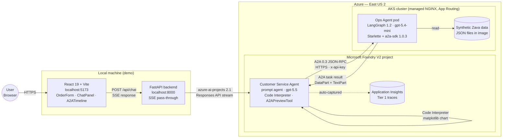
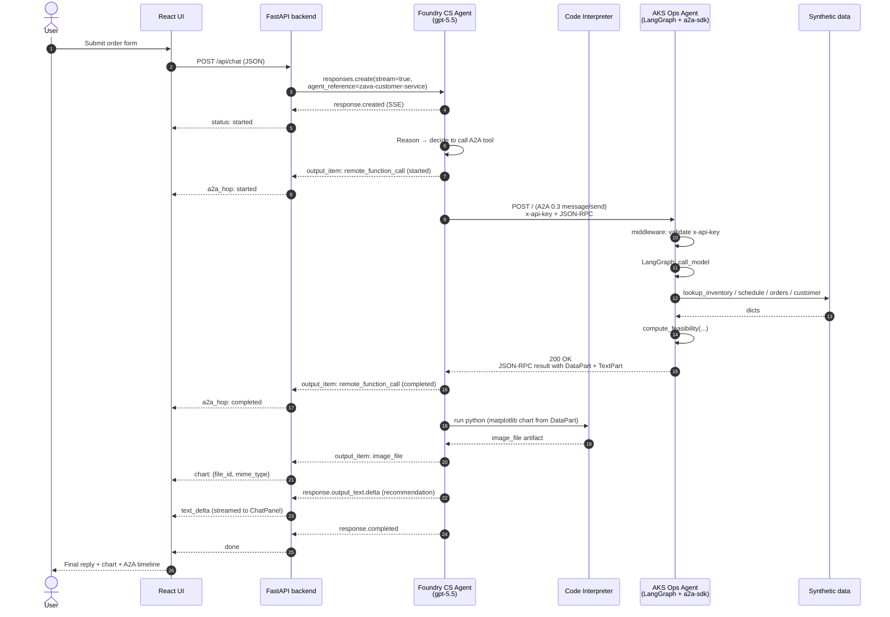

# Zava Smart Order Feasibility — Technology & Implementation

> **Audience:** Senior architect / engineering lead evaluating the Zava A2A demo as a reference implementation. This is the deepest technical document in the repository — it describes how every component is built, what versions are pinned, and how the **A2A (Agent-to-Agent) protocol** is wired across a Microsoft Foundry V2 orchestrator and a LangGraph worker on AKS.
>
> **Companion docs:** [`docs/use-case.md`](use-case.md) (the business scenario), [`docs/private-vnet-considerations.md`](private-vnet-considerations.md) (private-networking variant — out of scope for this build), and [`plan.md`](../plan.md) (especially §A.2 Architecture, §A.3 Tech Stack, §A.5 A2A Contract, §A.7 Observability, §A.8 Security).
>
> **Source-of-truth research reports:** the `research/2026-05-20-*.md` files in this repo. Citations below are inline.

---

## 1. Executive summary

This document describes the technology behind the **Zava Smart Order Feasibility** demo: a two-agent system in which a **Microsoft Foundry V2 Customer Service Agent** receives a customer-facing order-feasibility question and delegates the analytical work to a **LangGraph Manufacturing Ops Agent** running on **AKS**, using the open **A2A v0.3 protocol** as the inter-agent contract. A thin **FastAPI backend** mediates between a **React 19 + Vite** frontend and the Foundry project, streaming agent events back to the browser over **Server-Sent Events (SSE)**.

You will learn how each component is built in concrete versions and code-level patterns (§3, §4); **exactly how A2A is implemented in this project** — wire format, agent-card discovery, authentication, structured artifact passthrough, and the Foundry-portal-vs-SDK constraint that drives the deployment workflow (§5); why the model choices (`gpt-5.5` orchestrator + `gpt-5.4-mini` worker) are appropriate for a delegated-tool-calling pattern (§6); and how identity, transport security, RBAC, and observability are configured for a public-endpoint demo (§7–§9). If you only read one section, read [§5 A2A implementation details](#5-a2a-implementation-details).

---

## 2. Architecture overview



**Numbered data flow**

1. The user fills the order form and submits → `POST /api/chat` to the FastAPI backend.
2. The backend opens a streaming Foundry **Responses API** call via `AIProjectClient.get_openai_client(...).responses.create(stream=True)` (see `apps/backend/app/agent_client.py`).
3. The Foundry **Customer Service Agent** parses the request, then invokes its **A2APreviewTool**, which sends a JSON-RPC `message/send` to the AKS Ops Agent.
4. The Ops Agent's LangGraph `StateGraph` reasons over four data tools (`lookup_inventory`, `lookup_production_schedule`, `lookup_order_book`, `lookup_customer`) and computes a feasibility result via `compute_feasibility`.
5. The Ops Agent returns a v0.3 task with a structured **`DataPart`** (the feasibility dict) and a **`TextPart`** (a human-readable summary).
6. The Foundry agent extracts the structured data and runs **Code Interpreter** to render a matplotlib chart (timeline + risk bars + score gauge).
7. The backend translates Responses API stream events into a small `AgentEvent` taxonomy (`text_delta`, `a2a_hop`, `tool_call`, `chart`, `done`) and forwards them as SSE.
8. The React UI renders the chat reply, the chart, and the **A2A activity timeline** in real time.

---

## 3. Component breakdown

### 3.1 Foundry V2 Customer Service Agent (orchestrator)

| Aspect | Value |
|---|---|
| Foundry experience | **Foundry V2 (project-based, new portal)** — explicitly *not* Foundry Classic / Hubs |
| Agent type | **Prompt agent** (declarative; not a hosted-code agent and not a workflow) |
| Agent name | `zava-customer-service` |
| Model | `gpt-5.5` Global Standard, deployment `gpt-55-orchestrator` (fallback: `gpt-5.4-mini`) |
| Tools | (1) **Code Interpreter** (built-in, GA), (2) **A2APreviewTool** to the Ops Agent |
| Setup | provisioned via `apps/foundry-agent/` (uses `azure-ai-projects` ≥ 2.1.0) |

The Foundry V2 platform is the new project-based AI Foundry experience that Microsoft introduced to replace Foundry Classic / Hubs (see `research/2026-05-20-foundry-v2.md` §1). Within a project, **prompt agents** are server-side definitions that combine an LLM deployment, a system prompt, and a list of tools — invoked through the **Responses API** with an `agent_reference` extra-body parameter. Tool calls (Code Interpreter, A2A) are executed server-side and surfaced back to the client as Responses-API output items (see `research/2026-05-20-foundry-agents.md` §3, §4). Code Interpreter is a sandboxed Python tool that runs matplotlib / pandas / numpy — the orchestrator uses it after receiving the structured feasibility result, so the chart is generated *with* the worker's numbers rather than with hallucinated values.

### 3.2 AKS-hosted Ops Agent (LangGraph worker)

The worker lives in `apps/ops-agent/`. Its core (excerpted from `apps/ops-agent/app/agent.py`) is a tiny **LangGraph `StateGraph`**:

```
START → call_model → (tool_calls?) → call_tools → call_model
                          \_ no _→ END
```

| Aspect | Value |
|---|---|
| Framework | **LangGraph 1.2.0** + `langchain-openai` 1.2.1 + `langchain-core` 1.4.0 |
| LLM | `AzureChatOpenAI` bound to **gpt-5.4-mini** with bearer-token auth via `DefaultAzureCredential` |
| State | Built-in `MessagesState` (no custom reducers needed for this scope) |
| Tools | `lookup_inventory`, `lookup_production_schedule`, `lookup_order_book`, `lookup_customer` (all read JSON in `apps/ops-agent/data/`) |
| Computation | `compute_feasibility(...)` in `app/feasibility.py` produces the canonical numbers; the LLM owns the *narrative* but not the math |
| Server | **Starlette** + **uvicorn**, mounted by **`a2a-sdk[http-server]` 1.0.3** |

LangGraph 1.2 is the version line that decoupled `langgraph` from `langchain` and made `langchain-core` the only required peer (see `research/2026-05-20-langgraph-langchain.md` §2). The "tool-call loop" pattern above is the canonical ReAct-style agent shape from the LangGraph docs (`research/2026-05-20-langgraph-langchain.md` §3). The **synthetic data** (inventory, production schedule, order book, customer profiles) is baked into the container image as JSON files; each tool reads from disk and returns a small dict — no external database, intentionally (see [`docs/use-case.md`](use-case.md) §3 and `plan.md` §A.4 for the schemas).

### 3.3 A2A protocol layer

The bridge between the two agents. See [§5](#5-a2a-implementation-details) for the full deep-dive; this subsection introduces the topology only.

- **Foundry side (client):** the `A2APreviewTool` is a Foundry-managed outbound A2A tool. It is configured via an **A2A connection** on the Foundry project (currently *portal-only* in the V2 preview; see [§5.5](#55-foundry-side-the-portal-only-a2a-connection-constraint)). The orchestrator's prompt says "use the A2A tool to delegate feasibility" — Foundry handles the HTTP plumbing and surfaces the call as a `remote_function_call` output item in the Responses stream (`research/2026-05-20-foundry-agents.md` §5).
- **AKS side (server):** a Starlette app built with `a2a-sdk[http-server]` 1.0.3 — the official Python SDK from the A2A Working Group. The SDK is on the **1.0.x** line but **auto-handles A2A v0.3 requests** when no `A2A-Version` header is present (`research/2026-05-20-a2a-protocol.md` §3.8). This matters because Foundry's `A2APreviewTool` only speaks v0.3 today.
- **Wire format:** **JSON-RPC 2.0 over HTTPS** with v0.3 message shapes (`kind` discriminator, kebab-case enum values). Authentication is a custom `x-api-key` header validated by Starlette middleware on the server.

### 3.4 React UI

`apps/frontend/` — a small but conventional React 19 + Vite app:

| File | Role |
|---|---|
| `src/App.tsx` | Composes the page; owns top-level layout |
| `src/components/OrderForm.tsx` | The customer/SKU/quantity/date form |
| `src/components/ChatPanel.tsx` | Streamed assistant turn (text deltas) |
| `src/components/A2ATimeline.tsx` | The A2A & tool activity log — **the visible "demo magic"** |
| `src/components/ChartDisplay.tsx` | Renders the Code-Interpreter-produced chart |
| `src/hooks/useChat.ts` | SSE consumption (`fetch` + `ReadableStream` reader) |

The **A2ATimeline** is the component that makes the A2A protocol visible to the audience. As the backend forwards `a2a_hop` and `tool_call` events, each becomes a row in the timeline with a status pill (`started` → `completed`). This satisfies the project's primary UX requirement: "show every A2A hop and every agent action" (`.github/copilot-instructions.md`). The UI uses the browser-native `fetch` + `ReadableStream` API for SSE (rather than `EventSource`) so it can `POST` the form payload and stream the response in one round-trip — `EventSource` only supports `GET`.

### 3.5 FastAPI backend

`apps/backend/` — deliberately thin (≈ 10 KB of Python). Its responsibilities:

1. **CORS and origin lock** — only `http://localhost:5173` is allowed.
2. **Schema validation** — `ChatRequest` / `AgentEvent` Pydantic models in `app/models.py`.
3. **Foundry SDK abstraction** — the browser never touches `azure-ai-projects` and never sees `DefaultAzureCredential`; it only sees small `AgentEvent`s.
4. **No credentials in the browser** — auth happens server-side via `DefaultAzureCredential`. This is the canonical reason to have a backend at all in this design.
5. **SSE streaming** — `agent_client.invoke_agent(...)` is an `async` generator that translates Responses API events into `AgentEvent`s; `app/main.py` wraps it in a `StreamingResponse` with `text/event-stream` headers.

A subtle implementation detail (documented in `agent_client.py`): `azure-ai-projects` 2.1.0 returns a **synchronous** `openai.OpenAI` from `AIProjectClient.get_openai_client(...)`. To avoid blocking the FastAPI event loop, the backend pulls one event at a time via `asyncio.to_thread(next, stream_iter)` and duck-types every event field in `_classify_event` so behavioural drift across SDK versions degrades gracefully into a `status` event rather than a 500.

---

## 4. Tech stack with versions

The following table is the authoritative version pinning for the demo. Every Python version is from `apps/*/pyproject.toml`; the JS versions are from `apps/frontend/package.json`; the Bicep API versions are from `infra/modules/*.bicep`.

| Component | Technology | Version | Source of truth |
|---|---|---|---|
| Cloud | Azure (East US 2) | — | `plan.md` §A.3, `.github/copilot-instructions.md` |
| IaC — Foundry | Bicep `Microsoft.CognitiveServices/accounts` | API `2026-03-01` | `infra/modules/foundry.bicep` |
| IaC — Foundry deployments | Bicep `Microsoft.CognitiveServices/accounts/deployments` | API `2026-03-01` | `infra/modules/foundry-models.bicep` |
| IaC — AKS | Bicep `Microsoft.ContainerService/managedClusters` | API `2026-02-01` | `infra/modules/aks.bicep` |
| AI platform | Microsoft Foundry V2 (project-based) | GA | `research/2026-05-20-foundry-v2.md` §1 |
| Orchestrator model | `gpt-5.5` Global Standard | model version `2026-04-24` | `research/2026-05-20-model-availability.md` §5–6 |
| Worker model | `gpt-5.4-mini` Global Standard | model version `2026-03-17` | `research/2026-05-20-model-availability.md` §5–7 |
| Inter-agent protocol | A2A | wire **v0.3** (server SDK 1.0.x in compat mode) | `research/2026-05-20-a2a-protocol.md` §3.8 |
| Foundry SDK | `azure-ai-projects` | `>=2.1.0` (preview) | `apps/backend/pyproject.toml`, `apps/foundry-agent/pyproject.toml` |
| LangGraph | `langgraph` | `>=1.2.0` | `apps/ops-agent/pyproject.toml` |
| LangChain — OpenAI | `langchain-openai` | `>=1.2.1` | `apps/ops-agent/pyproject.toml` |
| LangChain — core | `langchain-core` | `>=1.4.0` | `apps/ops-agent/pyproject.toml` |
| A2A server SDK | `a2a-sdk[http-server]` | `>=1.0.3` | `apps/ops-agent/pyproject.toml` |
| Auth | `azure-identity` | `>=1.17.0` | all `pyproject.toml` |
| Backend framework | `fastapi` | `>=0.115.0` | `apps/backend/pyproject.toml` |
| ASGI server | `uvicorn` | `>=0.46.0` | `apps/backend/pyproject.toml`, `apps/ops-agent/pyproject.toml` |
| Validation | `pydantic` | `>=2.0.0` | `apps/backend/pyproject.toml` |
| Python runtime | CPython | `>=3.13` | `requires-python` in every `pyproject.toml` |
| Frontend framework | React + React DOM | `^19.0.0` | `apps/frontend/package.json` |
| Build tool | Vite | `^6.0.0` (with `@vitejs/plugin-react` `^4.3.4`) | `apps/frontend/package.json` |
| TypeScript | `typescript` | `^5.7.0` | `apps/frontend/package.json` |
| Node runtime | Node.js | `>=22` LTS (`engines` in `package.json`) | `apps/frontend/package.json` |
| AKS Kubernetes | K8s (chosen via Bicep `kubernetesVersion`) | 1.34 or 1.35 | `research/2026-05-20-aks.md` §2 |
| AKS ingress | Application Routing add-on (managed NGINX) | GA | `research/2026-05-20-aks.md` §4.2 |
| Container registry | Azure Container Registry, Basic SKU | — | `infra/modules/acr.bicep` |
| Observability — agent | Application Insights connected to Foundry project (Tier 1 traces) | — | `research/2026-05-20-foundry-control-plane.md` §2.3 |
| Observability — AKS | Container Insights on Log Analytics workspace | — | `research/2026-05-20-aks.md` §7 |

> Versions are expressed as `>=` (Python) or `^` (npm) in the lockless build configs in this repo, which is intentional for a demo. A production hardening would pin exact versions and commit a lockfile per app.

---

## 5. A2A implementation details

This is the core of the document. **A2A** ("Agent-to-Agent") is an open protocol governed by the Linux Foundation's A2A Working Group, with a 1.0 spec and an active 0.3 spec line that Foundry V2 currently targets (see `research/2026-05-20-a2a-protocol.md` §2 for governance and §3 for the wire spec).

### 5.1 Wire format — JSON-RPC 2.0 over HTTPS, v0.3 message shapes

Every A2A call in this demo is a single HTTPS `POST` to the Ops Agent's base URL with a JSON-RPC 2.0 body. The Ops Agent serves at `https://ops-agent.<demo-zone>/`.

**Request — `message/send`** (sent by Foundry's `A2APreviewTool`, reproduced from `plan.md` §A.5):

```json
{
  "jsonrpc": "2.0",
  "id": 1,
  "method": "message/send",
  "params": {
    "message": {
      "role": "user",
      "kind": "message",
      "parts": [
        {
          "kind": "text",
          "text": "Check order feasibility: SKU=ZP-7000, quantity=150, target_date=2026-07-15, customer_id=CUST-001"
        }
      ],
      "messageId": "msg-uuid-abc123"
    }
  }
}
```

The **v0.3 markers** in this payload are the `kind` discriminator field (instead of v1.0's `type`) and the kebab-case enum values (`"kind": "message"`, `"kind": "text"`). Foundry sends these without an `A2A-Version` HTTP header, and the `a2a-sdk` 1.0.x server interprets the absence of that header as "this is a v0.3 request" and parses accordingly (see `research/2026-05-20-a2a-protocol.md` §3.8).

**Response — completed task with structured artifact** (reproduced from `plan.md` §A.5):

```json
{
  "jsonrpc": "2.0",
  "id": 1,
  "result": {
    "id": "task-uuid-xyz789",
    "status": { "state": "completed" },
    "artifacts": [
      {
        "artifactId": "art-uuid-fea123",
        "name": "feasibility-result",
        "parts": [
          {
            "kind": "data",
            "data": {
              "feasibility_score": 0.72,
              "can_fulfill": true,
              "requested_quantity": 150,
              "available_inventory": 25,
              "production_capacity_by_date": 96,
              "supplier_pipeline": 50,
              "total_fulfillable": 171,
              "earliest_promise_date": "2026-07-18",
              "requested_date": "2026-07-15",
              "days_late": 3,
              "risk_factors": [
                "CNC-01 at 75% capacity — limited surge capacity",
                "Supplier lead time 21 days — cutting close for remaining 50 units",
                "3 competing orders for ZP-7000 in same window"
              ],
              "recommendation_text": "Order is feasible with a 3-day delay. Recommend confirming with customer for July 18 ship date. Platinum-tier customer CUST-001 (Apex Hydraulics) qualifies for priority scheduling which could recover 1-2 days."
            }
          }
        ]
      }
    ]
  }
}
```

The key fields in this exchange are summarised below.

| Layer | Field | v0.3 value | Purpose |
|---|---|---|---|
| Transport | HTTPS `POST` | — | Single-shot delivery; SSE streaming is also supported by the SDK but not used here |
| JSON-RPC | `method` | `message/send` | Synchronous task submission (vs. `message/stream` for streaming) |
| Message | `kind` | `"message"` | v0.3 discriminator (v1.0 uses `type`) |
| Message | `role` | `"user"` | Per A2A spec, the calling agent is the "user" relative to the responding agent |
| Part | `kind: "text"` | — | Free-form text part (the request prompt) |
| Part | `kind: "data"` | — | **Structured JSON part** — the contract surface of the demo |
| Task | `status.state` | `"completed"` | v0.3 enum value for terminal success (kebab-case where multi-word) |
| Artifact | `artifactId`, `name`, `parts[]` | — | One artifact carries the feasibility result; multiple parts allowed |

### 5.2 Agent Card discovery

The Ops Agent publishes a **public agent card** at `GET https://ops-agent.<demo-zone>/.well-known/agent-card.json`. The agent card declares the agent's name, description, supported skills, and authentication scheme (in our case, an `apiKey` security scheme with the header name `x-api-key`). This is the standard A2A discovery endpoint specified in `research/2026-05-20-a2a-protocol.md` §3.6. The Foundry-side A2A connection consumes this card to register the worker as a callable A2A endpoint inside the Foundry project.

### 5.3 Authentication — `x-api-key` with constant-time comparison

The plan locks A2A auth to **key-based auth** for the demo (`plan.md` §A.8): the deploy script generates a random 32-byte secret (`openssl rand -base64 32`), stores it as the `A2A_API_KEY` environment variable on the Ops Agent pod (sourced from a Kubernetes `Secret` named `ops-agent-secrets`), and registers the same key on the Foundry-side A2A connection. On the server, a Starlette middleware in front of the `a2a-sdk` app:

1. Reads the configured key from `A2A_API_KEY` at startup.
2. **Fail-secure:** if the env var is unset or empty, the middleware refuses **all** requests with HTTP 503 — there is no "auth disabled" mode.
3. On every `POST` to `/`, compares the inbound `x-api-key` header to the configured key using `hmac.compare_digest` (constant-time) to prevent timing attacks.
4. Returns `401 Unauthorized` on mismatch *before* the request reaches the JSON-RPC handler.

This approach was chosen over OAuth/Entra-ID-issued JWTs to keep the Foundry-portal A2A-connection configuration simple — A2A connections in the Foundry V2 preview today only support a small set of credential types, with `apiKey` being the most stable (`research/2026-05-20-foundry-agents.md` §5).

### 5.4 Structured artifact passthrough — avoiding the "opaque string" failure mode

A common A2A wiring mistake is to return only a `TextPart` containing JSON-as-a-string. The orchestrator then has to instruct its LLM to "parse the JSON and don't hallucinate", which is exactly the kind of brittle hand-off that erodes demo reliability (tracked as **R16** in `plan.md` §F). The Zava demo avoids this by returning **two parts** in the artifact: a `kind: "data"` `DataPart` containing the typed feasibility dict (which the orchestrator passes verbatim into Code Interpreter as a Python dict literal — never "parses JSON from a string"), and a `kind: "text"` `TextPart` containing `recommendation_text` (used directly in the user-visible chat reply). The worker's `compute_feasibility(...)` (in `apps/ops-agent/app/feasibility.py`) produces the canonical dict; the LangGraph agent's system prompt (in `apps/ops-agent/app/agent.py`) instructs the LLM to emit exactly the schema the orchestrator expects; and the `a2a-sdk` `AgentExecutor` wraps this into the v0.3 task artifact.

### 5.5 Foundry side — the portal-only A2A connection constraint

The Foundry V2 `A2APreviewTool` is configured by attaching an **A2A connection** to the project — analogous to other "tool connection" types (Bing Search, Logic Apps, etc.). At the time the Zava demo was implemented, **A2A connection management is portal-only in Foundry V2 preview** (see `research/2026-05-20-foundry-agents.md` §5 for the matrix and `docs/private-vnet-considerations.md` §5 for the implications when private endpoints get involved). The repo's deployment workflow:

1. Bicep provisions the Foundry account, project, and model deployments declaratively.
2. The deploy script attempts the A2A-connection setup via the `azure-ai-projects` SDK first; if the API surface is not available, it prints clear portal instructions and pauses.
3. A human operator enters the AKS A2A endpoint URL and the API key in the Foundry portal once.
4. The deploy script then calls `azure-ai-projects` to register the `zava-customer-service` prompt agent, referencing the existing connection.

This is documented as a known limitation (§10) and tracked in `plan.md` §F.

### 5.6 End-to-end sequence diagram



---

## 6. Model selection rationale

Two different model deployments are used — this is intentional and matches how the agents differ in workload (`research/2026-05-20-model-availability.md` §5–7).

- **Orchestrator: `gpt-5.5` (Global Standard, East US 2).** The Customer Service Agent has to (1) parse a free-form user request, (2) decide *whether* to call A2A, (3) interpret a structured feasibility dict, and (4) drive Code Interpreter to produce a chart. This is reasoning-heavy with a multi-step tool plan, and benefits from `gpt-5.5`'s improved tool selection and longer context window. `gpt-5.5` requires Tier 5 quota; the Bicep parameter `useFallbackModel = true` swaps it for `gpt-5.4-mini` if quota is unavailable, and the demo continues to function (with slightly lower-fidelity prose).
- **Worker: `gpt-5.4-mini` (Global Standard, East US 2).** The Ops Agent has a strict schema to fill, four tools to call in a predictable order, and a deterministic Python helper (`compute_feasibility`) doing the actual math. This profile rewards **fast, cheap tool-calling** over deep reasoning — exactly what `gpt-5.4-mini` is optimised for. Crucially, `gpt-5.4-mini` has no quota gate today, so it is safe to assume availability.

Both models are confirmed to support A2A on Foundry V2 (`research/2026-05-20-model-availability.md` §7) — the demo would not have shipped with a model that didn't.

---

## 7. Security model

| Concern | Implementation | Reference |
|---|---|---|
| AKS → Foundry auth | **Workload Identity**: a User-Assigned Managed Identity (UAMI) federated to a Kubernetes service account; the Ops Agent pod authenticates to Azure OpenAI via `DefaultAzureCredential` with no secrets on disk | `research/2026-05-20-aks.md` §5 |
| Public AKS endpoint | HTTPS-only via the **Application Routing add-on** (managed NGINX); CA-issued TLS certificate stored in **Key Vault** and consumed via the add-on's Key Vault integration | `research/2026-05-20-aks.md` §4.2, §4.4 |
| DNS | Azure DNS public zone with an A record `ops-agent.<demo-zone>` pointing at the NGINX public IP | `research/2026-05-20-aks.md` §4.4 |
| Foundry RBAC (deployer) | `Foundry Account Owner` (a.k.a. "Azure AI Account Owner") on the Foundry account | `research/2026-05-20-foundry-v2.md` §4 |
| Foundry RBAC (UAMI) | `Foundry User` on the project — read-only enough to call deployments, restrictive enough that a leaked pod credential cannot reconfigure the agent | `research/2026-05-20-foundry-v2.md` §4 |
| Container pull | AKS kubelet identity has `AcrPull` on the ACR registry — no docker secrets in the cluster | `research/2026-05-20-aks.md` §3.2 |
| A2A authentication | `x-api-key` header validated in constant time; fail-secure if key env var unset (see [§5.3](#53-authentication--x-api-key-with-constant-time-comparison)) | `plan.md` §A.8 |
| CORS | FastAPI allows `http://localhost:5173` only | `apps/backend/app/main.py` |
| Secrets | Environment variables only; no committed credentials. Demo deploy script writes the A2A key to a Kubernetes `Secret` and to the Foundry portal connection — never to a file in the repo | `.github/copilot-instructions.md` |

What this model is **not**: it is not a private-network deployment. The Foundry account has public network access, and the AKS ingress is a public IP. The hardened private-VNet variant (private endpoints, private DNS zones, the trade-offs around Foundry's `disableLocalAuth`, and the current portal-vs-API gaps) is documented separately in [`docs/private-vnet-considerations.md`](private-vnet-considerations.md) and is explicitly out of scope for this build.

---

## 8. Observability

**Tier 1 — server-captured agent traces (in scope):**

- The Foundry project is connected to a single Application Insights resource (provisioned by `infra/modules/appinsights.bicep`).
- Tracing is enabled at the project level — for **prompt agents**, this is **automatic**: model calls, tool calls (Code Interpreter, A2APreviewTool), inputs, outputs, latency, and token usage are captured server-side without any client-side OpenTelemetry instrumentation. This is the explicit Foundry V2 design (see `research/2026-05-20-foundry-control-plane.md` §2.3).
- Traces are visible from two surfaces: Foundry portal → Project → Agents → **Traces** tab (90-day retention), and Azure portal → Application Insights → **Agents (Preview)** blade.

**AKS-side observability:**

- **Container Insights** is enabled on the cluster, writing pod logs and metrics to a Log Analytics workspace.
- The Ops Agent emits structured JSON logs via Python's `logging` module; KQL queries on the workspace can correlate an A2A request id with the pod log entries that handled it.

**Tier 2 (out of scope):** AI Gateway with Defender/Purview integration, fleet-wide token enforcement, and policy. Justifiable for production multi-agent fleets but not for a single-orchestrator + single-worker demo (`research/2026-05-20-foundry-control-plane.md` §8).

---

## 9. Known limitations and tradeoffs

1. **A2A is in Preview on Foundry V2.** The `A2APreviewTool` and A2A connections are subject to schema and behavioural change. The pinned protocol version is **0.3**, and the demo relies on the `a2a-sdk` 1.0.x server's v0.3 compatibility shim (`research/2026-05-20-a2a-protocol.md` §3.8). When Foundry adds 1.0 support, the wire format will change (`type` instead of `kind`, snake_case enums) but the `DataPart` + `TextPart` *contract* should remain stable.
2. **A2A connections are portal-only.** Full IaC of the A2A connection itself is blocked on the Foundry V2 SDK exposing the connection-create API (see §5.5; tracked in `plan.md` §F).
3. **`gpt-5.5` quota gate.** Subscriptions without Tier 5 quota cannot deploy `gpt-5.5`. The Bicep `useFallbackModel` parameter swaps both deployments to `gpt-5.4-mini` so the demo still runs end-to-end.
4. **Public endpoints by design.** The AKS Ops Agent and the Foundry account both use public network access. For a hardened deployment, see [`docs/private-vnet-considerations.md`](private-vnet-considerations.md).
5. **Single-pod AKS deployment, not HA.** The Ops Agent runs as a single replica with no PodDisruptionBudget and no autoscaling. Production would want ≥ 2 replicas across zones, a readiness probe gating ingress, and HPA on CPU + concurrent requests.
6. **Synthetic data is static and image-baked.** Every redeploy ships the same JSON files. A production version would externalise this to a database with a versioned schema.
7. **Backend is local-only.** The FastAPI backend runs on the demo operator's laptop with `DefaultAzureCredential` resolving to their developer identity. Hosting it (App Service, Container Apps) is straightforward but unimplemented here.

---

## 10. Where to go next

- **Run the demo.** See `docs/how-to-demo.md` (forthcoming) for the operator's runbook.
- **Read the use case.** [`docs/use-case.md`](use-case.md) frames the business scenario this technology serves.
- **Plan a hardened deployment.** [`docs/private-vnet-considerations.md`](private-vnet-considerations.md) walks through the private-endpoint variant.
- **Inspect the A2A wire details.** `docs/a2a-implementation.md` (forthcoming) goes one level deeper than [§5](#5-a2a-implementation-details), with verbatim SDK-level code excerpts.
- **Read the plan.** [`plan.md`](../plan.md) — especially §A.2 Architecture, §A.5 A2A Contract, and §F Risk Register — for the full design rationale.
