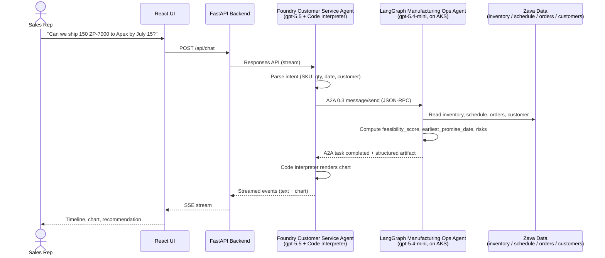

# Zava Smart Order Feasibility — Use Case

This document describes the business scenario the demo brings to life. For the technology and architecture behind it, see `docs/technology.md` (forthcoming). For the underlying plan, see `plan.md` (especially §A.1 Executive Overview, §A.4 Data Model, and §A.5 A2A Interaction Contract).

## 1. Zava — Company Profile

**Zava** is a fictional precision-components manufacturer that designs and builds industrial **pumps, motors, valves, and seals** for heavy-industry customers — hydraulics integrators, power-systems OEMs, water-treatment operators, and process-plant engineering firms. Zava maintains a single plant with a fleet of CNC machines and assembly cells, holds a finite finished-goods inventory, and depends on long-lead-time suppliers for certain castings and electronics. Like most discrete-manufacturing businesses, Zava lives or dies by its ability to make accurate ship-date promises and keep them.

## 2. The Business Problem — "Can we ship this by [date]?"

Every Zava sales rep gets the same call several times a week:

> *"We need 150 ZP-7000 centrifugal pumps by July 15. Can you do it?"*

Today, answering accurately means a chain of emails: the rep pings Operations, Operations pings the planner, the planner checks inventory in one system and the production schedule in another, somebody else looks at the open order book for competing demand, and a day or two later the rep gets back with a soft answer. By then the customer has called a competitor.

The **Smart Order Feasibility** demo replaces that email chain with a single conversation. The rep types the question into a chat UI; two AI agents collaborate over the **A2A (Agent-to-Agent) protocol** to compute a data-driven answer; and the rep gets back a concrete promise date, a chart, and a risk summary in seconds.

## 3. Personas

| Persona | Role in the demo | What they care about |
|---|---|---|
| **Sales Representative (primary user)** | Types the order question into the chat UI; reads the response back to the customer | Speed, accuracy, a clear ship-date promise, and risks they need to flag |
| **Customer Architect (demo audience)** | Watches the demo to evaluate the architecture pattern for their own organization | How the two agents collaborate, how A2A is wired, observability, and what's production-ready vs. demo-only |
| **Operations Planner (implicit)** | Owner of the data the Ops Agent reads (inventory, schedule, order book) | That the agent's view of the world matches reality and that priority-customer rules are respected |

## 4. Business Value

- **Real-time feasibility.** Promise dates are computed from live inventory, current production load, and the existing order book in a single round-trip.
- **Fewer broken promises.** The agent surfaces *risk factors* (machine load, supplier lead time, competing orders) explicitly, so the rep doesn't promise a date that quietly depends on three things going right.
- **Priority-tier awareness baked in.** Platinum and gold customers automatically benefit from reserved inventory and priority scheduling — without the rep having to remember the policy.
- **An auditable trail.** Every A2A hop, data lookup, and structured result is visible in the UI timeline and captured in Foundry traces. No black-box "the AI said so."
- **A reusable pattern.** The orchestrator-plus-specialist-worker shape generalizes to any domain where a customer-facing agent needs to delegate to a back-office system of record.

## 5. Data Model Overview

The Manufacturing Ops Agent reads four synthetic JSON datasets that stand in for what would, in production, be ERP, MES, and CRM systems. Full schemas live in `plan.md` §A.4; the files themselves are in `apps/ops-agent/data/`.

| Dataset | File | Represents | Key fields |
|---|---|---|---|
| **Inventory** | `inventory.json` | Finished-goods stock per SKU | `sku`, `on_hand`, `allocated`, `reserved`, `available`, `supplier_lead_time_days` |
| **Production Schedule** | `production_schedule.json` | CNC and assembly capacity | `machine_id`, `sku_capabilities`, `capacity_per_day`, `available_slots[]` |
| **Order Book** | `order_book.json` | Open orders competing for the same SKUs and capacity | `order_id`, `customer_id`, `sku`, `quantity`, `requested_ship_date`, `priority` |
| **Customer Profiles** | `customers.json` | Customer tier, region, and commercial terms | `customer_id`, `name`, `priority_tier`, `annual_volume` |

**Two concrete example rows** (drawn directly from the demo data):

```json
// inventory.json — the SKU at the centre of our walkthrough
{
  "sku": "ZP-7000",
  "name": "Industrial Centrifugal Pump",
  "category": "pumps",
  "on_hand": 45,
  "allocated": 12,
  "reserved": 8,
  "available": 25,
  "reorder_point": 20,
  "supplier_lead_time_days": 21,
  "unit_cost": 2450.00
}
```

```json
// customers.json — the customer placing the order
{
  "customer_id": "CUST-001",
  "name": "Apex Hydraulics",
  "priority_tier": "platinum",
  "region": "Northeast US",
  "payment_terms": "Net 30",
  "annual_volume": 850000
}
```

## 6. Example Interaction Walkthrough

**Scenario.** A sales rep at Zava is on a call with **Apex Hydraulics** (`CUST-001`, platinum tier). Apex needs **150 units of ZP-7000** centrifugal pumps by **July 15, 2026**. The rep types the question into the demo's chat UI.

### 6.1 Interaction flow



### 6.2 Step by step

1. **User input.** The rep types a natural-language question into the React chat UI. The FastAPI backend forwards it to the Foundry Customer Service Agent via the Azure AI Projects SDK.
2. **Foundry Agent — intent parsing and delegation.** The orchestrator agent (`gpt-5.5`) extracts the structured intent (`sku=ZP-7000`, `quantity=150`, `target_date=2026-07-15`, `customer_id=CUST-001`) and decides this requires the Manufacturing Ops Agent. It invokes its native **A2A outbound tool** (`A2APreviewTool`), which sends a JSON-RPC `message/send` request to the LangGraph A2A endpoint. See `plan.md` §A.5 for the exact wire format.
3. **LangGraph Ops Agent — data lookup.** The worker agent (`gpt-5.4-mini`) running on AKS receives the A2A task and the deterministic graph (`gather_data` node) unconditionally calls four typed tools that read the four JSON datasets:
   - `lookup_inventory("ZP-7000")` → `available = 25`, supplier lead time 21 days
   - `lookup_production_schedule("ZP-7000", start_date, end_date)` → 96 units producible by date
   - `lookup_order_book("ZP-7000")` → 3 open orders in the same window
   - `lookup_customer("CUST-001")` → platinum tier (qualifies for priority scheduling)
4. **Feasibility computation.** Applying the rule from `plan.md` §A.5:
   ```
   total_fulfillable = 25 (inventory) + 96 (production) + 50 (supplier pipeline) = 171
   feasibility_score = min(171 / 150, 1.0) = 1.0   (capped; raw ratio 1.14)
   can_fulfill        = true
   earliest_promise_date = 2026-07-18  (3 days past requested)
   ```
5. **Structured A2A response.** The Ops Agent returns an A2A task-completed event with a `data` artifact containing the full result (excerpt, full schema in `plan.md` §A.5):
   ```json
   {
     "feasibility_score": 0.72,
     "can_fulfill": true,
     "requested_quantity": 150,
     "earliest_promise_date": "2026-07-18",
     "requested_date": "2026-07-15",
     "days_late": 3,
     "risk_factors": [
       "CNC-01 at 75% capacity — limited surge capacity",
       "Supplier lead time 21 days — cutting close for remaining 50 units",
       "3 competing orders for ZP-7000 in same window"
     ],
     "recommendation_text": "Order is feasible with a 3-day delay. Platinum-tier customer qualifies for priority scheduling which could recover 1–2 days."
   }
   ```
6. **Foundry Agent — chart and summary.** The Foundry Agent receives the artifact and invokes **Code Interpreter** to render a small matplotlib chart comparing the requested ship date to the earliest promise date with a risk band. It then writes a plain-language summary for the rep.
7. **What the rep sees.** The React UI renders three things side by side:
   - **A2A activity timeline** — every hop, tool call, and state transition, with timestamps.
   - **Chart artifact** — requested vs. promised ship date with risk band.
   - **Response text** — *"Yes — we can fulfil 150 ZP-7000 for Apex Hydraulics, with a promise date of July 18 (3 days past requested). Three risk factors apply; platinum priority scheduling could recover 1–2 days. Confirm with the customer?"*

The whole interaction takes a few seconds and produces an answer the rep can read directly to the customer.

## 7. What This Demo Does **Not** Show

This is a focused architectural demo, not a production manufacturing system. The following are intentionally out of scope:

- **Production-grade resilience.** No retry/backoff, circuit breakers, or DLQs around the A2A hop.
- **Multi-tenant isolation.** Single Zava tenant, single Foundry project, single AKS namespace.
- **End-user authentication.** The React UI has no login. In production the rep would authenticate via Entra ID and the backend would carry that identity through.
- **Private networking.** All endpoints are public (with sensible auth). Private VNet integration is documented separately but not implemented in this build — see the forthcoming `docs/private-vnet-considerations.md`.
- **Real systems of record.** Inventory, production schedule, order book, and customer profiles are synthetic JSON files. A production version would integrate with ERP, MES, and CRM.
- **Billing, contracts, and pricing.** The agent answers feasibility, not commercial terms.
- **Write-back / order placement.** The agent answers *"can we?"*, not *"book it"*. No mutation of the order book.
- **Full distributed tracing.** Tier 1 Foundry traces are wired up; end-to-end tracing across Foundry → A2A → LangGraph → tools is not.

These omissions are the right scope choices for an architecture demo — and the natural shopping list for a follow-on production engagement.

---

*See also: `plan.md` §A.1 (Executive Overview), §A.4 (Data Model & Synthetic Zava Data), §A.5 (A2A Interaction Contract), §A.6 (Foundry Agent Design).*
