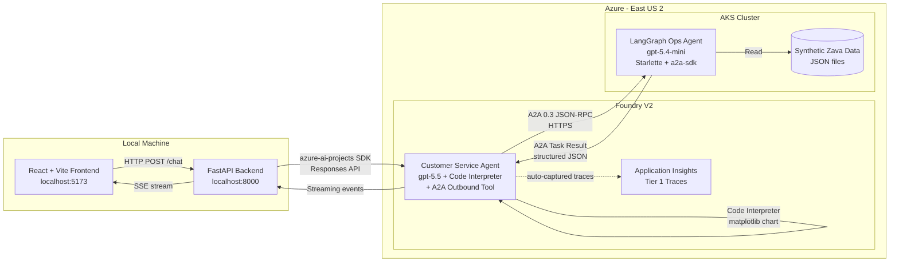
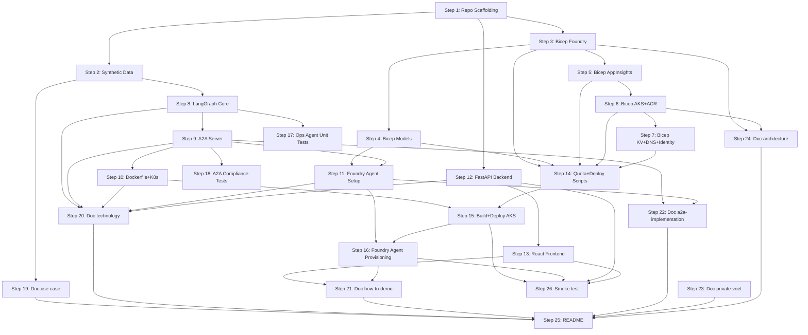

# Zava Smart Order Feasibility — A2A Multi-Agent Demo: Implementation Plan

**Plan slug:** `zava-a2a-demo`
**Created:** 2026-05-20
**Status:** Approved (Round 2) — ready for implementation

---

## Part A — System & Architecture

### A.1 Executive Overview

The Zava Smart Order Feasibility demo is an external-customer-facing demonstration showing two AI agents collaborating via the **A2A (Agent-to-Agent) protocol** to answer a practical manufacturing question: "Can Zava fulfill this order by this date?" A **Foundry V2 Customer Service Agent** (orchestrator) receives the user's request through a React chat UI, delegates the feasibility computation to a **LangGraph Manufacturing Ops Agent** running on AKS via an A2A 0.3 task, receives structured feasibility results, renders a chart via Code Interpreter, and returns a rich response to the user. The React frontend visualizes every A2A hop, tool call, and agent action in real time. All infrastructure is deployed via Bicep to Azure East US 2.

**Capabilities:**
1. User submits an order feasibility query (SKU, quantity, target date, customer) through a React chat UI
2. Foundry Customer Service Agent reasons about the request and delegates feasibility analysis to the LangGraph Ops Agent via A2A 0.3
3. LangGraph Ops Agent queries synthetic Zava data (inventory, production schedule, order book, customer profile) and computes a feasibility score
4. LangGraph Ops Agent returns structured JSON (feasibility_score, earliest_promise_date, risk_factors, recommendation) via A2A task completion
5. Foundry Agent synthesizes the response and uses Code Interpreter to render a chart (promised vs requested ship date with risk band)
6. React UI displays the full A2A interaction timeline, agent actions, and chart artifact
7. Tier 1 observability: Foundry project traces visible in Application Insights

**Key constraints:**
- Public endpoints only (private VNet documented but not implemented)
- Public GitHub repo — no secrets committed
- A2A preview on Foundry (v0.3 only), `a2a-sdk` 1.0.x in 0.3 compatibility mode
- `gpt-5.5` requires Tier 5 quota; fallback to dual `gpt-5.4-mini` if unavailable

### A.2 Architecture Diagram



**Data flow (numbered):**
1. User fills order form in React UI → POST `/api/chat` to FastAPI backend
2. Backend creates/resumes Foundry agent conversation via `azure-ai-projects` SDK (`openai.responses.create(stream=True)`)
3. Foundry Agent reasons, invokes A2A outbound tool (`A2APreviewTool`) → JSON-RPC `message/send` to AKS endpoint
4. LangGraph Ops Agent receives A2A task, queries synthetic data, computes feasibility
5. LangGraph returns `TaskStatusUpdateEvent(COMPLETED)` + artifact with structured JSON
6. Foundry Agent receives A2A result, invokes Code Interpreter to render chart
7. Backend streams Foundry response events (including chart file) back to React via SSE
8. React renders chat response, chart image, and A2A activity timeline

### A.3 Tech Stack

| Component | Choice | Version | Rationale | Research Citation |
|---|---|---|---|---|
| **Cloud** | Azure | — | User requirement | `.github/copilot-instructions.md` |
| **IaC** | Bicep | API `2026-03-01` (Foundry), `2026-02-01` (AKS) | User requirement; current GA versions | `foundry-v2.md` §3, `aks.md` §3.1 |
| **AI Platform** | Microsoft Foundry V2 (project-based) | GA | New experience, supports Agents V2 + A2A | `foundry-v2.md` §1, `foundry-agents.md` §1 |
| **Orchestrator Model** | `gpt-5.5` (Global Standard, East US 2) | 2026-04-24 | Best reasoning; supports A2A + Code Interpreter | `model-availability.md` §5–6 |
| **Worker Model** | `gpt-5.4-mini` (Global Standard, East US 2) | 2026-03-17 | Cost-efficient; no access gate; supports A2A | `model-availability.md` §5–7 |
| **Inter-agent Protocol** | A2A v0.3 (Foundry native) | 0.3 | Foundry supports 0.3 only; `a2a-sdk` has 0.3 compat mode | `a2a-protocol.md` §3.8, `foundry-agents.md` §5 |
| **Agent Pattern** | Orchestrator + Specialist Worker | — | Canonical A2A pattern for delegation | `a2a-use-cases.md` §2.1 |
| **Worker Runtime** | LangGraph + langchain-openai | LangGraph 1.2.0, langchain-openai 1.2.1 | Official recommendation for stateful agents | `langgraph-langchain.md` §2 |
| **A2A Server SDK** | `a2a-sdk[http-server]` | 1.0.3 | Official A2A Python SDK; 0.3 compat mode | `langgraph-langchain.md` §3, `a2a-protocol.md` §3.8 |
| **A2A Server Framework** | Starlette + uvicorn | — | Standard pattern from a2a-samples | `langgraph-langchain.md` §3 |
| **Foundry SDK** | `azure-ai-projects` | 2.1.0 (preview) | Official Foundry Agent Service SDK | `foundry-agents.md` §3 |
| **Auth** | `azure-identity` | ≥1.17.0 | DefaultAzureCredential for all Azure calls | `aks.md` §5, `foundry-v2.md` §4 |
| **AKS** | Free tier, 1–2 nodes Standard_D2s_v5 | K8s 1.34 or 1.35 | Cost-efficient demo cluster | `aks.md` §2.1–2.3 |
| **Ingress** | Application Routing add-on (managed NGINX) | GA | Built-in TLS via Key Vault + Azure DNS | `aks.md` §4.2 |
| **Container Registry** | Azure Container Registry (Basic) | — | `az acr build` for simplicity | `aks.md` §6 |
| **Observability** | App Insights → Foundry project; Container Insights for AKS | — | Tier 1 traces auto-captured for prompt agents | `foundry-control-plane.md` §2.3, `aks.md` §7 |
| **Frontend** | React 19 + Vite + TypeScript | Node 22 LTS | User requirement; modern DX | `.github/copilot-instructions.md` |
| **Local Backend** | FastAPI (Python) | Python 3.13 | Bridges React UI ↔ Foundry SDK; async streaming | `.github/copilot-instructions.md` |
| **Containerization** | Docker | — | Standard for AKS deployment | `aks.md` §6 |

### A.4 Data Model & Synthetic Zava Data

All synthetic data is stored as JSON files in `apps/ops-agent/data/`. The LangGraph agent reads these at startup and queries them via tool functions.

#### A.4.1 Inventory (`inventory.json`)

```json
{
  "$schema": "Inventory",
  "items": [
    {
      "sku": "ZP-7000",
      "name": "Industrial Centrifugal Pump",
      "category": "pumps",
      "on_hand": 45,
      "allocated": 12,
      "reserved": 8,
      "available": 25,
      "reorder_point": 20,
      "supplier_lead_time_days": 21,
      "unit_cost": 2450.00
    }
  ]
}
```

**Fields:** `sku` (string, PK), `name`, `category` (pumps|motors|valves|seals), `on_hand` (int), `allocated` (int, committed to open orders), `reserved` (int, held for priority customers), `available` (int = on_hand − allocated − reserved), `reorder_point` (int), `supplier_lead_time_days` (int), `unit_cost` (float).

Target: 12–15 SKUs covering pumps, motors, valves, and seals.

#### A.4.2 Production Schedule (`production_schedule.json`)

```json
{
  "$schema": "ProductionSchedule",
  "machines": [
    {
      "machine_id": "CNC-01",
      "name": "CNC Lathe Alpha",
      "sku_capabilities": ["ZP-7000", "ZP-7100"],
      "capacity_per_day": 8,
      "current_load_pct": 75,
      "scheduled_maintenance": null,
      "available_slots": [
        {"date": "2026-06-15", "available_units": 2},
        {"date": "2026-06-16", "available_units": 4}
      ]
    }
  ]
}
```

**Fields:** `machine_id` (string, PK), `name`, `sku_capabilities` (string[]), `capacity_per_day` (int), `current_load_pct` (int 0–100), `scheduled_maintenance` (date|null), `available_slots[]` with `date` and `available_units`.

Target: 6–8 machines.

#### A.4.3 Order Book (`order_book.json`)

```json
{
  "$schema": "OrderBook",
  "orders": [
    {
      "order_id": "ORD-2026-0142",
      "customer_id": "CUST-003",
      "sku": "ZP-7000",
      "quantity": 20,
      "order_date": "2026-05-01",
      "requested_ship_date": "2026-06-20",
      "status": "confirmed",
      "priority": "standard"
    }
  ]
}
```

**Fields:** `order_id` (string, PK), `customer_id` (string, FK), `sku` (string, FK), `quantity` (int), `order_date` (date), `requested_ship_date` (date), `status` (confirmed|in_production|shipped|cancelled), `priority` (rush|standard|low).

Target: 15–20 open orders.

#### A.4.4 Customer Profiles (`customers.json`)

```json
{
  "$schema": "CustomerProfiles",
  "customers": [
    {
      "customer_id": "CUST-001",
      "name": "Apex Hydraulics",
      "priority_tier": "platinum",
      "region": "Northeast US",
      "payment_terms": "Net 30",
      "annual_volume": 850000
    }
  ]
}
```

**Fields:** `customer_id` (string, PK), `name`, `priority_tier` (platinum|gold|silver|standard), `region`, `payment_terms`, `annual_volume` (float, annual $ volume).

Target: 8–10 customers with varied priority tiers.

### A.5 A2A Interaction Contract

The Foundry Customer Service Agent issues a feasibility request to the LangGraph Ops Agent via A2A 0.3 JSON-RPC. The Foundry agent uses the native `A2APreviewTool`, which sends a `message/send` request to the LangGraph A2A server endpoint.

**Foundry → LangGraph: A2A 0.3 Request** (as sent by Foundry's `A2APreviewTool`):

```json
{
  "jsonrpc": "2.0",
  "id": 1,
  "method": "message/send",
  "params": {
    "message": {
      "role": "user",
      "kind": "message",
      "parts": [
        {
          "kind": "text",
          "text": "Check order feasibility: SKU=ZP-7000, quantity=150, target_date=2026-07-15, customer_id=CUST-001"
        }
      ],
      "messageId": "msg-uuid-abc123"
    }
  }
}
```

> Note: Foundry sends A2A 0.3 wire format — `kind` discriminators present, kebab-case enum values, no `A2A-Version` header (server defaults to 0.3). Citation: `a2a-protocol.md` §3.8.

**LangGraph → Foundry: A2A 0.3 Response** (task completed with structured artifact):

```json
{
  "jsonrpc": "2.0",
  "id": 1,
  "result": {
    "id": "task-uuid-xyz789",
    "status": {
      "state": "completed"
    },
    "artifacts": [
      {
        "artifactId": "art-uuid-fea123",
        "name": "feasibility-result",
        "parts": [
          {
            "kind": "data",
            "data": {
              "feasibility_score": 0.72,
              "can_fulfill": true,
              "requested_quantity": 150,
              "available_inventory": 25,
              "production_capacity_by_date": 96,
              "supplier_pipeline": 50,
              "total_fulfillable": 171,
              "earliest_promise_date": "2026-07-18",
              "requested_date": "2026-07-15",
              "days_late": 3,
              "risk_factors": [
                "CNC-01 at 75% capacity — limited surge capacity",
                "Supplier lead time 21 days — cutting close for remaining 50 units",
                "3 competing orders for ZP-7000 in same window"
              ],
              "recommendation_text": "Order is feasible with a 3-day delay. Recommend confirming with customer for July 18 ship date. Platinum-tier customer CUST-001 (Apex Hydraulics) qualifies for priority scheduling which could recover 1-2 days."
            }
          }
        ]
      }
    ]
  }
}
```

**Feasibility computation logic** (implemented in LangGraph tools):
```
total_fulfillable = available_inventory
                  + production_capacity_by_target_date
                  + supplier_pipeline_if_within_lead_time
                  - reserved_for_higher_priority_orders

feasibility_score = min(total_fulfillable / requested_quantity, 1.0)
can_fulfill = total_fulfillable >= requested_quantity
earliest_promise_date = computed from production schedule + supplier lead time
```

### A.6 Foundry Agent Design

**Agent type:** Prompt agent (not hosted, not workflow)
**Agent name:** `zava-customer-service`
**Model:** `gpt-5.5` (deployment name: `gpt-55-orchestrator`)

**System prompt (instructions):**
```
You are the Zava Customer Service Agent — an expert assistant for Zava, a precision-components manufacturer specializing in industrial pumps, motors, valves, and seals.

Your primary function is to help customers check order feasibility. When a customer asks about order fulfillment:

1. Extract the product SKU, quantity, target ship date, and customer ID from their request.
2. Use the A2A tool to delegate the feasibility analysis to the Manufacturing Ops Agent.
3. When you receive the feasibility result, use Code Interpreter to create a visualization showing:
   - Requested ship date vs earliest promise date
   - Risk factors as a color-coded bar chart
   - Feasibility score gauge
4. Summarize the findings in clear, professional language appropriate for a customer-facing interaction.

Always be helpful, accurate, and transparent about any risks or delays. If the order cannot be fulfilled by the target date, provide the earliest feasible date and suggest alternatives.
```

**Tools:**
1. **Code Interpreter** (built-in, GA) — renders matplotlib charts for feasibility visualization
2. **A2APreviewTool** — outbound A2A call to the LangGraph Ops Agent at `https://ops-agent.<dns-zone>/`

**Code Interpreter use case:** After receiving the feasibility result, the agent runs Python code to generate a matplotlib figure showing:
- Bar chart: requested quantity vs available (inventory + production + supplier)
- Timeline: requested ship date vs earliest promise date with risk band
- Score gauge: feasibility score 0–1.0

Citation: `foundry-agents.md` §4 (Code Interpreter), §5 (A2A outbound tool pattern).

### A.7 Observability

**Tier 1 — Portal-visible traces (in scope for demo):**
- Foundry project connected to Application Insights resource
- Tracing enabled on the project (GA for prompt agents — auto-captured)
- Server-side traces cover: model calls, tool calls (Code Interpreter, A2A), inputs/outputs, latencies, token consumption
- No additional OpenTelemetry instrumentation required for Foundry agent traces
- View path: Foundry portal → Project → Agents → Traces tab (last 90 days)
- Alt view: Azure portal → App Insights → Agents (Preview) blade

**Tier 2 — AI Gateway (out of scope for demo):**
- Fleet-wide compliance, Defender/Purview integration, token limit enforcement
- Requires AI gateway setup — not justified for a single-agent demo

**AKS observability:**
- Container Insights enabled via Log Analytics workspace
- Pod logs queryable via KQL in Azure Monitor

**Bicep resources required:**
- `Microsoft.Insights/components` (Application Insights)
- `Microsoft.OperationalInsights/workspaces` (Log Analytics)
- Connection from Foundry project to App Insights (portal or SDK post-deployment)

Citation: `foundry-control-plane.md` §2.3, §8.

### A.8 Security

| Concern | Implementation | Citation |
|---|---|---|
| AKS → Foundry auth | Workload Identity: UAMI + federated credential + `Foundry User` role | `aks.md` §5 |
| AKS public endpoint | HTTPS only, CA-issued TLS cert in Key Vault, Application Routing | `aks.md` §4.4 |
| DNS | Azure DNS subdomain: `ops-agent.<demo-zone>` | `aks.md` §4.4 |
| Foundry RBAC | `Foundry Account Owner` for demo user (full resource management) | `foundry-v2.md` §4, `foundry-agents.md` §2 |
| Secrets | Environment variables only; never committed to repo | `.github/copilot-instructions.md` |
| CORS | FastAPI backend allows `localhost:5173` only | — |
| A2A auth | Foundry A2A connection uses **key-based auth** (`x-api-key` header). Key generated by deploy script (`openssl rand -base64 32`), stored in K8s Secret `ops-agent-secrets` (env var `A2A_API_KEY`), and configured on the Foundry portal A2A connection side. Server middleware (Step 9) rejects all `message/send` requests without a valid key (401). | `foundry-agents.md` §5; plan-review R1 |
| Container images | ACR Basic with AcrPull role for AKS kubelet identity | `aks.md` §3.2 |

---

## Part B — Repository Structure

```
/
├── README.md                           # Primary entry point: Use Case + Technology + Demo Guide
├── demo-status.md                      # Orchestration state tracker
├── plan.md                             # This implementation plan
├── .github/
│   └── copilot-instructions.md         # Canonical project context
├── .gitignore                          # Python, Node, Azure, IDE ignores
├── docs/
│   ├── use-case.md                     # Zava scenario, persona, business value
│   ├── technology.md                   # Stack, architecture, component deep dive
│   ├── how-to-demo.md                  # Step-by-step demo script for customer call
│   ├── a2a-implementation.md           # A2A protocol deep dive with code excerpts
│   ├── private-vnet-considerations.md  # VNet feasibility, A2A+VNet support matrix
│   └── architecture.md                 # Architecture diagrams, data flow, component roles
├── infra/
│   ├── main.bicep                      # Orchestrator: calls all modules
│   ├── main.parameters.json            # Parameter values (no secrets)
│   ├── azure.yaml                      # azd environment config
│   └── modules/
│       ├── foundry.bicep               # Foundry account + project
│       ├── foundry-models.bicep        # gpt-5.5 + gpt-5.4-mini deployments
│       ├── aks.bicep                   # AKS cluster + node pool
│       ├── acr.bicep                   # Azure Container Registry
│       ├── keyvault.bicep              # Key Vault for TLS cert
│       ├── dns.bicep                   # Azure DNS zone
│       ├── appinsights.bicep           # App Insights + Log Analytics workspace
│       └── identity.bicep             # UAMI + role assignments (Foundry User, AcrPull, KV)
├── apps/
│   ├── frontend/                       # React + Vite + TypeScript
│   │   ├── package.json
│   │   ├── tsconfig.json
│   │   ├── vite.config.ts
│   │   ├── index.html
│   │   └── src/
│   │       ├── main.tsx
│   │       ├── App.tsx
│   │       ├── components/
│   │       │   ├── ChatPanel.tsx        # Chat message display
│   │       │   ├── OrderForm.tsx        # SKU, quantity, date, customer inputs
│   │       │   ├── A2ATimeline.tsx      # A2A hop visualization
│   │       │   └── ChartDisplay.tsx     # Code Interpreter chart rendering
│   │       ├── hooks/
│   │       │   └── useChat.ts           # SSE streaming hook
│   │       ├── types/
│   │       │   └── index.ts             # Shared TypeScript types
│   │       └── styles/
│   │           └── index.css            # Tailwind or vanilla CSS
│   ├── backend/                        # FastAPI Python backend
│   │   ├── pyproject.toml
│   │   ├── app/
│   │   │   ├── __init__.py
│   │   │   ├── main.py                 # FastAPI app, CORS, SSE endpoint
│   │   │   ├── agent_client.py         # Foundry agent invocation + streaming
│   │   │   ├── models.py               # Pydantic request/response models
│   │   │   └── config.py               # Environment variable config
│   │   └── tests/
│   │       └── test_agent_client.py
│   ├── foundry-agent/                  # Foundry agent setup scripts
│   │   ├── pyproject.toml
│   │   ├── setup_agent.py              # Create/update agent via SDK
│   │   ├── create_a2a_connection.py    # Create A2A connection to AKS endpoint
│   │   └── test_agent.py              # Smoke test: invoke agent, verify response
│   └── ops-agent/                      # LangGraph + A2A server
│       ├── pyproject.toml
│       ├── Dockerfile
│       ├── app/
│       │   ├── __init__.py
│       │   ├── server.py               # Starlette A2A server entry point
│       │   ├── agent.py                # LangGraph graph definition
│       │   ├── tools.py                # Data lookup tools (inventory, schedule, etc.)
│       │   ├── feasibility.py          # Feasibility computation logic
│       │   ├── executor.py             # AgentExecutor bridging a2a-sdk ↔ LangGraph
│       │   ├── agent_card.py           # AgentCard definition
│       │   └── config.py               # Environment variable config
│       ├── data/
│       │   ├── inventory.json
│       │   ├── production_schedule.json
│       │   ├── order_book.json
│       │   └── customers.json
│       ├── k8s/
│       │   ├── deployment.yaml         # Deployment + ServiceAccount (Workload Identity)
│       │   ├── service.yaml            # ClusterIP Service
│       │   └── ingress.yaml            # Ingress with TLS + custom hostname
│       └── tests/
│           ├── test_tools.py           # Unit tests for data tools
│           ├── test_feasibility.py     # Unit tests for feasibility logic
│           ├── test_agent.py           # Integration test for LangGraph graph
│           └── test_a2a_server.py      # A2A protocol compliance test
├── scripts/
│   ├── verify-quota.ps1                # Check gpt-5.5 quota availability
│   ├── deploy-infra.ps1                # Deploy all Bicep infrastructure
│   ├── build-and-push.ps1              # Build Docker image + push to ACR
│   ├── deploy-k8s.ps1                  # Apply K8s manifests to AKS
│   ├── setup-foundry-agent.ps1         # Run foundry-agent setup scripts
│   └── smoke-test.ps1                  # End-to-end smoke test
└── research/                           # Approved research reports (read-only reference)
    ├── 2026-05-20-a2a-protocol.md
    ├── 2026-05-20-a2a-use-cases.md
    ├── 2026-05-20-foundry-v2.md
    ├── 2026-05-20-foundry-agents.md
    ├── 2026-05-20-foundry-control-plane.md
    ├── 2026-05-20-aks.md
    ├── 2026-05-20-langgraph-langchain.md
    └── 2026-05-20-model-availability.md
```

---

## Part C — Implementation Steps

### Step 1: Repo Scaffolding & Monorepo Conventions — ✅ Approved

**Files:** `.gitignore`, `apps/frontend/package.json`, `apps/frontend/tsconfig.json`, `apps/frontend/vite.config.ts`, `apps/backend/pyproject.toml`, `apps/ops-agent/pyproject.toml`, `apps/foundry-agent/pyproject.toml`
**Depends on:** None

**Tasks:**
- [x] Create `.gitignore` with Python (`__pycache__`, `.venv`, `*.pyc`), Node (`node_modules`, `dist`), Azure (`.azure/`), IDE (`.vscode/`, `.idea/`) patterns
- [x] Initialize `apps/frontend/` as a Vite + React + TypeScript project: `package.json` with React 19, Vite, TypeScript dependencies; `tsconfig.json`; `vite.config.ts` with dev server proxy to `localhost:8000`
- [x] Initialize `apps/backend/` with `pyproject.toml`: Python 3.13, FastAPI, uvicorn, azure-ai-projects, azure-identity dependencies
- [x] Initialize `apps/ops-agent/` with `pyproject.toml`: Python 3.13, langgraph, langchain-openai, a2a-sdk[http-server], azure-identity dependencies
- [x] Initialize `apps/foundry-agent/` with `pyproject.toml`: Python 3.13, azure-ai-projects, azure-identity dependencies
- [x] Create empty directory stubs: `apps/frontend/src/`, `apps/backend/app/`, `apps/ops-agent/app/`, `apps/ops-agent/data/`, `apps/ops-agent/k8s/`, `apps/ops-agent/tests/`, `apps/foundry-agent/`, `scripts/`, `infra/modules/`, `docs/`

**Verification:**
- [x] `cd apps/frontend && npm install` completes without errors
- [x] `cd apps/backend && pip install -e .` completes without errors (in a venv)
- [x] `cd apps/ops-agent && pip install -e .` completes without errors (in a venv)
- [x] All directories exist and `.gitignore` excludes expected patterns

**Implementation Notes:**
- 2026-05-20 — Local implementation and verification complete; awaiting reviewer verdict.
- `.gitignore` already contained all required Node / Python / Azure / IDE patterns from prior repo init — no edit was necessary; existing content covers the step's requirements (verified line-by-line).
- Empty-directory stubs use `.gitkeep` files (standard Git idiom for tracking empty dirs).
- Created `apps/frontend/{package.json,tsconfig.json,vite.config.ts}` with React 19 / Vite 6 / TS 5.7 (Node 22 engines pin). `vite.config.ts` proxies `/api` → `http://localhost:8000` for FastAPI backend (SSE-friendly: `ws: false`, `changeOrigin: true`). Added `@vitejs/plugin-react` (^4.3.4) as the canonical React plugin for Vite 6.
- All four `pyproject.toml` files declare `requires-python = ">=3.13"` and pin the exact minimum versions from plan §"Package Dependencies".
- `apps/foundry-agent/pyproject.toml` uses `py-modules = []` because Step 1 only initializes the project; the `setup_agent.py` script lands in Step 11.
- `apps/ops-agent/pyproject.toml` keeps `pytest` / `httpx` in `[project.optional-dependencies].dev` (so `pip install -e .` doesn't pull test deps unless `-e .[dev]`); plan listed them in the dependency table but they are test-only per common convention.
- **Environment note:** local machine has Python 3.14.0 (no 3.13 installed). `requires-python = ">=3.13"` is satisfied by 3.14, and all installs succeeded. If CI pins 3.13 exactly, that should still work.
- **Verification results (all ✅):**
  - `apps/frontend`: `npm install --no-audit --no-fund` → 69 packages added in 11s, exit 0.
  - `apps/backend`: venv + `pip install -e .` → resolved fastapi 0.136.1, uvicorn 0.47.0, azure-ai-projects 2.1.0, azure-identity 1.25.3, pydantic 2.13.4; exit 0.
  - `apps/ops-agent`: venv + `pip install -e .` → resolved langgraph 1.2.0, langchain-openai 1.2.1, langchain-core 1.4.0, **a2a-sdk 1.0.3** (R-risk preview package available on PyPI ✅), azure-identity 1.25.3, uvicorn 0.47.0; exit 0.
  - `apps/foundry-agent`: venv + `pip install -e .` → resolved azure-ai-projects 2.1.0, azure-identity 1.25.3; exit 0.

---

#### Step 2: Synthetic Zava data + JSON schemas — ✅ Approved
**Files:** `apps/ops-agent/data/inventory.json`, `apps/ops-agent/data/production_schedule.json`, `apps/ops-agent/data/order_book.json`, `apps/ops-agent/data/customers.json`
**Depends on:** Step 1

**Tasks:**
- [x] Create `inventory.json` with 12–15 SKUs across pumps, motors, valves, seals categories, following the schema in §A.4.1. Include realistic precision-manufacturing items (e.g., ZP-7000 Industrial Centrifugal Pump, ZM-3200 Servo Motor Assembly, ZV-1500 Ball Valve, ZS-0800 Mechanical Seal Kit)
- [x] Create `production_schedule.json` with 6–8 machines (CNC lathes, assembly lines, test stations), following the schema in §A.4.2. Include available slots spanning the next 60 days with varied load percentages
- [x] Create `order_book.json` with 15–20 open orders across multiple customers and SKUs, following the schema in §A.4.3. Include a mix of statuses and priorities with ship dates in the next 30–90 days
- [x] Create `customers.json` with 8–10 customers across all 4 priority tiers, following the schema in §A.4.4
- [x] Ensure data is internally consistent: customer_ids in orders match customers.json; SKUs in orders match inventory.json; SKU capabilities in machines cover all inventory SKUs

**Verification:**
- [x] Each JSON file is valid JSON (parseable with `python -m json.tool`)
- [x] Cross-referential integrity: all `customer_id` values in orders exist in customers; all `sku` values in orders exist in inventory; all SKUs in inventory appear in at least one machine's `sku_capabilities`
- [x] Data volume: inventory has 12–15 items, machines has 6–8, orders has 15–20, customers has 8–10

**Implementation Notes:**
- 2026-05-20 — Local implementation and verification complete; awaiting reviewer verdict.
- **Volumes:** inventory=13 SKUs (4 pumps ZP-7000/7100/7200/7300, 3 motors ZM-3100/3200/3300, 3 valves ZV-1500/1600/1700, 3 seals ZS-0800/0900/0950); machines=7; orders=18; customers=9.
- **Customer tier mix:** 2 platinum (CUST-001 Apex Hydraulics, CUST-002 Pacific Power Systems), 3 gold (CUST-003/004/005), 2 silver (CUST-006/007), 2 standard (CUST-008/009) — all four tiers covered.
- **Inventory arithmetic invariant** verified: every item satisfies `available == on_hand - allocated - reserved`. Tightness is varied per SKU so feasibility math produces feasible/delayed/infeasible outcomes for different test inputs (e.g., ZP-7200 has only 6 available with low slot capacity → likely "delayed"; ZS-0800 has 260 available → likely "feasible"; ZM-3300 has 5 available + slow CNC-02 + 42-day supplier lead time → likely "infeasible" for large rush orders).
- **Production slots** span 2026-05-21 → 2026-08-11 (covers the §A.5 example target_date 2026-07-15). CNC-02 has scheduled_maintenance 2026-07-04 and ASM-02 has 2026-06-26 (exercises the maintenance-aware path). Each inventory SKU is covered by at least two machines (a primary + TST-01 test station for pumps/motors, MCH-01 for valves, SEAL-01 for seals).
- **Cross-ref integrity (verified by inline Python script):** 0 orders with unknown customer_id, 0 orders with unknown SKU, 0 inventory SKUs missing from machine capabilities, 0 machine capabilities referencing unknown SKUs.
- **Verification output:** all 4 files pass `python -m json.tool`; volumes and integrity assertions all pass.

---

#### Step 3: Bicep — Foundry V2 account + project + RBAC — ✅ Approved
**Files:** `infra/modules/foundry.bicep`, `infra/main.bicep`, `infra/main.parameters.json`
**Depends on:** Step 1

**Tasks:**
- [x] Create `infra/modules/foundry.bicep`: Foundry account (`Microsoft.CognitiveServices/accounts`, kind: `AIServices`, API version `2026-03-01`) + project (`Microsoft.CognitiveServices/accounts/projects`). Parameters: `foundryName`, `projectName`, `location` (default: `eastus2`). Properties: `allowProjectManagement: true`, `customSubDomainName`, `disableLocalAuth: false`. Output: `projectEndpoint`, `foundryResourceId`
- [x] Create initial `infra/main.bicep` that calls the foundry module. Parameters: resource group naming, location, deployer principal ID for RBAC
- [x] Create `infra/main.parameters.json` with East US 2 location and naming convention `foundry-zava-demo` / `zava-project`
- [x] Add `Foundry Account Owner` role assignment (GUID `e47c6f54-e4a2-4754-9501-8e0985b135e1`) for the deployer user principal on the Foundry resource scope

**Verification:**
- [x] `az bicep build --file infra/main.bicep` compiles without errors
- [x] `az deployment group validate --resource-group rg-zava-demo --template-file infra/main.bicep --parameters @infra/main.parameters.json` passes validation
- [x] Foundry module outputs `projectEndpoint` in format `https://{name}.services.ai.azure.com/api/projects/{project}`

**Implementation Notes:**
- 2026-05-20 — Local implementation and verification complete; awaiting reviewer verdict.
- API version `2026-03-01` is current GA per `foundry-v2.md` §3.
- `kind: 'AIServices'` is correct (not `FoundryServices`) per `foundry-v2.md` §2.
- SKU `S0` per official sample patterns.
- **Files created:** `infra/modules/foundry.bicep`, `infra/main.bicep`, `infra/main.parameters.json`.
- **Module outputs (`foundry.bicep`):** `projectEndpoint`, `foundryResourceId`, `foundryAccountName`, `projectName`, `foundryPrincipalId` (system-assigned MI of the account, useful for downstream RBAC).
- **`projectEndpoint` format:** `https://${foundryName}.services.ai.azure.com/api/projects/${projectName}` — matches plan §A.3 spec (note: `services.ai.azure.com` subdomain, distinct from the older `ai.azure.com` form quoted in some research snippets).
- **RBAC implementation:** `Foundry Account Owner` (GUID `e47c6f54-e4a2-4754-9501-8e0985b135e1`) granted via `Microsoft.Authorization/roleAssignments@2022-04-01`, scoped to the Foundry account using an `existing` reference. The role assignment `name` uses `guid(resourceGroup().id, foundryName, deployerPrincipalId, roleId)` — must be deployment-time-computable (BCP120). `principalType` is parameter-overridable (`User` default; can be set to `ServicePrincipal` or `Group`) so a service-principal deployer in CI works without code change.
- **Parameters file:** `deployerPrincipalId` is intentionally NOT pre-populated in `main.parameters.json` (no secret/PII committed). It must be supplied at deploy time, e.g.:
  - `az deployment group create -g <rg> -f infra/main.bicep -p @infra/main.parameters.json -p deployerPrincipalId=$(az ad signed-in-user show --query id -o tsv)`
  - The `_comments` block in the parameters JSON documents this.
- **Verification results:**
  - `az bicep build --file infra/main.bicep` → exit 0, **no warnings or errors** (Bicep CLI v0.43.8). Initial build on Bicep v0.40.2 emitted BCP081 type-availability warnings for `Microsoft.CognitiveServices/accounts@2026-03-01`; those cleared after `az bicep upgrade`.
  - `az deployment group validate` against a temp RG (`rg-zava-bicep-validate-tmp`, eastus2) using the signed-in user's OID → `provisioningState: Succeeded`, `error: null`. Temp RG deleted post-validation.
- **Scope discipline:** No model deployments, App Insights, AKS, or other modules added — deferred to Steps 4–7 as scoped.
- **Dep note:** Step 1 was `🔄 In progress` (awaiting reviewer) at the time this step started. Orchestrator explicitly directed Step 3; no Step 1 artifacts were touched.

---

#### Step 4: Bicep — Model deployments (gpt-5.5 + gpt-5.4-mini) — ⬜ Not started
**Files:** `infra/modules/foundry-models.bicep`
**Depends on:** Step 3

**Tasks:**
- [ ] Create `infra/modules/foundry-models.bicep`: two `Microsoft.CognitiveServices/accounts/deployments` resources, API version `2026-03-01`. Parameters: `useGpt55` (bool, default true), `orchestratorDeploymentName` (string, default `gpt-55-orchestrator`), `workerDeploymentName` (string, default `gpt-54mini-worker`). Output: `orchestratorDeploymentName`, `workerDeploymentName` (so downstream modules and Step 11 can read them, not hard-code).
- [ ] **Primary path (`useGpt55 = true`):**
  - Deployment 1: name = `${orchestratorDeploymentName}` (default `gpt-55-orchestrator`), model `gpt-5.5`, version `2026-04-24`, SKU `GlobalStandard`, capacity 1
  - Deployment 2: name = `${workerDeploymentName}` (default `gpt-54mini-worker`), model `gpt-5.4-mini`, version `2026-03-17`, SKU `GlobalStandard`, capacity 10
- [ ] **Fallback path (`useGpt55 = false`):** the Bicep must still emit **two distinct deployments** (so "different deployment per agent" is preserved) — both pointing at `gpt-5.4-mini`:
  - Deployment 1: name = `${orchestratorDeploymentName}` (default `gpt-55-orchestrator` — name kept stable so Step 11 / agent_reference doesn't need to change), model `gpt-5.4-mini`, version `2026-03-17`, SKU `GlobalStandard`, capacity 10
  - Deployment 2: name = `${workerDeploymentName}` (default `gpt-54mini-worker`), model `gpt-5.4-mini`, version `2026-03-17`, SKU `GlobalStandard`, capacity 10
  - Rationale: keeping the orchestrator deployment **name** stable across branches means Step 11 (`setup_agent.py`) reads the name from an env var / Bicep output and does NOT need branching logic. Citation: R1 mitigation in §F.
- [ ] Wire into `infra/main.bicep`; export the two deployment names as deployment outputs so deploy scripts can surface them.

**Verification:**
- [ ] `az bicep build --file infra/main.bicep` compiles without errors
- [ ] Deployment names follow naming convention (no dots in deployment names)
- [ ] Model versions match research: gpt-5.5 = `2026-04-24`, gpt-5.4-mini = `2026-03-17` per `model-availability.md` §2
- [ ] In both `useGpt55=true` and `useGpt55=false` parameter branches, `az bicep build` emits exactly two `Microsoft.CognitiveServices/accounts/deployments` resources (verified by grep on compiled ARM JSON)
- [ ] In fallback branch, both deployment `properties.model.name` resolve to `gpt-5.4-mini` and have distinct deployment names

**Implementation Notes:**
- Model deployments are children of the Foundry account, not the project (`foundry-v2.md` §2)
- gpt-5.5 Global Standard is limited to East US 2 and South Central US (`model-availability.md` §4)
- gpt-5.5 has 0 RPM / 0 TPM default quota at Tiers 1–4; needs Tier 5 or quota request (`model-availability.md` §7, `foundry-agents.md` executive summary)
- Step 11 (`setup_agent.py`) reads `FOUNDRY_ORCHESTRATOR_DEPLOYMENT` env var (populated from this module's output) — do NOT hard-code `gpt-55-orchestrator` in the Python script

---

#### Step 5: Bicep — App Insights + Log Analytics — ⬜ Not started
**Files:** `infra/modules/appinsights.bicep`
**Depends on:** Step 3

**Tasks:**
- [ ] Create `infra/modules/appinsights.bicep`: Log Analytics workspace (`Microsoft.OperationalInsights/workspaces`, API `2023-09-01`, SKU `PerGB2018`, retention 30 days) + Application Insights (`Microsoft.Insights/components`, kind `web`, linked to the workspace)
- [ ] Output: `appInsightsId`, `appInsightsConnectionString`, `logAnalyticsWorkspaceId`
- [ ] Wire into `infra/main.bicep`

**Verification:**
- [ ] `az bicep build --file infra/main.bicep` compiles without errors
- [ ] Module outputs the connection string needed for Foundry project tracing setup

**Implementation Notes:**
- App Insights connection to Foundry project is done post-deployment via portal or SDK (`foundry-control-plane.md` §4.1)
- Tracing is GA for prompt agents and auto-captured (`foundry-control-plane.md` §2.3)

---

#### Step 6: Bicep — AKS cluster + ACR — ⬜ Not started
**Files:** `infra/modules/aks.bicep`, `infra/modules/acr.bicep`
**Depends on:** Step 5

**Tasks:**
- [ ] Create `infra/modules/acr.bicep`: Azure Container Registry, Basic SKU, `adminUserEnabled: false`
- [ ] Create `infra/modules/aks.bicep`: AKS cluster (`Microsoft.ContainerService/managedClusters`, API `2026-02-01`):
  - Free tier, SystemAssigned identity
  - OIDC issuer enabled (`oidcIssuerProfile.enabled: true`)
  - Workload Identity enabled (`securityProfile.workloadIdentity.enabled: true`)
  - Application Routing enabled (`ingressProfile.webAppRouting.enabled: true`)
  - System node pool: 1–2 nodes, `Standard_D2s_v5`, Linux, 30GB OS disk
  - Container Insights via `omsagent` addon profile linked to Log Analytics workspace
- [ ] Add AcrPull role assignment for AKS kubelet identity on ACR
- [ ] Wire both modules into `infra/main.bicep`
- [ ] Output: `clusterName`, `clusterFqdn`, `oidcIssuerUrl`, `acrLoginServer`

**Verification:**
- [ ] `az bicep build --file infra/main.bicep` compiles without errors
- [ ] AKS module includes all required properties: OIDC, Workload Identity, App Routing, Container Insights
- [ ] AcrPull role assignment uses correct role GUID `7f951dda-4ed3-4680-a7ca-43fe172d538d`

**Implementation Notes:**
- K8s version: use `1.34` or `1.35` (both fully supported per `aks.md` §2.2). Default to N-1 by omitting `kubernetesVersion` or explicitly setting it
- `Standard_D2s_v5` = 2 vCPU, 8 GiB RAM per `aks.md` §2.3

---

#### Step 7: Bicep — Key Vault + DNS zone + Workload Identity — ⬜ Not started
**Files:** `infra/modules/keyvault.bicep`, `infra/modules/dns.bicep`, `infra/modules/identity.bicep`
**Depends on:** Step 6

**Tasks:**
- [ ] Create `infra/modules/keyvault.bicep`: Key Vault, standard SKU, RBAC authorization enabled, tenant ID from subscription
- [ ] Create `infra/modules/dns.bicep`: Azure DNS zone (location: `global`), parameter for zone name
- [ ] Create `infra/modules/identity.bicep`:
  - User-Assigned Managed Identity (UAMI) for AKS workload identity
  - Federated identity credential linking UAMI to K8s service account (`system:serviceaccount:default:ops-agent-sa`)
  - Role assignments: `Foundry User` (GUID `53ca6127-db72-4b80-b1b0-d745d6d5456d`) on Foundry resource for the UAMI
  - `Key Vault Certificate User` on Key Vault for the Application Routing add-on managed identity
  - `DNS Zone Contributor` on DNS zone for the Application Routing add-on managed identity
- [ ] Wire all modules into `infra/main.bicep`
- [ ] Output: `uamiClientId`, `uamiPrincipalId`, `keyVaultUri`, `dnsZoneId`

**Verification:**
- [ ] `az bicep build --file infra/main.bicep` compiles without errors
- [ ] Identity module creates federated credential with correct issuer (AKS OIDC URL), subject, and audience
- [ ] All role GUIDs match official documentation values

**Implementation Notes:**
- Federated credential audience: `api://AzureADTokenExchange` (standard for AKS Workload Identity per `aks.md` §5)
- The Application Routing add-on identity's object ID must be read from the AKS resource output (`ingressProfile.webAppRouting.identity.objectId`)
- TLS certificate provisioning (import CA cert to Key Vault) is a manual step covered in the deployment script

---

#### Step 8: LangGraph Ops Agent — core graph + data tools — ⬜ Not started
**Files:** `apps/ops-agent/app/__init__.py`, `apps/ops-agent/app/config.py`, `apps/ops-agent/app/tools.py`, `apps/ops-agent/app/feasibility.py`, `apps/ops-agent/app/agent.py`
**Depends on:** Step 2

**Tasks:**
- [ ] Create `config.py`: load environment variables (`AZURE_OPENAI_ENDPOINT`, `AZURE_OPENAI_DEPLOYMENT`, `AZURE_OPENAI_API_VERSION`), data directory path
- [ ] Create `tools.py` with LangChain `@tool`-decorated functions:
  - `lookup_inventory(sku: str) -> dict` — reads `inventory.json`, returns item details or "not found"
  - `lookup_production_schedule(sku: str, start_date: str, end_date: str) -> dict` — reads `production_schedule.json`, returns machines capable of producing the SKU and their available slots in the date range
  - `lookup_order_book(sku: str) -> dict` — reads `order_book.json`, returns open orders for the SKU
  - `lookup_customer(customer_id: str) -> dict` — reads `customers.json`, returns customer profile
  - All tools load JSON files from `data/` directory (loaded once at module level, cached)
- [ ] Create `feasibility.py` with pure function `compute_feasibility(inventory: dict, production_slots: list, orders: list, customer: dict, quantity: int, target_date: str) -> dict` that implements the computation logic from §A.5. Returns the structured result dict
- [ ] Create `agent.py`: build the LangGraph `StateGraph(MessagesState)`:
  - Node `call_model`: invokes `AzureChatOpenAI` with tools bound
  - Node `call_tools`: executes tool calls
  - Conditional edge from `call_model`: if tool_calls → `call_tools`, else → END
  - Edge from `call_tools` → `call_model`
  - `graph = StateGraph(...).compile()`
  - Use `AzureChatOpenAI` from `langchain-openai` with `azure_deployment` parameter (no dots in deployment name)

**Verification:**
- [ ] Unit test `test_tools.py`: each tool function returns expected data for known SKUs/customers and handles "not found" cases
- [ ] Unit test `test_feasibility.py`: `compute_feasibility()` with known inputs produces expected `feasibility_score`, `can_fulfill`, `earliest_promise_date`
- [ ] Integration test `test_agent.py`: `graph.ainvoke({"messages": [...]})` with a feasibility question returns a response containing feasibility data (requires Azure OpenAI endpoint — mark as integration test)

**Implementation Notes:**
- `AzureChatOpenAI` requires `azure_deployment` (no dots — e.g., `gpt-54mini-worker`), `api_version` (e.g., `2025-03-01-preview`). Citation: `langgraph-langchain.md` §4
- Data files loaded at module init for simplicity (tiny dataset, single-pod deployment)

---

#### Step 9: LangGraph Ops Agent — A2A server + Agent Card — ⬜ Not started
**Files:** `apps/ops-agent/app/executor.py`, `apps/ops-agent/app/agent_card.py`, `apps/ops-agent/app/server.py`
**Depends on:** Step 8

**Tasks:**
- [ ] Create `executor.py`: `ZavaOpsAgentExecutor(AgentExecutor)` class following the pattern from `langgraph-langchain.md` §3:
  - `execute()`: extract text from A2A message parts → invoke LangGraph graph → emit `TaskStatusUpdateEvent(WORKING)` → get result → emit `TaskArtifactUpdateEvent` with structured feasibility data as a `data` part → emit `TaskStatusUpdateEvent(COMPLETED)`
  - `cancel()`: raise not-supported error
  - Handle errors gracefully: if graph fails, emit `TaskStatusUpdateEvent(FAILED)` with error message
- [ ] Create `agent_card.py`: define `AgentCard` with:
  - `name`: "Zava Manufacturing Ops Agent"
  - `description`: "Queries inventory, production capacity, and lead times for Zava precision components to compute order feasibility."
  - `version`: "1.0.0"
  - `default_input_modes`: `["text/plain"]`
  - `default_output_modes`: `["application/json", "text/plain"]`
  - `capabilities`: `AgentCapabilities(streaming=False)`
  - `skills`: one skill — "order-feasibility" with description, tags, examples
- [ ] Create `server.py`: Starlette application:
  - `DefaultRequestHandler(agent_executor, task_store=InMemoryTaskStore(), agent_card)`
  - Routes: `create_agent_card_routes(agent_card)` + `create_jsonrpc_routes(handler, "/")`
  - Health check endpoint: `GET /health` → 200 OK (unauthenticated, for K8s probes)
  - Agent Card endpoint: `GET /.well-known/agent-card.json` (unauthenticated, public discovery is the A2A norm)
  - **API key auth middleware:** Starlette middleware that runs on every request *except* `/health` and `/.well-known/agent-card.json`. Reads expected key from `A2A_API_KEY` env var. Checks incoming `x-api-key` header; if missing or mismatched, returns `401 Unauthorized` with JSON body `{"error":"unauthorized"}`. Constant-time string comparison (`hmac.compare_digest`) to prevent timing leaks. If `A2A_API_KEY` env var is unset, the server logs a clear startup warning and **refuses to start** (fail-secure) — prevents accidental open relay in dev.
  - `uvicorn.run(app, host="0.0.0.0", port=9000)`
- [ ] Add `__main__.py` or entry point for `python -m app.server`

**Verification:**
- [ ] Start server locally with `A2A_API_KEY=test-key-123 python -m app.server` → listening on port 9000; log shows "A2A_API_KEY configured, length=12"
- [ ] Start server WITHOUT `A2A_API_KEY` env var → server logs fatal warning and exits non-zero (fail-secure)
- [ ] `curl http://localhost:9000/health` returns 200 (unauthenticated probe works)
- [ ] `curl http://localhost:9000/.well-known/agent-card.json` returns valid Agent Card JSON with correct name, skills (unauthenticated discovery works)
- [ ] `curl -X POST http://localhost:9000/ -H "Content-Type: application/json" -d '{"jsonrpc":"2.0","id":1,"method":"message/send","params":{...}}'` → **401 Unauthorized** (no x-api-key header)
- [ ] Same curl with `-H "x-api-key: wrong"` → **401 Unauthorized**
- [ ] Same curl with `-H "x-api-key: test-key-123"` → 200 with valid JSON-RPC response
- [ ] Send A2A 0.3 test request (with valid `x-api-key`, *without* `A2A-Version` header): response contains task with `state: completed` and artifact with feasibility data (requires Azure OpenAI — mark as integration test)

**Implementation Notes:**
- The `a2a-sdk` 1.0.x `DefaultRequestHandler` automatically handles v0.3 wire format when `A2A-Version` header is absent. Citation: `a2a-protocol.md` §3.8, `langgraph-langchain.md` §3
- Port 9000 chosen to avoid conflicts with backend (8000) and frontend (5173)
- The matching `x-api-key` value must be configured on the Foundry side when the A2A connection is created (Step 11). Both sides must hold the same secret.
- API key middleware addresses the public-endpoint open-relay risk identified by plan-reviewer R1 (§F). Even with public endpoints, anonymous A2A requests must be rejected to prevent quota burn or arbitrary model invocations.

---

#### Step 10: LangGraph Ops Agent — Dockerfile + K8s manifests — ⬜ Not started
**Files:** `apps/ops-agent/Dockerfile`, `apps/ops-agent/k8s/deployment.yaml`, `apps/ops-agent/k8s/service.yaml`, `apps/ops-agent/k8s/ingress.yaml`
**Depends on:** Step 9

**Tasks:**
- [ ] Create `Dockerfile`: multi-stage build. Stage 1 (builder): Python 3.13-slim, install deps from `pyproject.toml`. Stage 2 (runtime): copy installed packages + app code + `data/` directory. Entrypoint: `python -m app.server`. Expose port 9000. Run as non-root user
- [ ] Create `k8s/deployment.yaml`:
  - `Deployment` with 1 replica
  - Container: image from ACR (`${ACR_LOGIN_SERVER}/ops-agent:latest`), port 9000
  - `serviceAccountName: ops-agent-sa`
  - Environment variables from configmap/secrets: `AZURE_OPENAI_ENDPOINT`, `AZURE_OPENAI_DEPLOYMENT`, `AZURE_OPENAI_API_VERSION`, `AZURE_CLIENT_ID` (UAMI client ID for Workload Identity), `A2A_API_KEY` (from `ops-agent-secrets` Secret, see below)
  - Liveness probe: `GET /health` port 9000, period 30s
  - Readiness probe: `GET /health` port 9000, period 10s
  - Resource requests: 256Mi memory, 250m CPU; limits: 512Mi, 500m
  - Label: `azure.workload.identity/use: "true"` on pod template
  - `ServiceAccount` with annotation `azure.workload.identity/client-id: ${UAMI_CLIENT_ID}`
- [ ] Create `k8s/secret.yaml`: K8s `Secret` named `ops-agent-secrets` with `A2A_API_KEY` data (base64-encoded). The deploy script (Step 15) generates the key with `openssl rand -base64 32` and creates/patches the Secret via `kubectl create secret generic`. Manifest file is a placeholder template — actual Secret is created imperatively to avoid committing keys.
- [ ] Create `k8s/service.yaml`: ClusterIP Service, port 9000, selector matching deployment labels
- [ ] Create `k8s/ingress.yaml`:
  - `ingressClassName: webapprouting.kubernetes.azure.com`
  - Annotation: `kubernetes.azure.com/tls-cert-keyvault-uri: https://${KV_NAME}.vault.azure.net/certificates/tls-cert-ops-agent`
  - Host rule: `ops-agent.${DNS_ZONE}`
  - TLS with `secretName: keyvault-ops-agent-ingress`
  - Backend: service `ops-agent-svc`, port 9000

**Verification:**
- [ ] `docker build -t ops-agent:test -f apps/ops-agent/Dockerfile apps/ops-agent/` succeeds
- [ ] `docker run --rm -p 9000:9000 -e AZURE_OPENAI_ENDPOINT=... ops-agent:test` starts and responds to health check
- [ ] K8s manifests are valid YAML: `kubectl apply --dry-run=client -f apps/ops-agent/k8s/`
- [ ] Ingress manifest references correct `ingressClassName` and TLS annotation format per `aks.md` §4.4

**Implementation Notes:**
- K8s manifest values that reference deployment-specific names (ACR, KV, DNS zone) use placeholder variables — the deployment script substitutes them. Alternatively use Kustomize overlays
- `secretName` in Ingress TLS must equal `keyvault-` + ingress metadata.name per `aks.md` §4.4

---

#### Step 11: Foundry Customer Service Agent — setup script — ⬜ Not started
**Files:** `apps/foundry-agent/setup_agent.py`, `apps/foundry-agent/create_a2a_connection.py`, `apps/foundry-agent/test_agent.py`
**Depends on:** Step 4 (model deployments exist), Step 9 (AKS endpoint exists to reference)

**Tasks:**
- [ ] Create `setup_agent.py`: uses `azure-ai-projects` SDK to create the Foundry prompt agent:
  - `AIProjectClient(endpoint=os.environ["FOUNDRY_PROJECT_ENDPOINT"], credential=DefaultAzureCredential())`
  - Reads orchestrator deployment name from `FOUNDRY_ORCHESTRATOR_DEPLOYMENT` env var (populated from Bicep output — do **NOT** hard-code `gpt-55-orchestrator` here; the `useGpt55=false` fallback may map this name to a different model)
  - Looks up the A2A connection by name: `connection = project.connections.get(name=os.environ["A2A_CONNECTION_NAME"])` — must already exist (created by `create_a2a_connection.py` first)
  - `project.agents.create_version(agent_name="zava-customer-service", definition=PromptAgentDefinition(model=ORCHESTRATOR_DEPLOYMENT, instructions=SYSTEM_PROMPT, tools=[CodeInterpreterTool(), A2APreviewTool(project_connection_id=connection.id)]))`
  - System prompt from §A.6
  - Print agent name, version, ID

- [ ] Create `create_a2a_connection.py` — **portal-first, SDK fallback**:
  - **Canonical path (manual portal):** Print step-by-step instructions to stdout:
    1. Open Foundry portal → Project `zava-project` → Connections → "+ Add connection"
    2. Select "Agent (A2A)" connection type
    3. Connection name: `ops-agent-a2a`
    4. Endpoint URL: `https://ops-agent.${DNS_ZONE}/`
    5. Authentication: API key
    6. Header name: `x-api-key`
    7. Header value: (the value generated by Step 15's deploy script — print the value or ask deployer to paste from `kubectl get secret ops-agent-secrets`)
    8. Save
    9. Then re-run this script with `--verify` to confirm the connection exists via SDK
  - **Fallback attempt (SDK):** wrap in `try/except` — attempt `project.connections.create(connection_type="A2A", name="ops-agent-a2a", endpoint=..., auth=...)`. On success, print confirmation. On exception (most likely outcome — research indicates portal-only), print clear message: "SDK creation failed (expected — A2A connections are portal-only per current Preview). Please complete the manual portal steps above." Exit 0 either way; do not block.
  - `--verify` mode: lookup `project.connections.get(name="ops-agent-a2a")` and print connection details if found. Exit non-zero if not found.

- [ ] Create `test_agent.py`: smoke test that invokes the agent with a sample feasibility query:
  - Reads agent name + deployment from env
  - Send input via `openai.responses.create(stream=True, input="Check feasibility for SKU ZP-7000, quantity 50, target_date 2026-07-15, customer CUST-001", extra_body={"agent_reference": {"name": "zava-customer-service"}})`
  - Verify response contains both:
    1. Text mentioning feasibility data (score, can_fulfill, earliest_promise_date)
    2. A file artifact (Code Interpreter chart)
  - **Artifact passthrough verification:** the A2A artifact from the worker must reach the orchestrator's model context as parseable JSON, NOT as an opaque string. Inspect the streaming events for a `remote_function_call` output that contains structured fields like `feasibility_score`. If only an opaque string is returned, log a warning — this surfaces R16 from §F early.
  - Print output text and any file artifacts

**Verification:**
- [ ] `python create_a2a_connection.py` prints portal instructions; if SDK fallback works, also prints "SDK fallback succeeded".
- [ ] After manual portal steps OR SDK fallback success: `python create_a2a_connection.py --verify` → connection lookup succeeds; prints connection ID
- [ ] `python setup_agent.py` creates agent successfully (prints agent name/version); does NOT fail with "deployment not found" in either `useGpt55=true` or `useGpt55=false` configurations (env var indirection working)
- [ ] `python test_agent.py` returns a response that includes both text and a Code Interpreter-generated artifact (requires deployed infrastructure — integration test)
- [ ] A2A connection in Foundry portal references the correct AKS endpoint URL (`https://ops-agent.${DNS_ZONE}/`) with `x-api-key` auth header configured

**Implementation Notes:**
- `A2APreviewTool` requires a `project_connection_id` from a pre-configured A2A connection. Citation: `foundry-agents.md` §5
- A2A outbound connections are **portal-created** in the current Foundry V2 Preview per `foundry-agents.md` lines 481–493. SDK creation is attempted as a fallback but not relied on.
- Model reference uses **deployment name** (read from env var — could be `gpt-55-orchestrator` in primary path or remain `gpt-55-orchestrator` in fallback path pointing to gpt-5.4-mini; same name either way to keep this script branch-free)
- The x-api-key value the Foundry connection uses must exactly match the K8s Secret value created in Step 15. Print both for the deployer to copy.

---

#### Step 12: Local backend (FastAPI) — ✅ Approved
**Files:** `apps/backend/app/__init__.py`, `apps/backend/app/config.py`, `apps/backend/app/models.py`, `apps/backend/app/agent_client.py`, `apps/backend/app/main.py`
**Depends on:** Step 1

**Tasks:**
- [x] Create `config.py`: load `FOUNDRY_PROJECT_ENDPOINT`, `FOUNDRY_AGENT_NAME` from environment
- [x] Create `models.py`: Pydantic models:
  - `ChatRequest(sku: str, quantity: int, target_date: str, customer_id: str, conversation_id: Optional[str])`
  - `AgentEvent(type: str, data: dict)` — for SSE streaming (types: `status`, `text_delta`, `tool_call`, `a2a_hop`, `chart`, `done`)
- [x] Create `agent_client.py`:
  - `invoke_agent(request: ChatRequest) -> AsyncGenerator[AgentEvent]`
  - Initialize `AIProjectClient` + `openai` client
  - Construct user message from form fields
  - Call `openai.responses.create(stream=True, input=user_message, extra_body={"agent_reference": ...})`
  - Parse streaming events: `response.output_text.delta` → text_delta events, `response.output_item.done` with `remote_function_call` → a2a_hop events, file artifacts → chart events
  - Yield `AgentEvent` objects for each event type
- [x] Create `main.py`:
  - FastAPI app with CORS middleware: allow origins `["http://localhost:5173"]`
  - `POST /api/chat` → accepts `ChatRequest`, returns `StreamingResponse` with SSE content type
  - `GET /api/health` → 200 OK
  - SSE format: `data: {json}\n\n` per event

**Verification:**
- [x] `cd apps/backend && uvicorn app.main:app --port 8000` starts without errors
- [x] `curl http://localhost:8000/api/health` returns 200
- [x] `curl -X POST http://localhost:8000/api/chat -H "Content-Type: application/json" -d '{"sku":"ZP-7000","quantity":50,"target_date":"2026-07-15","customer_id":"CUST-001"}'` returns SSE stream (requires deployed Foundry agent — integration test)
- [x] CORS headers present in response for origin `http://localhost:5173`

**Implementation Notes:**
- SSE streaming approach: iterate over Foundry response stream, classify each event, yield as SSE
- The `remote_function_call` event type indicates an A2A tool invocation — extract `label` and `call_id` for the A2A timeline
- 2026-05-21: Local implementation and verification complete; awaiting reviewer verdict.
- **Files added beyond the plan's `**Files:**` declaration:** `apps/backend/tests/__init__.py` and `apps/backend/tests/test_agent_client.py` (unit tests scoped to this step's models + classifier; agreed in implementer brief). Also added optional `HealthResponse` Pydantic model in `models.py`.
- **SDK quirk discovered (azure-ai-projects 2.1.0 + openai 2.37.0):** `AIProjectClient.get_openai_client(...)` returns a plain `openai.OpenAI` (not `AzureOpenAI`) and forwards all `**kwargs` directly to the OpenAI constructor. Passing `api_version="..."` raises `OpenAI.__init__() got an unexpected keyword argument 'api_version'`. The supported pattern is `default_query={"api-version": "<version>"}`, which the SDK threads through to the OpenAI client's request query string. Verified by reading `azure/ai/projects/_patch.py` lines 105–189. Step 11 (Foundry agent setup) and Step 13 (frontend) should not be affected; Step 12's `agent_client.py` documents the pattern.
- **Async bridge:** `get_openai_client` returns a sync client, so `invoke_agent` drives the streaming iterator from a worker thread via `asyncio.to_thread(next, iter)` with a sentinel for end-of-stream. This keeps the FastAPI event loop responsive during long Foundry responses.
- **Defensive event mapping:** `_classify_event` duck-types Responses API events (matches on `event.type` substrings, falls back to `status` for unknowns) so future SDK additions surface in logs/UI rather than crashing the stream.
- **DEV_MODE:** added `DEV_MODE=true` env var to start the backend without a real `FOUNDRY_PROJECT_ENDPOINT` — uses a placeholder endpoint and logs a warning. Used for local smoke testing of `/api/health`, SSE headers, and CORS without a deployed Foundry agent.
- **SSE response headers** (R11 mitigation) verified on the wire: `Cache-Control: no-cache`, `X-Accel-Buffering: no`, `Connection: keep-alive`, plus `content-type: text/event-stream; charset=utf-8` and `transfer-encoding: chunked`.
- **CORS verified** end-to-end: simple GET response to `Origin: http://localhost:5173` carries `access-control-allow-origin`; OPTIONS preflight to `/api/chat` returns 200 with `access-control-allow-methods` including POST and `access-control-allow-headers: content-type`.
- **Tests:** 12 unit tests pass (`pytest -m "not integration"`); integration tests are placeholders skipped by default. One harmless `PytestUnknownMarkWarning` for the `integration` marker — registering markers requires editing `pyproject.toml`, which is outside Step 12's `**Files:**` scope, so left as-is.

---

#### Step 13: React frontend — chat UI + order form + A2A timeline — ⬜ Not started
**Files:** `apps/frontend/index.html`, `apps/frontend/src/main.tsx`, `apps/frontend/src/App.tsx`, `apps/frontend/src/components/ChatPanel.tsx`, `apps/frontend/src/components/OrderForm.tsx`, `apps/frontend/src/components/A2ATimeline.tsx`, `apps/frontend/src/components/ChartDisplay.tsx`, `apps/frontend/src/hooks/useChat.ts`, `apps/frontend/src/types/index.ts`, `apps/frontend/src/styles/index.css`
**Depends on:** Step 12 (backend API contract)

**Tasks:**
- [ ] Create `types/index.ts`: TypeScript interfaces for `ChatRequest`, `AgentEvent` (matching backend models), `TimelineEntry` (for A2A visualization)
- [ ] Create `hooks/useChat.ts`: custom hook that:
  - Sends POST to `/api/chat` with form data
  - Reads SSE stream using `EventSource` or `fetch` with `ReadableStream`
  - Accumulates text deltas, tool calls, A2A hops, chart data into state
  - Exposes: `messages[]`, `timeline[]`, `chartUrl`, `isLoading`, `sendMessage()`
- [ ] Create `OrderForm.tsx`: interactive form with:
  - SKU dropdown (populated from a static list matching synthetic data SKUs)
  - Quantity number input
  - Target date picker
  - Customer dropdown (populated from static list)
  - Submit button
- [ ] Create `ChatPanel.tsx`: displays chat messages (user + agent), supports markdown rendering for agent responses
- [ ] Create `A2ATimeline.tsx`: visual timeline showing:
  - Agent cards (Foundry CS Agent, LangGraph Ops Agent) as nodes
  - A2A hop arrows with status badges (submitted → working → completed)
  - Tool call entries (Code Interpreter, data lookups)
  - Timestamps for each event
- [ ] Create `ChartDisplay.tsx`: renders Code Interpreter chart output (base64 image or file URL)
- [ ] Create `App.tsx`: layout with sidebar (OrderForm) and main area split between ChatPanel + A2ATimeline, with ChartDisplay inline in chat
- [ ] Add CSS styling: clean, professional look suitable for customer demo. Use Tailwind CSS or a minimal design system

**Verification:**
- [ ] `cd apps/frontend && npm run dev` starts dev server on port 5173
- [ ] `npm run build` produces production build without errors
- [ ] UI renders order form with all fields, empty chat panel, empty timeline
- [ ] Submitting the form with mock SSE data (via a test endpoint) renders chat messages, timeline entries, and chart

**Implementation Notes:**
- Vite dev server proxy config routes `/api/*` to `http://localhost:8000` to avoid CORS issues in dev
- SSE parsing: use `fetch()` with `getReader()` for fine-grained control over the stream

---

#### Step 14: Quota check + infrastructure deployment scripts — ⬜ Not started
**Files:** `scripts/verify-quota.ps1`, `scripts/deploy-infra.ps1`, `infra/azure.yaml`
**Depends on:** Steps 3–7 (all Bicep modules)

**Tasks:**
- [ ] Create `scripts/verify-quota.ps1`:
  - Check Azure subscription tier for `gpt-5.5` quota: `az cognitiveservices usage list --location eastus2` or equivalent
  - Report available TPM/RPM for `gpt-5.5` GlobalStandard
  - If quota is 0, print warning and instructions to request quota or use fallback (`gpt-5.4-mini` for both agents)
  - Check AKS `Standard_D2s_v5` availability in East US 2
- [ ] Create `scripts/deploy-infra.ps1`:
  - `az group create --name rg-zava-demo --location eastus2`
  - `az deployment group create --resource-group rg-zava-demo --template-file infra/main.bicep --parameters @infra/main.parameters.json`
  - Print all outputs (endpoints, resource IDs, deployment names, App Insights resource ID, KV name, DNS zone)
  - Run `az aks get-credentials --resource-group rg-zava-demo --name aks-zava-demo`
  - **TLS certificate provisioning (manual or scripted):**
    - Print explicit instructions for the deployer to either (a) import an existing CA-issued PFX into Key Vault via `az keyvault certificate import --vault-name ${KV_NAME} --name tls-cert-ops-agent --file <path-to-pfx> --password <pfx-password>`, or (b) request a cert via Key Vault's CA integration with DigiCert/GlobalSign, or (c) use cert-manager + Let's Encrypt (out of scope for this script — documented in `docs/how-to-demo.md`)
    - The certificate **name in Key Vault must be `tls-cert-ops-agent`** to match the Ingress annotation `kubernetes.azure.com/tls-cert-keyvault-uri` from Step 10
    - The certificate's Common Name / SAN must equal `ops-agent.${DNS_ZONE}`
    - Pause: wait for deployer confirmation (`Read-Host`) before proceeding
    - Verify: `az keyvault certificate show --vault-name ${KV_NAME} --name tls-cert-ops-agent` returns a valid (not expired) cert
  - Print next steps
- [ ] Create `infra/azure.yaml`: minimal azd config pointing to `infra/` directory, `eastus2` default location

**Verification:**
- [ ] `scripts/verify-quota.ps1` runs without errors and prints quota information
- [ ] `scripts/deploy-infra.ps1` runs idempotently (safe to run twice)
- [ ] After `deploy-infra.ps1`, `az aks get-credentials` succeeds and `kubectl get nodes` shows nodes
- [ ] After TLS cert import, `az keyvault certificate show --vault-name ${KV_NAME} --name tls-cert-ops-agent` returns a cert with `attributes.enabled=true`, `attributes.expires` more than 30 days in the future, and a SAN matching the AKS Ingress hostname

**Implementation Notes:**
- gpt-5.5 requires Tier 5 subscription for non-zero default quota. Citation: `model-availability.md` §7, `foundry-agents.md` executive summary
- TLS cert provisioning is a multi-vendor manual step covered here (R4 mitigation). The Application Routing add-on's managed identity must have `Key Vault Certificate User` role on the KV (already assigned in Step 7) and the cert lifecycle is owned by the deployer (renewal, etc.)
- Cert name `tls-cert-ops-agent` is hard-coupled to the K8s Ingress annotation in Step 10; if changed here, update Step 10 manifests accordingly.

---

#### Step 15: Build, push, and deploy ops-agent to AKS — ⬜ Not started
**Files:** `scripts/build-and-push.ps1`, `scripts/deploy-k8s.ps1`
**Depends on:** Step 10 (Dockerfile + K8s manifests), Step 14 (infrastructure deployed)

**Tasks:**
- [ ] Create `scripts/build-and-push.ps1`:
  - Get ACR login server from deployment outputs
  - `az acr build --registry ${ACR_NAME} --image ops-agent:latest --file apps/ops-agent/Dockerfile apps/ops-agent/`
  - Verify image exists: `az acr repository show-tags --name ${ACR_NAME} --repository ops-agent`
- [ ] Create `scripts/deploy-k8s.ps1`:
  - Substitute placeholders in K8s manifests (ACR_LOGIN_SERVER, KV_NAME, DNS_ZONE, UAMI_CLIENT_ID) using `envsubst` or PowerShell string replacement
  - **Generate A2A API key:** `$apiKey = openssl rand -base64 32` (or PowerShell equivalent). Print to stdout for the deployer to copy into the Foundry portal A2A connection (Step 16).
  - **Create K8s Secret imperatively (not committed):** `kubectl create secret generic ops-agent-secrets --from-literal=A2A_API_KEY="$apiKey" --dry-run=client -o yaml | kubectl apply -f -` (upsert semantics — safe to re-run)
  - `kubectl apply -f apps/ops-agent/k8s/deployment.yaml`
  - `kubectl apply -f apps/ops-agent/k8s/service.yaml`
  - `kubectl apply -f apps/ops-agent/k8s/ingress.yaml`
  - Wait for deployment rollout: `kubectl rollout status deployment/ops-agent`
  - Wait for external IP: poll `kubectl get ingress ops-agent-ingress`
  - Print the public endpoint URL AND the API key (one final reminder for the deployer to record both)

**Verification:**
- [ ] `az acr repository show-tags --name ${ACR_NAME} --repository ops-agent` shows `latest` tag
- [ ] `kubectl get pods -l app=ops-agent` shows 1/1 Running
- [ ] `kubectl get ingress ops-agent-ingress` shows an address
- [ ] `curl https://ops-agent.${DNS_ZONE}/health` returns 200
- [ ] `curl https://ops-agent.${DNS_ZONE}/.well-known/agent-card.json` returns valid Agent Card

**Implementation Notes:**
- TLS certificate must be provisioned in Key Vault before the Ingress can work. Either import a CA-issued cert manually or set up Let's Encrypt via cert-manager
- DNS zone NS records must be delegated from the parent domain registrar to Azure DNS

---

#### Step 16: Foundry agent provisioning + A2A connection — ⬜ Not started
**Files:** `scripts/setup-foundry-agent.ps1`
**Depends on:** Step 11 (setup scripts), Step 15 (AKS endpoint live)

**Tasks:**
- [ ] Create `scripts/setup-foundry-agent.ps1`:
  - Set environment variables: `FOUNDRY_PROJECT_ENDPOINT`, `FOUNDRY_ORCHESTRATOR_DEPLOYMENT`, `A2A_CONNECTION_NAME=ops-agent-a2a`, `OPS_AGENT_ENDPOINT` (from deploy-k8s output), `OPS_AGENT_API_KEY` (from `kubectl get secret`)
  - Print the API key value and prompt deployer to copy it into the Foundry portal A2A connection form
  - Run `python apps/foundry-agent/create_a2a_connection.py` → prints portal instructions + attempts SDK fallback
  - Pause: wait for deployer to confirm portal steps complete (`Read-Host`)
  - Run `python apps/foundry-agent/create_a2a_connection.py --verify` → confirms connection exists
  - Run `python apps/foundry-agent/setup_agent.py`
  - Run `python apps/foundry-agent/test_agent.py` to verify end-to-end (verifies both invocation succeeds AND artifact passthrough returns structured JSON, not opaque string)
  - **App Insights → Foundry project linkage (manual portal step):**
    - Print explicit instructions: Foundry portal → Project settings → Connected resources → "Add Application Insights" → select the App Insights resource created by `appinsights.bicep` (resource ID printed by Step 14)
    - Then: portal → Project → Tracing → toggle "Enable" → click Save
    - Pause: wait for deployer confirmation
  - **Trace propagation verification with KQL fallback:**
    - Run a second `test_agent.py` invocation to generate one fresh trace
    - Poll Foundry portal Traces tab for up to **5 minutes** (print instructions; manual visual check)
    - **Automated fallback diagnostic:** if Traces tab is empty, run `az monitor app-insights query --apps ${APP_INSIGHTS_NAME} --analytics-query "requests | where timestamp > ago(10m) | where customDimensions.gen_ai_agent_name == 'zava-customer-service' | take 5"` — if rows return, traces ARE flowing (portal UI lag); if no rows, the App Insights → Foundry link is broken
    - Print a clear PASS/FAIL summary

**Verification:**
- [ ] Agent `zava-customer-service` exists in Foundry project (visible in portal)
- [ ] A2A connection `ops-agent-a2a` points to the correct AKS endpoint and uses x-api-key auth
- [ ] `python apps/foundry-agent/test_agent.py` completes: agent invokes A2A tool → LangGraph processes → Foundry returns response with chart
- [ ] Test invocation surfaces artifact passthrough as structured data (R16 mitigation): the orchestrator's tool output dict contains a parseable `feasibility_score` field, not just a string blob
- [ ] App Insights resource appears in Foundry project's Connected resources list (portal screenshot)
- [ ] Tracing toggle is enabled on the Foundry project (portal screenshot)
- [ ] Within 5 minutes of a fresh invocation, at least one trace row is visible EITHER in the Foundry portal Traces tab OR via the App Insights KQL fallback query — both being empty after 10 minutes is a failure

**Implementation Notes:**
- App Insights connection: Foundry portal → Project settings → Connected resources → Add Application Insights. Citation: `foundry-control-plane.md` §4.1. This is currently a **manual portal step** with no documented Bicep/SDK equivalent for V2 projects (R13).
- Tracing enable: portal → Project → Tracing → Enable. Auto-captured for prompt agents, no OTel needed. Citation: `foundry-control-plane.md` §2.3
- The KQL fallback distinguishes "App Insights linkage broken" from "Foundry portal Traces UI lagging" — both look like an empty Traces tab to a human reviewer.

---

#### Step 17: Ops Agent unit tests — ⬜ Not started
**Files:** `apps/ops-agent/tests/test_tools.py`, `apps/ops-agent/tests/test_feasibility.py`
**Depends on:** Step 8

**Tasks:**
- [ ] Create `test_tools.py`:
  - Test `lookup_inventory("ZP-7000")` returns correct item data
  - Test `lookup_inventory("NONEXISTENT")` returns not-found indication
  - Test `lookup_production_schedule("ZP-7000", "2026-06-15", "2026-07-15")` returns machines with slots
  - Test `lookup_order_book("ZP-7000")` returns matching orders
  - Test `lookup_customer("CUST-001")` returns correct customer profile
- [ ] Create `test_feasibility.py`:
  - Test basic feasibility: sufficient inventory → score 1.0, `can_fulfill = true`
  - Test partial feasibility: needs production → score < 1.0, check `earliest_promise_date` calculation
  - Test infeasible: insufficient everything → score < threshold, `can_fulfill = false`
  - Test priority customer impact on reserved inventory
  - Test edge case: zero quantity → score 1.0

**Verification:**
- [ ] `cd apps/ops-agent && python -m pytest tests/test_tools.py tests/test_feasibility.py -v` — all tests pass
- [ ] Tests run without any Azure credentials (pure unit tests against local JSON data)

**Implementation Notes:**

---

#### Step 18: A2A protocol compliance test — ⬜ Not started
**Files:** `apps/ops-agent/tests/test_a2a_server.py`
**Depends on:** Step 9

**Tasks:**
- [ ] Create `test_a2a_server.py` using `httpx` (async test client for Starlette):
  - Test Agent Card: `GET /.well-known/agent-card.json` → 200, valid JSON, contains `name`, `skills`, `version`
  - Test health: `GET /health` → 200
  - Test message/send (v0.3 format): POST with `method: "message/send"`, v0.3 message format (with `kind` discriminators) → response contains `result` with task, artifact, completed state
  - Test malformed request: POST with invalid JSON-RPC → error response
  - Test v0.3 compatibility: ensure no `A2A-Version` header → server processes as v0.3
- [ ] Mock the LangGraph graph invocation (replace `AzureChatOpenAI` with a mock) so tests run without Azure credentials

**Verification:**
- [ ] `cd apps/ops-agent && python -m pytest tests/test_a2a_server.py -v` — all tests pass
- [ ] Tests run without Azure credentials (mocked model calls)

**Implementation Notes:**
- Use `starlette.testclient.TestClient` for synchronous tests or `httpx.AsyncClient` with `app` transport for async
- Mock `AzureChatOpenAI` to return a fixed response so the A2A protocol layer is tested independently

---

#### Step 19: Documentation — use-case.md — ⬜ Not started
**Files:** `docs/use-case.md`
**Depends on:** Step 2 (synthetic data defined)

**Tasks:**
- [ ] Write `docs/use-case.md` covering:
  - Zava company profile (fictional): precision-components manufacturer, industrial pumps & motors
  - The "Smart Order Feasibility" scenario: customer asks if an order can be fulfilled by a target date
  - Persona: Sales representative using the system, customer architect viewing the demo
  - Business value: real-time feasibility checks replace manual email chains, reduce promise-to-ship mismatches
  - Data model overview (reference the JSON schemas from §A.4)
  - Example interaction walkthrough (step by step with expected outputs)

**Verification:**
- [ ] Document is well-structured Markdown with headings, no broken links
- [ ] Includes at least one concrete example interaction (input → output)

**Implementation Notes:**

---

#### Step 20: Documentation — technology.md — ⬜ Not started
**Files:** `docs/technology.md`
**Depends on:** Steps 8–12 (implementation complete enough to document)

**Tasks:**
- [ ] Write `docs/technology.md` covering:
  - Architecture overview (reproduce/expand the mermaid diagram from §A.2)
  - Component breakdown: Foundry V2, AKS, LangGraph, A2A protocol
  - Tech stack table with versions (from §A.3)
  - How A2A is implemented: Foundry as client (A2APreviewTool), LangGraph as server (a2a-sdk), protocol version 0.3 interop
  - Model selection rationale: gpt-5.5 for orchestrator, gpt-5.4-mini for worker
  - Security model: Workload Identity, HTTPS, RBAC
  - Observability: Tier 1 traces
  - Citations to research reports throughout

**Verification:**
- [ ] All architecture claims are backed by citations to research reports
- [ ] Tech stack versions match implementation
- [ ] Mermaid diagram renders correctly

**Implementation Notes:**

---

#### Step 21: Documentation — how-to-demo.md — ⬜ Not started
**Files:** `docs/how-to-demo.md`
**Depends on:** Steps 13–16 (full system operational)

**Tasks:**
- [ ] Write `docs/how-to-demo.md` as a step-by-step demo script:
  - Prerequisites: Azure subscription, deployed infrastructure, local tools (Node 22, Python 3.13)
  - Setup steps: clone repo, install dependencies, set environment variables, start backend, start frontend
  - Demo flow: open browser → fill order form → submit → observe A2A timeline → view chat response → view chart
  - Talking points for each stage (what to say to the customer)
  - Troubleshooting section: common issues (CORS, auth, quota)
  - Cleanup: how to tear down Azure resources

**Verification:**
- [ ] A new developer can follow the instructions from scratch and run the demo
- [ ] All environment variable names are documented
- [ ] Cleanup instructions include `az group delete`

**Implementation Notes:**

---

#### Step 22: Documentation — a2a-implementation.md — ⬜ Not started
**Files:** `docs/a2a-implementation.md`
**Depends on:** Steps 9, 11 (A2A implementation complete)

**Tasks:**
- [ ] Write `docs/a2a-implementation.md` covering:
  - A2A protocol overview (v0.3 vs v1.0, why Foundry uses 0.3)
  - Wire-level details: JSON-RPC 2.0 binding, message format, task lifecycle
  - Request/response samples (verbatim from §A.5)
  - Agent Card specification for the Ops Agent
  - `a2a-sdk` usage: AgentExecutor, DefaultRequestHandler, Starlette routes
  - Foundry A2APreviewTool configuration: connection setup, tool binding
  - Version interop: how `a2a-sdk` 1.0.x handles 0.3 requests
  - Auth model: how Foundry authenticates to the A2A endpoint
  - Error handling: what happens when the A2A server is down, times out, or returns an error
  - Code excerpts from the actual implementation

**Verification:**
- [ ] JSON-RPC request/response samples are syntactically valid JSON
- [ ] Code excerpts match the actual implementation files
- [ ] Document covers the full request lifecycle: Foundry invocation → A2A transport → LangGraph processing → response

**Implementation Notes:**

---

#### Step 23: Documentation — private-vnet-considerations.md — ⬜ Not started
**Files:** `docs/private-vnet-considerations.md`
**Depends on:** None (pure documentation from research)

**Tasks:**
- [ ] Write `docs/private-vnet-considerations.md` covering:
  - Is A2A with Foundry Agents + private VNets supported? → YES, per `foundry-agents.md` §6–7
  - A2A + VNet support matrix (from foundry-agents research): A2A traffic flows through customer VNet subnet when network isolation is enabled
  - How to architect it: Foundry with network isolation → private endpoint → VNet → AKS with internal load balancer → internal A2A endpoint
  - Bicep snippets for: Foundry with `publicNetworkAccess: Disabled`, private endpoint for Foundry, AKS with internal load balancer
  - Network diagram showing private connectivity
  - What's NOT supported or has caveats
  - This demo's choice: public endpoints for simplicity (documented, not implemented)

**Verification:**
- [ ] All claims about VNet support cite official Microsoft Learn pages
- [ ] Bicep snippets are syntactically valid (compilable)
- [ ] Document clearly states this is NOT implemented in the demo, just documented

**Implementation Notes:**
- A2A + private VNet is explicitly supported per `foundry-agents.md` §7: "A2A traffic flows through the customer's VNet subnet when network isolation is enabled"

---

#### Step 24: Documentation — architecture.md — ⬜ Not started
**Files:** `docs/architecture.md`
**Depends on:** Steps 3–7 (infrastructure defined)

**Tasks:**
- [ ] Write `docs/architecture.md` covering:
  - System architecture diagram (expanded mermaid from §A.2)
  - Component roles and responsibilities
  - Data flow (numbered sequence matching §A.2)
  - Infrastructure topology: resource group → Foundry + AKS + supporting resources
  - Deployment architecture: what runs where (local vs Azure)
  - Scaling considerations (out of scope but documented for completeness)

**Verification:**
- [ ] Mermaid diagrams render correctly
- [ ] All components from the repo structure are accounted for
- [ ] Data flow matches the actual implementation

**Implementation Notes:**

---

#### Step 25: README.md consolidation — ⬜ Not started
**Files:** `README.md`
**Depends on:** Steps 19–24 (all docs written)

**Tasks:**
- [ ] Rewrite `README.md` with three main sections per `.github/copilot-instructions.md`:
  - **Use Case** — Zava Smart Order Feasibility story (summarize `docs/use-case.md`, link to full doc)
  - **Technology / How it's implemented** — Architecture overview, A2A implementation summary, component stack (summarize `docs/technology.md` and `docs/a2a-implementation.md`, link to full docs)
  - **How to Run the Demo** — Prerequisites, quickstart commands, environment variables, link to full `docs/how-to-demo.md`
- [ ] Add badges: Azure, A2A, React, Python, LangGraph
- [ ] Add architecture diagram (mermaid) inline
- [ ] Add links to all docs in `docs/` directory
- [ ] Add disclaimer: this is a demo, not production code; A2A is preview; synthetic data only

**Verification:**
- [ ] README renders correctly on GitHub (check mermaid rendering)
- [ ] All internal links resolve to existing files
- [ ] All three required sections (Use Case, Technology, How to Demo) are present
- [ ] No secrets or real customer data in README

**Implementation Notes:**

---

#### Step 26: End-to-end smoke test script — ⬜ Not started
**Files:** `scripts/smoke-test.ps1`
**Depends on:** Steps 15, 16, 12, 13 (all components deployed/running)

**Tasks:**
- [ ] Create `scripts/smoke-test.ps1` that validates the full stack:
  - Check AKS ops-agent health: `curl https://ops-agent.${DNS_ZONE}/health` → 200
  - Check Agent Card: `curl https://ops-agent.${DNS_ZONE}/.well-known/agent-card.json` → valid JSON
  - Check A2A endpoint: send v0.3 `message/send` → get completed task with feasibility data
  - Check backend health: `curl http://localhost:8000/api/health` → 200
  - Check frontend dev server: `curl http://localhost:5173/` → 200
  - Full integration test: POST to backend `/api/chat` with test data → receive SSE stream with text, A2A hop events, chart data
  - Verify Foundry traces: print instructions to check portal (automated trace check is not feasible)
  - Print summary: PASS/FAIL for each check

**Verification:**
- [ ] Script runs end-to-end and reports status for each check
- [ ] All checks pass when the full stack is deployed and running
- [ ] Script is idempotent (safe to run multiple times)

**Implementation Notes:**
- Backend and frontend must be running locally when the smoke test executes
- The A2A endpoint test validates v0.3 compatibility (no A2A-Version header)

---

## Part D — Dependency Graph



### D.1 Critical Path

The longest dependency chain through the system is:

**S1 → S3 → S5 → S6 → S7 → S14 → S15 → S16 → S26**

Equivalently: scaffold → Foundry account → App Insights → AKS+ACR → Identity → deploy infra → push image+deploy K8s → provision Foundry agent + A2A connection → smoke test.

### D.2 Parallelization Opportunities

After **Step 1** completes, the following tracks can proceed in parallel:

| Track | Steps | Purpose |
|---|---|---|
| **Infra track** | S3 → S4, S5 → S6 → S7 | Bicep modules (mostly file-only work, fast) |
| **Worker app track** | S2 → S8 → S9 → S10 | LangGraph A2A server (Python only) |
| **Backend track** | S12 | FastAPI bridge (independent until S13) |
| **Frontend track** | S13 (after S12 contract) | React UI |
| **Test track** | S17 (after S8), S18 (after S9) | Unit + A2A protocol tests |
| **Docs track** | S19 (after S2), S23 (anytime) | Pure documentation |

**Recommended parallel waves:**

- **Wave 1 (after S1):** S2, S3, S12 in parallel
- **Wave 2:** S4 (after S3), S5 (after S3), S8 (after S2), S13 (after S12)
- **Wave 3:** S6 (after S5), S9 (after S8), S17 (after S8), S19 (after S2), S23 (anytime)
- **Wave 4:** S7 (after S6), S10 (after S9), S11 (after S4+S9), S18 (after S9), S20 (after S8–S12)
- **Wave 5 (deployment serial):** S14 → S15 → S16 → S21+S22+S24
- **Wave 6:** S25 (after all docs), S26 (after S15+S16+S12+S13)

---

## Part E — Verification & Acceptance Criteria

### E.1 Per-Step Verification

Each implementation step in Part C includes its own **Verification** subsection with explicit checks (compile, lint, test, curl, etc.). Step-reviewer agents must confirm those checks pass before marking a step Approved.

### E.2 Phase-Level Acceptance Gates

| Gate | Criterion | Evidence |
|---|---|---|
| **Infra deployable** | `az deployment group create` succeeds for all Bicep modules | Deployment outputs printed; resources visible in portal |
| **Worker functional** | LangGraph agent responds to A2A `message/send` with valid v0.3 completed task containing feasibility artifact | `test_a2a_server.py` passes; smoke test PASS for A2A endpoint |
| **AKS endpoint live** | Public HTTPS endpoint serves Agent Card + accepts A2A requests | `curl https://ops-agent.${DNS_ZONE}/.well-known/agent-card.json` returns valid JSON; TLS cert is CA-issued (not self-signed) |
| **Foundry agent functional** | Foundry agent invokes A2A tool, receives result, runs Code Interpreter, returns chart | `apps/foundry-agent/test_agent.py` passes |
| **Local stack works** | FastAPI + React running locally; frontend can call backend; backend streams SSE | `npm run dev` + `uvicorn` both healthy; manual UI submission renders timeline + chart |
| **End-to-end demo flow** | User submits form → React shows A2A hops → chat displays summary + chart | `scripts/smoke-test.ps1` all checks PASS |
| **Observability** | Foundry portal Traces tab shows agent invocations with model + tool spans | Manual portal screenshot in `docs/how-to-demo.md` |
| **Docs complete** | All 6 docs + README present, mermaid renders, no broken internal links | Markdown lint passes; manual GitHub render review |

### E.3 Demo Day Acceptance

The demo is considered ready for a customer when:
1. Fresh clone + `scripts/deploy-infra.ps1` + `scripts/build-and-push.ps1` + `scripts/deploy-k8s.ps1` + `scripts/setup-foundry-agent.ps1` produces a working stack from a clean Azure subscription (Tier 5 or with quota request approved).
2. `scripts/smoke-test.ps1` reports all PASS.
3. A demo run on the local UI shows the full A2A timeline (Foundry → A2A hop → LangGraph processing → Foundry receives result → Code Interpreter chart → response) within ~30 seconds.
4. Foundry portal Traces tab is populated and screenshot-ready.
5. The five Markdown docs and README are readable end-to-end by a technical customer stakeholder unfamiliar with the codebase.

---

## Part F — Risks & Mitigations

| # | Risk | Likelihood | Impact | Mitigation | Trigger / Detection | Reference |
|---|---|---|---|---|---|---|
| **R1** | `gpt-5.5` quota = 0 at Tier 1–4 | HIGH | HIGH (orchestrator can't deploy) | Run `scripts/verify-quota.ps1` first; fallback `useGpt55=false` deploys dual `gpt-5.4-mini` (different deployment names still satisfies "different deployment per agent" requirement) | Step 14 quota check returns 0 TPM/RPM | `model-availability.md` §7 |
| **R2** | A2A `a2a-sdk` 1.0.x ↔ Foundry 0.3 wire interop fails at runtime | MEDIUM | HIGH (whole demo dead) | Step 18 A2A compliance test validates 0.3 wire format locally before deployment; if interop fails, pin `a2a-sdk` to 0.3.x branch instead | `test_a2a_server.py` failures; Foundry returns parse error from A2A response | `a2a-protocol.md` §3.8 |
| **R3** | AKS Standard_D2s_v5 capacity unavailable in East US 2 | LOW | MEDIUM | Step 14 quota script also checks VM SKU availability; fallback SKUs: `Standard_D2as_v5` (AMD) or `Standard_B2s` | `az vm list-skus` shows restrictions | `aks.md` §2.3 |
| **R4** | TLS cert provisioning (CA + Key Vault + DNS delegation) is multi-vendor and brittle | MEDIUM | MEDIUM (no public HTTPS = no Foundry→AKS) | Document manual cert acquisition + Key Vault import in `docs/how-to-demo.md`; provide alternate test path using port-forward + self-signed (for demo behind-the-curtain only) | `kubectl get ingress` no address; cert errors in nginx logs | `aks.md` §4.4 |
| **R5** | A2A Foundry tool is Preview → API changes mid-development | MEDIUM | MEDIUM | Pin SDK versions in `pyproject.toml` (`azure-ai-projects==2.1.0`); document Preview status in README + a2a-implementation.md | `azure-ai-projects` import errors or method-not-found | `foundry-agents.md` §5 |
| **R6** | `azure-ai-projects` 2.1.0 is preview with non-trivial API surface for prompt agents | MEDIUM | MEDIUM | Step 11 includes smoke test before larger integration; reference official samples patterns | `setup_agent.py` failure | `foundry-agents.md` §3 |
| **R7** | DNS zone delegation requires external domain registrar action | MEDIUM | LOW-MEDIUM | Document NS delegation in `docs/how-to-demo.md` prerequisites; if no domain available, fallback to nip.io/sslip.io for testing (cannot get CA cert though) | DNS resolution failures from outside Azure | `aks.md` §4.4 |
| **R8** | Workload Identity federated credential misconfiguration (issuer/subject mismatch) | MEDIUM | MEDIUM | Strict templating in Step 7 Bicep using OIDC issuer output directly; verification step explicitly checks federated credential subject format | Pod logs show `AADSTS70021` or token exchange failure | `aks.md` §5 |
| **R9** | Code Interpreter rate limits or unavailability for `gpt-5.5` | LOW | MEDIUM (chart missing but flow still works) | System prompt instructs agent to return textual feasibility even if Code Interpreter fails; UI handles missing chart gracefully | Foundry response missing file artifact | `foundry-agents.md` §4 |
| **R10** | Foundry → A2A endpoint network egress blocked (NSG/firewall) | LOW | HIGH (no A2A traffic at all) | Public endpoint with no NSG restrictions (deliberate demo choice); document in private-vnet considerations | A2A tool call timeout | `foundry-agents.md` §5 |
| **R11** | SSE streaming through React proxy causes buffering / delayed events | LOW | MEDIUM (UX feels broken) | Configure Vite proxy with `changeOrigin: true`; backend explicitly sets `Cache-Control: no-buffer` and flushes per event | UI shows no events until done | — |
| **R12** | Synthetic data inconsistency (orders reference nonexistent SKUs/customers) | MEDIUM | LOW (feasibility returns weird results) | Step 2 verification explicitly cross-checks referential integrity | `test_tools.py` fails referential integrity checks | — |
| **R13** | Foundry App Insights connection setup requires portal click-through (not fully Bicep-able) | MEDIUM | LOW (Tier 1 traces still flow once configured) | Documented portal steps in `scripts/setup-foundry-agent.ps1` + `docs/how-to-demo.md`; could be automated via REST PATCH if needed | Foundry Traces tab empty | `foundry-control-plane.md` §4.1 |
| **R14** | LangGraph + langchain-openai version drift breaks `AzureChatOpenAI` parameters | LOW | MEDIUM | Pin specific minor versions in `pyproject.toml`; Step 8 verification includes `pip install -e .` to surface version conflicts | Import or runtime errors | `langgraph-langchain.md` §2, §4 |
| **R15** | Demo cost overruns (AKS + Foundry + App Insights + Log Analytics + KV + ACR running 24/7) | MEDIUM | LOW (financial only) | Document daily teardown via `az group delete` in `docs/how-to-demo.md`; default AKS to 1 node | — | — |
| **R16** | `A2APreviewTool` returns LangGraph artifact as an opaque string instead of structured JSON to the orchestrator's model context | MEDIUM | MEDIUM (orchestrator can't reason over fields like `feasibility_score`; chart prompt fails) | Step 11 `test_agent.py` explicitly verifies artifact passthrough surfaces parseable fields. If opaque string, update system prompt (§A.6) to instruct agent to JSON-parse the tool output first. | `test_agent.py` artifact-passthrough check fails | `foundry-agents.md` §5 |
| **R17** | A2A endpoint as open relay (anonymous Internet requests burn Azure OpenAI quota or invoke arbitrary models) | LOW (after mitigation) | HIGH (cost / abuse) | Step 9 implements x-api-key middleware with fail-secure startup; Step 10 wires `A2A_API_KEY` from K8s Secret; Step 11 mirrors the key on the Foundry A2A connection. Verification curl in Step 9 confirms 401 without header. | Anonymous `curl` to `https://ops-agent.${DNS_ZONE}/` returns 200 | Plan-review R1 round 1 |

### F.1 Pre-Implementation Gating Risks

The following risks/questions must be **resolved or accepted** before Step 15 (AKS deployment) starts:

- **R1 (gpt-5.5 quota):** Run `scripts/verify-quota.ps1` (Step 14). If 0, decide between (a) request quota, (b) fallback to dual `gpt-5.4-mini` (`useGpt55=false`). Record decision in `demo-status.md`.
- **Q1 (DNS zone/domain) [from §F.4]:** A real DNS zone delegated to Azure is required for the public AKS endpoint. Either confirm a domain is available and delegated, OR accept testing-only fallback with nip.io/sslip.io (no CA cert possible). Record domain in `demo-status.md`.
- **Q2 (CA-issued TLS cert) [from §F.4]:** Confirm the cert acquisition path — purchased cert, Let's Encrypt + cert-manager, Key Vault CA integration, or internal CA. Cannot proceed past Step 14 (TLS cert provisioning sub-step) without this.
- **R7 (DNS delegation):** Confirm NS delegation from registrar to Azure DNS is in place — otherwise public DNS resolution will fail.
- **R4 (TLS cert):** Confirm CA cert can be imported into Key Vault and matches the DNS zone domain.

### F.2 Mid-Implementation Risks

- **R2 (A2A interop):** Step 18 must pass before Step 15. If `a2a-sdk` 1.0.x produces non-0.3 wire format despite documentation, switch to `a2a-sdk` 0.3.x branch.
- **R6 (azure-ai-projects API):** Step 11 must produce a working agent before Step 16.

### F.3 Post-Deployment Risks

- **R10 (egress):** Verify in Step 26 smoke test. If Foundry can't reach AKS endpoint, check Foundry outbound rules and AKS NSG.
- **R13 (App Insights wiring):** Verify Tier 1 traces appear in Foundry portal as part of Step 16 verification.

---

## Plan Round 1 — Self-Assessment

**Coverage:**
- All architecture decisions from research (Foundry V2, GPT-5.5 + GPT-5.4-mini, East US 2, AKS Standard_D2s_v5, A2A 0.3 wire format, Workload Identity + Foundry User RBAC, Trusted TLS, App Insights Tier 1 traces) are explicitly cited and implemented across 26 steps.
- Use case (Smart Order Feasibility) implemented with realistic data schemas and feasibility computation logic.
- All required artifacts (use-case doc, technology doc, how-to-demo, A2A implementation doc, private VNet considerations, architecture doc, README) are explicit deliverables.
- A2A protocol implementation (both sides) covered with wire-format examples.
- Verification criteria are concrete and executable.
- Risks are explicit with mitigations and triggers.

**Known follow-ups for plan-reviewer:**
- Confirm step sequencing minimizes blocking on cloud deployments (S15/S16 are serial deployment steps).
- Confirm dependency graph correctness (no false dependencies, no missing edges).
- Confirm risk register completeness for an external customer demo.
- Confirm verification criteria are sufficient to declare each step "done."

### F.4 Open Questions

Tracked separately from risks. These must be answered (not just mitigated) for the demo to proceed cleanly. Q1 and Q2 are also gating risks listed in §F.1 above.

| # | Question | When to resolve | Resolution path | Impact if unresolved |
|---|---|---|---|---|
| Q1 | What DNS zone/domain will be used for the AKS public endpoint? | Before Step 7 (DNS Bicep) | Pick a domain registered to the deployer; create Azure DNS zone; delegate NS records from registrar to Azure. Capture zone name in `demo-status.md` and as a Bicep parameter. | Cannot configure Ingress TLS without a real DNS name; Foundry A2A connection cannot use HTTPS endpoint |
| Q2 | How to obtain a CA-issued TLS certificate? | Before Step 15 (AKS deploy) | Three options: (a) purchase from CA, (b) free DV cert via Let's Encrypt + cert-manager, (c) Key Vault CA integration with DigiCert/GlobalSign. Pick one and document the choice. | Browsers and Foundry's outbound HTTP client reject self-signed certs; A2A traffic blocked |
| Q3 | Is the Foundry A2A outbound connection creatable via SDK (`project.connections.create()`) or portal-only? | During Step 11 implementation (smoke test) | Research (`foundry-agents.md` lines 481–493) indicates portal-only. Step 11 makes portal the canonical path with SDK attempted as `try/except` fallback. | If SDK fails, fall back to documented portal steps. |
| Q4 | What auth mechanism should the Foundry A2A outbound connection use? | During Step 11 implementation | Demo choice: **key-based (x-api-key)**. Simpler than Entra ID for a Preview API; matches the public-endpoint posture. Document Entra ID alternative in `docs/a2a-implementation.md`. | Key-based selected; mitigation R10 covers exposure risk via key rotation if needed |
| Q5 | Should `useGpt55` be decided at Bicep deploy time or after quota check? | Before Step 4 deployment | `scripts/verify-quota.ps1` runs first and prints `useGpt55=true` or `useGpt55=false` based on `gpt-5.5` TPM availability. Deployer copies the value into `main.parameters.json`. | Documented in §C Step 14 + Step 4 fallback path |

---

## Package Dependencies

### Python — Ops Agent (`apps/ops-agent/`)

| Package | Version | Purpose |
|---|---|---|
| `langgraph` | ≥1.2.0 | Agent graph orchestration runtime |
| `langchain-openai` | ≥1.2.1 | `AzureChatOpenAI` model client |
| `langchain-core` | ≥1.4.0 | Core interfaces (messages, tools) |
| `a2a-sdk[http-server]` | ≥1.0.3 | A2A protocol server (Starlette routes, AgentExecutor) |
| `azure-identity` | ≥1.17.0 | DefaultAzureCredential for Workload Identity |
| `uvicorn` | ≥0.46.0 | ASGI server |
| `pytest` | ≥8.0.0 | Testing |
| `httpx` | ≥0.28.0 | Async test client |

### Python — Backend (`apps/backend/`)

| Package | Version | Purpose |
|---|---|---|
| `fastapi` | ≥0.115.0 | Web framework |
| `uvicorn` | ≥0.46.0 | ASGI server |
| `azure-ai-projects` | ≥2.1.0 | Foundry Agent Service SDK |
| `azure-identity` | ≥1.17.0 | DefaultAzureCredential |
| `pydantic` | ≥2.0.0 | Request/response validation |

### Python — Foundry Agent Setup (`apps/foundry-agent/`)

| Package | Version | Purpose |
|---|---|---|
| `azure-ai-projects` | ≥2.1.0 | Create agents, connections |
| `azure-identity` | ≥1.17.0 | DefaultAzureCredential |

### Node — Frontend (`apps/frontend/`)

| Package | Version | Purpose |
|---|---|---|
| `react` | ^19.0.0 | UI framework |
| `react-dom` | ^19.0.0 | React DOM rendering |
| `vite` | ^6.0.0 | Build tool + dev server |
| `typescript` | ^5.7.0 | Type safety |
| `@types/react` | ^19.0.0 | React type definitions |

---

## Key Design Decisions

| Decision | Choice | Rationale |
|---|---|---|
| A2A protocol version | 0.3 (via compat mode) | Foundry supports 0.3 only; `a2a-sdk` 1.0.x handles this transparently. Citation: `a2a-protocol.md` §3.8 |
| A2A server library | `a2a-sdk[http-server]` directly, not `langgraph-a2a` | Official SDK; community `langgraph-a2a` has non-standard state shape requirement; direct approach gives more control. Citation: `langgraph-langchain.md` §3 |
| Foundry agent type | Prompt agent (not hosted/workflow) | Simplest type; supports Code Interpreter + A2A; tracing is GA. Citation: `foundry-agents.md` §2 |
| Data format | JSON files (not CSV) | Easier to parse in Python, supports nested structures needed for production schedule slots |
| Backend framework | FastAPI (Python) | Async SSE streaming; `azure-ai-projects` SDK is Python; avoids Node/Python split in backend |
| AKS ingress | Application Routing add-on | Managed by AKS, built-in TLS via KV + DNS integration, GA. Citation: `aks.md` §4.2 |
| AKS tier | Free | Demo workload; no SLA needed; saves ~$72/month. Citation: `aks.md` §2.1 |
| Observability scope | Tier 1 only (no AI gateway) | Sufficient for demo; auto-captured traces for prompt agents. Citation: `foundry-control-plane.md` §8 |
| Model pairing | gpt-5.5 (orchestrator) + gpt-5.4-mini (worker) | Different models show heterogeneous multi-agent; gpt-5.5 for best reasoning on orchestration. Citation: `model-availability.md` §8 |
| Region | East US 2 | Only US region with gpt-5.5 Global Standard + Foundry + AKS. Citation: `model-availability.md` §4, `foundry-v2.md` §6 |

---

## Assumptions

| # | Assumption | Impact if wrong | Validation |
|---|---|---|---|
| 1 | The deployer's Azure subscription is at Tier 5 or has gpt-5.5 quota available in East US 2 | Fall back to dual gpt-5.4-mini (less impressive but functional) | Run `scripts/verify-quota.ps1` before deployment |
| 2 | `azure-ai-projects` 2.1.0 SDK `A2APreviewTool` class exists and works as documented in research | Agent creation fails; may need to use REST API directly | Verify import: `from azure.ai.projects.models import A2APreviewTool` |
| 3 | `a2a-sdk` 1.0.x 0.3 compatibility mode works with Foundry's outbound A2A client | A2A communication fails | Test with raw v0.3 JSON-RPC curl before Foundry integration |
| 4 | Foundry A2A connections can be created programmatically (not portal-only) | Manual portal step required in provisioning | Attempt SDK creation; fall back to portal instructions |
| 5 | Standard_D2s_v5 VM SKU is available in East US 2 for new AKS deployments | Use Standard_D2s_v3 as fallback | Check availability during `verify-quota.ps1` |
| 6 | The user has Owner or Contributor role on the subscription/resource group | RBAC assignments fail; Bicep deployment fails | Pre-flight check in deploy script |
| 7 | DNS zone delegation can be set up by the deployer (requires access to a domain registrar) | AKS endpoint unreachable via custom hostname; fall back to IP-based access | Document as a prerequisite; suggest using Azure-provided FQDN for testing |
| 8 | Code Interpreter on Foundry Agents V2 can produce and return matplotlib chart images | Agent response won't include charts; will be text-only | Test in Foundry playground before building frontend chart display |
